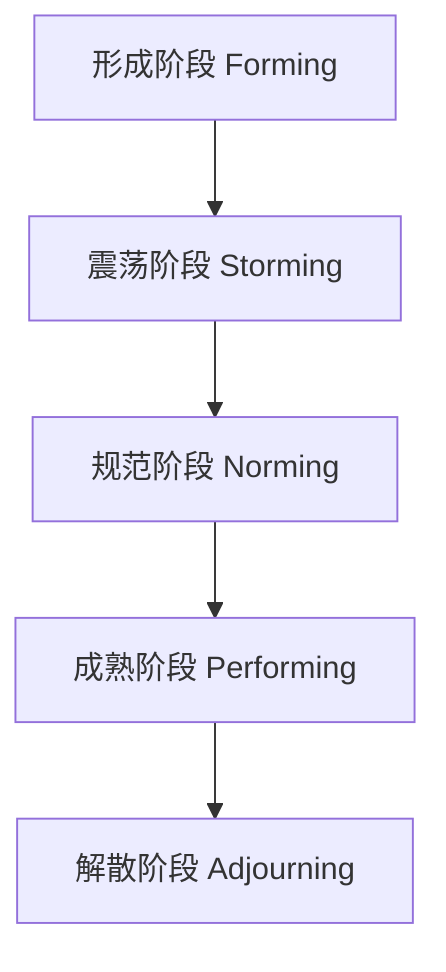

> [上一章：00-PMP考纲与知识体系总览](00-PMP考纲与知识体系总览.md) | [返回目录](../README.md) | [下一章：02-过程域核心考点精解](02-过程域核心考点精解.md)

---
# 01-人员域核心考点精解.md

> **人员域 (People)** 是PMP考试的重中之重，占比高达 **42%**。本领域的题目几乎全部是 **情景分析题**，旨在考察您作为项目经理，在真实、复杂的项目环境中领导团队、赋能成员、管理冲突和引导干系人的“软技能”。掌握此域的关键不在于死记硬背，而在于深刻理解并践行PMP所推崇的 **仆人式领导** 和 **人本主义** 思想。

---

## 模块一：领导力与团队管理 (Leadership & Team Management)

### 1.1 领导力风格 (Leadership Styles)

- **核心知识点**:

  - **仆人式领导 (Servant Leadership)**: **敏捷和PMP考试中最推崇的风格**。领导者以为团队服务为首要职责，专注于移除障碍、提供资源、创造环境，使团队能高效工作。其目标是“赋能”而非“管控”。
  - **变革型领导 (Transformational Leadership)**: 通过激励和鼓舞团队成员，使其超越自身利益，为实现共同的宏伟愿景而努力。
  - **魅力型领导 (Charismatic Leadership)**: 依靠个人魅力和感染力来影响他人。
  - **交易型领导 (Transactional Leadership)**: 基于“交换”原则，通过明确的奖励和惩罚来管理团队。关注任务完成。
  - **放任型领导 (Laissez-faire Leadership)**: “无为而治”，给予团队高度的自主权。
  - **情境领导 (Situational Leadership)**: (由赫塞和布兰查德提出) 根据团队成员的 **能力** 和 **意愿** (即成熟度)，灵活调整自己的领导风格，在 **指导(Telling)、教练(Selling)、支持(Participating)、授权(Delegating)** 四种风格中切换。
- **重难点解析**:

  - **仆人式 vs 传统命令式**: 传统领导是“权力金字塔”的顶端，而仆人式领导是“倒金字塔”的底座，支撑着整个团队。
  - **情境领导的应用**: 面对没能力但有意愿的新人，用“指导”；面对有能力但没意愿的“老油条”，用“支持”；面对能力和意愿双高的专家，用“授权”。
- **PMP备考与应试策略**:

  - **掌握程度**: **深刻理解并应用**。必须能判断在特定情境下哪种领导风格最合适。
  - **常考题型**: 情景题，描述一个团队状态或成员表现，问“作为项目经理，最适宜的领导行为是什么？”
  - **解题思路**: **优先选择“仆人式领导”** 相关的选项，如“移除障碍”、“提供支持”、“保护团队不受干扰”。如果题目给出了明确的团队成熟度信息，则应考虑 **“情境领导”** 模型。

### 1.2 团队建设与发展 (Team Building & Development)

- **核心知识点**:
  - **塔克曼阶梯 (Tuckman Ladder)**: 描述团队发展的五个阶段，是考试的 **高频考点**。
    1. **形成阶段 (Forming)**: 团队成员相互认识，比较独立，行为拘谨。PM需要提供清晰的方向。
    2. **震荡阶段 (Storming)**: 出现冲突和分歧，争夺控制权。**此阶段是冲突的高发期**。PM需要扮演教练角色，引导团队解决冲突。
    3. **规范阶段 (Norming)**: 团队开始形成共识，建立合作规范和流程。PM需要促进协作。
    4. **成熟阶段 (Performing)**: 团队高度协作，像一个高效的整体运作，能自我管理。PM应下放权力，扮演仆人式领导。
    5. **解散阶段 (Adjourning)**: 项目结束，团队解散。PM需要认可成就，总结经验。

- **团队章程 (Team Charter)**: 一份由团队 **共同制定** 的文件，定义了团队的价值观、行为准则、决策流程、冲突解决方法等。它是团队的“内部宪法”。
- **重难点解析**:

  - **识别阶段特征**: 考试的关键是根据题目描述的行为（如“团队成员开始挑战你的权威”、“团队开始协同工作”）准确判断团队处于哪个阶段。
  - **团队章程的作用**: 它不是由PM单方面制定的，其核心价值在于 **“共创”** 过程本身，能有效预防未来的冲突。
- **PMP备考与应试策略**:

  - **掌握程度**: **熟练掌握**。能准确判断团队阶段并选择对应的管理行为。
  - **常考题型**: 情景题。“一个新组建的团队，成员在会议上很少发言，你应该做什么？” (答案：明确项目目标和个人角色，即形成阶段的行为)。“团队成员就技术方案争执不下，你应该做什么？” (答案：引导他们关注问题本身，促进沟通，即震荡阶段的行为)。
  - **解题思路**: **判断阶段 -> 匹配行动**。看到冲突，多半是震荡期；看到合作，多半是规范期；看到自组织，多半是成熟期。

---

## 模块二：冲突与沟通 (Conflict & Communication)

### 2.1 冲突管理 (Conflict Management)

- **核心知识点**:
  - **冲突的来源**: 资源稀缺、进度压力、成本限制、技术异议、个人风格差异等。
  - **五种冲突解决方法**:
    1. **合作/解决问题 (Collaborate/Problem Solve)**: **最佳策略**。将冲突视为一个需要共同解决的问题，深入探究根源，寻求 **双赢(Win-Win)** 结果。
    2. **妥协/调解 (Compromise/Reconcile)**: 寻求一种折中方案，双方都有所退让，结果是 **双输(Lose-Lose)**。
    3. **缓和/包容 (Smooth/Accommodate)**: 强调一致性，淡化分歧。是一种暂时的、治标不治本的方法。
    4. **强制/命令 (Force/Direct)**: 利用职权强行推行一种方案，结果是 **赢-输(Win-Lose)**。适用于紧急情况或处理破坏性行为。
    5. **撤退/回避 (Withdraw/Avoid)**: 从冲突中退出，推迟处理。最消极的方法。

| 策略 (Strategy)   | 描述 (Description)                             | 结果 (Outcome)       | 别名 (Alias)                  | 适用场景 (Scenario)                          |
| :------------------ | :----------------------------------------------- | :--------------------- | :------------------------------ | :--------------------------------------------- |
| **合作/解决问题** | 深入探讨，找出根源，寻求对双方都有利的最佳方案 | **双赢 (Win-Win)**   | Confronting / Problem Solving | **PMP首选**。问题重要，关系重要，时间充足。  |
| **妥协/调解**     | 双方各退一步，寻求一个都能接受的中间方案       | **双输 (Lose-Lose)** | Reconcile                     | 双方势均力敌，或需要临时解决方案。           |
| **缓和/包容**     | 强调共同点，淡化分歧，以维持和谐关系           | 赢-输 (Win-Lose)     | Accommodating                 | 维护关系比解决问题更重要，或己方理亏。       |
| **强制/命令**     | 利用职权强行推行一种方案                       | 赢-输 (Lose-Lose)     | Forcing / Directing           | 紧急情况，或需要执行不受欢迎的决定时。       |
| **撤退/回避**     | 从冲突中退出或推迟处理                         | 输-赢 (Lose-Win)     | Avoiding                      | 问题不重要，或需要时间冷静，或对方情绪激动。 |

- **重难点解析**:

  - **合作 vs 妥协**: “合作”是找到一个让双方都满意的“第三方案”，而“妥协”是双方都在自己的原有方案上“砍一刀”。
  - **策略选择**: 没有绝对的好坏，只有是否适合当前情境。但PMP考试有明显的偏好。
- **PMP备考与应试策略**:

  - **掌握程度**: **精通级别**。这是人员域 **必考** 内容。
  - **常考题型**: 经典情景题。“两位关键成员对一个重要功能的设计有严重分歧，你该怎么办？”
  - **解题思路**: 
    - **首选“合作/解决问题”**：寻找鼓励双方沟通、分析利弊、共同寻找最佳方案的选项。
    - **次选“妥协”**：如果时间和资源有限，无法达成完美共识，可以选择各退一步。
    - **慎用“强制”和“回避”**：“强制”仅在紧急、重大危机或反道德行为时使用；“回避”通常是错误答案，除非问题极小或需要时间冷静。

### 2.2 沟通管理 (Communication Management)

- **核心知识点**:

  - **沟通模型**: 发送方 -> 编码 -> 信息 -> 媒介 -> 解码 -> 接收方，整个过程伴随着 **“噪音”** 的干扰。接收方的 **“反馈”** 是确认信息被正确理解的关键。
  - **沟通方法**:
    - **交互式沟通 (Interactive)**: 双向、实时，如会议、电话。效率最高，用于复杂或重要议题。
    - **推式沟通 (Push)**: 单向发送，不要求立即回应，如邮件、备忘录。
    - **拉式沟通 (Pull)**: 将信息放在公共区域，供接收者自行获取，如网站、知识库。用于大量信息或非紧急信息。
  - **沟通渠道数**: `N * (N-1) / 2`，其中N是干系人数量。每增加一个人，沟通的复杂性都将指数级增长。
- **PMP备考与应试策略**:

  - **掌握程度**: **熟练掌握**。
  - **常考题型**: “项目增加了一位重要干系人，沟通的主要挑战是什么？” (答案：沟通复杂性增加)。“你需要与一个远程团队讨论一个复杂的技术问题，应选择哪种沟通方式？” (答案：视频会议，即交互式沟通)。
  - **解题思路**: 沟通的目的是 **确保理解**。对于复杂、敏感、重要的信息，永远选择 **交互式** 沟通。

---

## 模块三：干系人管理 (Stakeholder Engagement)

### 3.1 干系人分析 (Stakeholder Analysis)

- **核心知识点**:

  - **干系人**: 任何可能影响项目、被项目影响，或自认为会受项目影响的个人或组织。
  - **分析模型**:
    - **权力/利益方格 (Power/Interest Grid)**: **高频考点**。用于对干系人进行分类，并制定不同的管理策略。
      - **高权力-高利益 (关键干系人)**: **重点管理 (Manage Closely)**。必须让他们满意。
      - **高权力-低利益**: **令其满意 (Keep Satisfied)**。不要过多打扰，但要满足其需求。
      - **低权力-高利益**: **随时告知 (Keep Informed)**。让他们了解项目情况，获取他们的反馈。
      - **低权力-低利益**: **监督 (Monitor)**。只需最少的努力。

| 权力 / 利益 | **低利益** | **高利益** |
| :--- | :--- | :--- |
| **高权力** | **令其满意 (Keep Satisfied)** | **重点管理 (Manage Closely)** |
| **低权力** | **监督 (Monitor)** | **随时告知 (Keep Informed)** |

    - **显著性模型 (Salience Model)**: 通过 **权力、紧迫性、合法性** 三个维度来评估干系人的优先级。
- **PMP备考与应试策略**:

  - **掌握程度**: **熟练掌握**。必须能使用权力/利益方格进行快速分类和策略匹配。
  - **常考题型**: 描述一个干系人的特征（如“他是公司CEO，但不直接参与项目”），问应采取何种策略。(答案：高权力-低利益，令其满意)。
  - **解题思路**: **分类 -> 定策略**。准确判断干系人属于哪个象限是解题的关键。

### 3.2 干系人参与 (Stakeholder Engagement)

- **核心知识点**:

  - **参与度评估矩阵**: 用于评估干系人 **当前** 的参与水平和 **期望** 的参与水平。
    - **不知情 (Unaware)** -> **抵制 (Resistant)** -> **中立 (Neutral)** -> **支持 (Supportive)** -> **领导 (Leading)**
  - **从“管理”到“引导”**: PMBOK第七版强调，对待干系人应是主动的 **“引导参与 (Engagement)”**，而不是被动的“管理”。核心是建立信任、发展关系。
- **PMP备考与应试策略**:

  - **掌握程度**: **深刻理解并应用**。
  - **常考题型**: “一位有很大影响力的干系人对项目持抵制态度，你首先应该做什么？”
  - **解题思路**: **沟通和理解是第一步**。最佳答案通常是“与他/她进行一对一沟通，了解其担忧和期望”，而不是“升级问题”或“按计划进行”。目标是识别参与度差距，并制定策略将其向“支持”或“领导”方向引导。

---

## 模块四：赋能与发展 (Empowerment & Development)

### 4.1 激励理论 (Motivation Theories)

- **核心知识点**:

| 理论名称 | 核心内容 | 关键点 / PMP启示 |
| :--- | :--- | :--- |
| **马斯洛需求层次理论** | 需求分为五个层次：生理 → 安全 → 社交 → 尊重 → 自我实现。 | 必须先满足员工的低层次需求（如合理的薪酬和安全的工作环境），然后更高层次的需求（如尊重和成就感）才能起到激励作用。 |
| **赫茨伯格双因素理论** | <ul><li>**保健因素**: 缺失会导致**不满意**（如薪水、公司政策、工作环境）。</li><li>**激励因素**: 存在能带来**满意**和激励（如成就感、认可、责任、成长）。</li></ul> | 消除不满意（改善保健因素）和提供激励（强化激励因素）是两回事。想真正激励团队，应专注于提供成长机会、认可等激励因素。 |
| **麦格雷戈X理论和Y理论** | <ul><li>**X理论**: 假设人是懒惰的，需要被监督和命令。</li><li>**Y理论**: 假设人是积极的，愿意主动承担责任。</li></ul> | PMP考试和现代项目管理推崇**Y理论**。项目经理应被视为引导者和赋能者，应信任、授权并赋能团队成员，而不是微观管理。 |
- **PMP备考与应试策略**:

  - **掌握程度**: **理解概念**。
  - **常考题型**: 理论本身考得较少，但其思想会融入情景题中。
  - **解题思路**: 当题目问及如何激励团队时，优先选择那些能提供 **成就感、认可、成长机会** 的选项（激励因素），而不是仅仅提高薪水（保健因素）。始终假设团队成员是Y理论类型的人。

### 4.2 培训与赋能 (Training & Empowerment)

- **核心知识点**:

  - **技能差距分析**: 通过能力评估、绩效评估等方式，识别团队当前技能与项目所需技能之间的差距。
  - **培训**: 针对技能差距提供培训，是项目经理的责任之一。
  - **赋能 (Empowerment)**: 给予团队成员完成工作的 **权力和自主性**。这是仆人式领导的核心实践，也是敏捷团队（自组织）的基础。
- **PMP备考与应试策略**:

  - **掌握程度**: **深刻理解并应用**。
  - **常考题型**: “你发现团队缺少某项关键技术能力，应该怎么办？” (答案：为团队安排相关培训)。“一个高效的敏捷团队向你寻求决策，你应该怎么做？” (答案：引导他们自己讨论并做出决定，而不是直接给出答案)。
  - **解题思路**: **赋能是黄金法则**。在PMP的世界里，项目经理是一个教练和引导者，而不是一个事必躬亲的微观管理者。优先选择那些能提升团队能力、鼓励团队自组织的选项。

---
> [上一章：00-PMP考纲与知识体系总览](00-PMP考纲与知识体系总览.md) | [返回目录](../README.md) | [下一章：02-过程域核心考点精解](02-过程域核心考点精解.md)
