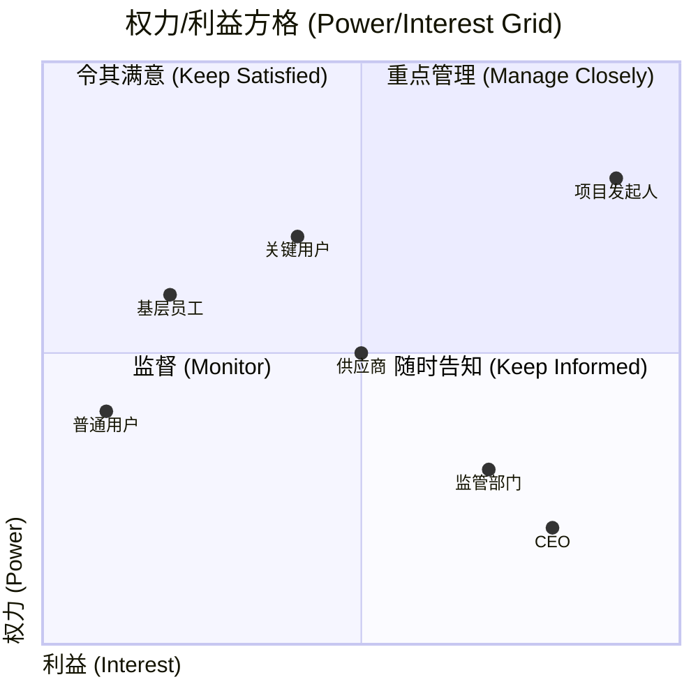

> [上一章：00-PMP考纲与知识体系总览](00-PMP考纲与知识体系总览.md) | [返回目录](../README.md) | [下一章：02-过程域核心考点精解](02-过程域核心考点精解.md)

---
# 人员域核心考点精解

> 人员域在PMP考试中占比 **42%**，是决定成败的关键。本领域的题目几乎全是情景题，不考察死记硬背，而是考察项目经理在真实场景下的 **领导力、情商和PMP思维**。本篇笔记将为您提炼人员域最高频的“考点”，助您掌握“做人”的艺术。

---

## 1. 仆人式领导 (Servant Leadership)

这是现代PMP理念，特别是敏捷和混合方法中，**最受推崇的领导力风格**。

- **A. 核心思想**: 领导者的首要职责是 **服务团队**，而不是管理或指挥团队。项目经理的角色从“管理者”转变为“**赋能者、教练和协调者**”。
- **B. 主要工作**: 
    - **移除障碍**: 为团队扫清前进道路上的一切困难。
    - **提供资源与支持**: 确保团队拥有完成工作所需的一切。
    - **保护团队**: 使团队免受外界不必要的干扰和压力。
    - **引导协作**: 促进团队内部和外部的有效沟通与协作。
- **C. 考试应用**: 在情景题中，当选项体现了项目经理 **主动为团队解决问题、创造良好环境、赋能团队成员** 时，通常是正确答案。而体现 **命令、控制、指责** 的选项通常是错误的。

**真题示例**: 
项目经理管理敏捷团队时，如何确保快速交付价值?
A. 并行任务  
B. 请求额外资源  
C. 定期发布增量  
D. 增加专家加班费  
**答案**: C  
**解析**: 敏捷强调通过定期发布增量来持续交付价值，而非并行任务或加班。

---

## 2. 塔克曼阶梯理论 (Tuckman's Ladder)

该理论描述了团队发展的五个阶段，是PMP考试中关于团队管理的核心模型。

| 阶段 | 团队特征 | 项目经理的应对策略 (考点) |
| :--- | :--- | :--- |
| **1. 形成阶段 (Forming)** | 成员相互认识，比较礼貌和拘谨，不确定性高。 | **指令型领导**。明确设定团队目标、角色和职责，提供清晰的方向。 |
| **2. 震荡阶段 (Storming)** | 开始出现冲突和分歧，成员争夺地位和控制权。 | **教练型领导**。引导团队成员公开讨论、解决冲突，帮助他们相互理解，而不是压制或回避冲突。 |
| **3. 规范阶段 (Norming)** | 团队开始形成共识，建立起协作规范和流程，信任度提升。 | **参与/支持型领导**。鼓励团队参与决策，赋能团队，开始下放权力。 |
| **4. 成熟阶段 (Performing)** | 团队高度自治、高效协作，像一个运转顺畅的机器。 | **授权型领导**。充分授权，信任团队，不过多干预，专注于移除障碍和对外协调。 |
| **5. 解散阶段 (Adjourning)** | 项目结束，团队解散，成员可能会感到失落。 | **关怀与总结**。认可团队成员的贡献，总结经验教训，帮助成员过渡到新的岗位。 |

---

## 3. 冲突解决方法 (Conflict Resolution)

冲突是不可避免的，但管理好冲突可以带来积极成果。PMP将冲突解决方法分为五种，有明确的优劣排序。

| 方法 | 做法 | 结果 | PMP考试应用 |
| :--- | :--- | :--- | :--- |
| **合作/解决问题** | **开放对话**，深入探究问题根源，共同寻找能让**双方都满意**的解决方案。 | **双赢 (Win-Win)** | **PMP最推崇的最佳方法**。通常是情景题的最优选。 |
| **妥协/调解** | 双方各退一步，都放弃一些东西，以快速达成一致。 | **双输 (Lose-Lose)** | **次优选择**。当时间和资源有限，或问题不是特别重要时可以采用。 |
| **包容/缓和** | 强调一致、淡化分歧，满足对方的需求以维持关系。 | **一赢一输 (I Win, You Lose - 对对方而言)** | **不推荐**。可能暂时维持了和谐，但问题本身并未解决，日后可能再次爆发。 |
| **撤退/回避** | 从冲突中退出，推迟或回避问题。 | **双输 (Lose-Lose)** | **通常是错误选项**。除非问题极小，或需要时间冷静。 |
| **强迫/命令** | 利用职权或权力，强制推行某一方的观点。 | **一赢一输 (I Win, You Lose - 对自己而言)** | **PMP最不推荐的方法**。只有在紧急情况或涉及道德、安全问题时才可能使用。 |

**真题示例**: 
一个项目经理在运作一个数据中心安装项目。他发现相关方很恼火，因为他超出了预算，原因是人员费用要高于原先的计划。另外项目结束时，服务器未能提供相关方所需要的空间，这也让相关方很不满意。以下哪个约束不受这个问题的影响？
A.质量
B.资源
C.时间
D.成本
**答案**: C  
**解析**: 问题影响了成本（预算超支）和质量（服务器空间不足），未提及时间。

---

## 4. 激励理论 (Motivation Theories)

### 4.1 赫兹伯格双因素理论 (Herzberg's Two-Factor Theory)
- **保健因素**: 必须满足，否则员工会 **不满意**。但满足了也 **不会** 带来额外的激励。例如：薪水、工作条件、公司政策。
- **激励因素**: 满足了能 **极大地激励** 员工。例如：成就感、认可、责任、成长机会。
- **考试应用**: 要激励团队，应多从“激励因素”入手，如公开表扬、授予更重要的职责。

### 4.2 麦格雷戈X&Y理论 (McGregor's Theory X and Y)
- **X理论**: 假设员工天生懒惰，需要被监督和强迫。对应“**命令-控制**”式管理。
- **Y理论**: 假设员工天生积极主动，有自我驱动力。对应“**赋能-信任**”式管理。
- **考试应用**: PMP推崇 **Y理论** 的管理思维。

---

## 5. 权力类型 (Types of Power)

项目经理在不同情境下可以运用不同类型的权力来影响团队和干系人。

| 权力类型 | 说明 | 效果与应用 |
| :--- | :--- | :--- |
| **正式权力 (Formal/Legitimate)** | 来自于职位和头衔的权力 | 基础权力,但单靠职位难以赢得真正的尊重 |
| **奖励权力 (Reward)** | 能够给予奖励(奖金、晋升、认可)的权力 | 短期有效,但过度使用可能导致团队只为奖励工作 |
| **惩罚权力 (Penalty/Coercive)** | 能够施加惩罚的权力 | **PMP最不推荐**,会破坏信任和团队士气 |
| **专家权力 (Expert)** | 基于专业知识和技能的权力 | **高度有效**,赢得团队真正的尊重 |
| **参照权力 (Referent)** | 基于个人魅力、品格和他人的尊敬 | **最持久有效**,建立在信任和尊重基础上 |

**考试应用**: PMP推崇运用 **专家权力** 和 **参照权力**,而不是依赖 **惩罚权力**。

---

## 6. 领导风格 (Leadership Styles)

项目经理应根据团队成熟度和情境灵活调整领导风格。

| 领导风格 | 特点 | 适用场景 |
| :--- | :--- | :--- |
| **指令型 (Directing)** | 明确告诉团队做什么、怎么做 | 团队新组建、成员经验不足(形成阶段) |
| **教练型 (Coaching)** | 引导、培养团队能力,解释"为什么" | 团队出现冲突、需要技能提升(震荡阶段) |
| **支持型 (Supporting)** | 鼓励团队参与决策,提供支持 | 团队已建立信任、需要赋能(规范阶段) |
| **授权型 (Delegating)** | 充分授权,团队自主决策和执行 | 团队高度成熟、自组织(成熟阶段) |

**考试应用**: 情境领导理论强调 **没有最好的风格,只有最合适的风格**。根据团队发展阶段选择对应风格。

---

## 7. 冲突来源分析

了解冲突的常见来源有助于预防和解决冲突。

**项目中冲突的七大来源**(按频率排序):

1. **进度安排** - 对时间表和优先级的分歧
2. **项目优先级** - 对什么最重要存在不同看法
3. **资源** - 资源有限导致的竞争
4. **技术观点** - 对技术方案的不同意见
5. **管理程序** - 对流程和方法的分歧
6. **成本** - 预算和费用分配争议
7. **个性冲突** - 性格和工作风格差异

**考试应用**: 识别冲突根源,才能对症下药。大多数冲突源于 **进度、优先级和资源**,而非个性。

---

## 8. 团队建设活动

项目经理应持续开展团队建设活动,提升团队凝聚力和绩效。

**团队建设活动类型**:

- **正式活动**: 外出团建、培训工作坊、团队会议
- **非正式活动**: 午餐聚餐、庆祝里程碑、日常交流
- **持续性活动**: 每日站会、回顾会议、一对一沟通

**关键原则**:
- 团队建设是 **持续的过程**,而非一次性活动
- 应贯穿项目 **全生命周期**
- 既要有正式活动,也要重视 **非正式互动**

**考试应用**: 当团队士气低落或协作不佳时,项目经理应 **主动组织团队建设活动**。

---

## 9. 干系人分析 (Stakeholder Analysis)

识别和管理干系人是项目成功的关键。最常用的工具是权力/利益方格。

**干系人权力/利益方格**:

**四个象限的管理策略**:

| 象限 | 权力/利益 | 管理策略 | 示例 |
| :--- | :--- | :--- | :--- |
| **重点管理** | 高权力/高利益 | 密切合作,重点沟通,确保满意 | 项目发起人、CEO、关键决策者 |
| **令其满意** | 高权力/低利益 | 保持满意,但不过度沟通 | 高管(非直接相关)、监管部门 |
| **随时告知** | 低权力/高利益 | 充分告知,保持参与感 | 最终用户、基层员工 |
| **监督** | 低权力/低利益 | 最少精力,监控即可 | 外围干系人、旁观者 |

**考试应用**: 
- 对高权力/高利益干系人要 **积极主动管理**
- 不同象限采用不同沟通频率和方式
- 干系人可能在项目不同阶段移动到不同象限

---

## 10. 情商 (Emotional Intelligence - EQ)

情商是项目经理最重要的软技能之一，指识别、理解和管理自身及他人情绪的能力。

- **A. 自我意识**: 了解自己的情绪、优点和缺点。
- **B. 自我管理**: 控制冲动，管理自己的情绪和行为。
- **C. 社会意识**: 理解、共情他人的情绪和组织动态。
- **D. 关系管理**: 建立并维持良好的人际关系，影响和激励他人。
- **考试应用**: 优秀的项目经理能运用情商来建立信任、化解冲突、有效沟通和领导团队。

---

## 11. 学习自检清单

完成本章学习后，请检查您是否掌握了以下核心知识点：

- [ ] 理解了仆人式领导的核心思想和实践方法
- [ ] 能够识别团队发展的5个阶段及其特点
- [ ] 掌握5种冲突解决方法及优先级排序
- [ ] 理解权力类型的分类及应用原则
- [ ] 掌握领导风格与团队发展阶段的匹配关系
- [ ] 理解干系人分析方法和管理策略
- [ ] 掌握激励理论在项目管理中的应用
- [ ] 理解情商的四个维度及其在作用

> **学习建议**: 对于未掌握的知识点，建议回到相应章节重新学习，并结合实际项目经验进行思考。

---
> [上一章：00-PMP考纲与知识体系总览](00-PMP考纲与知识体系总览.md) | [返回目录](../README.md) | [下一章：02-过程域核心考点精解](02-过程域核心考点精解.md)
