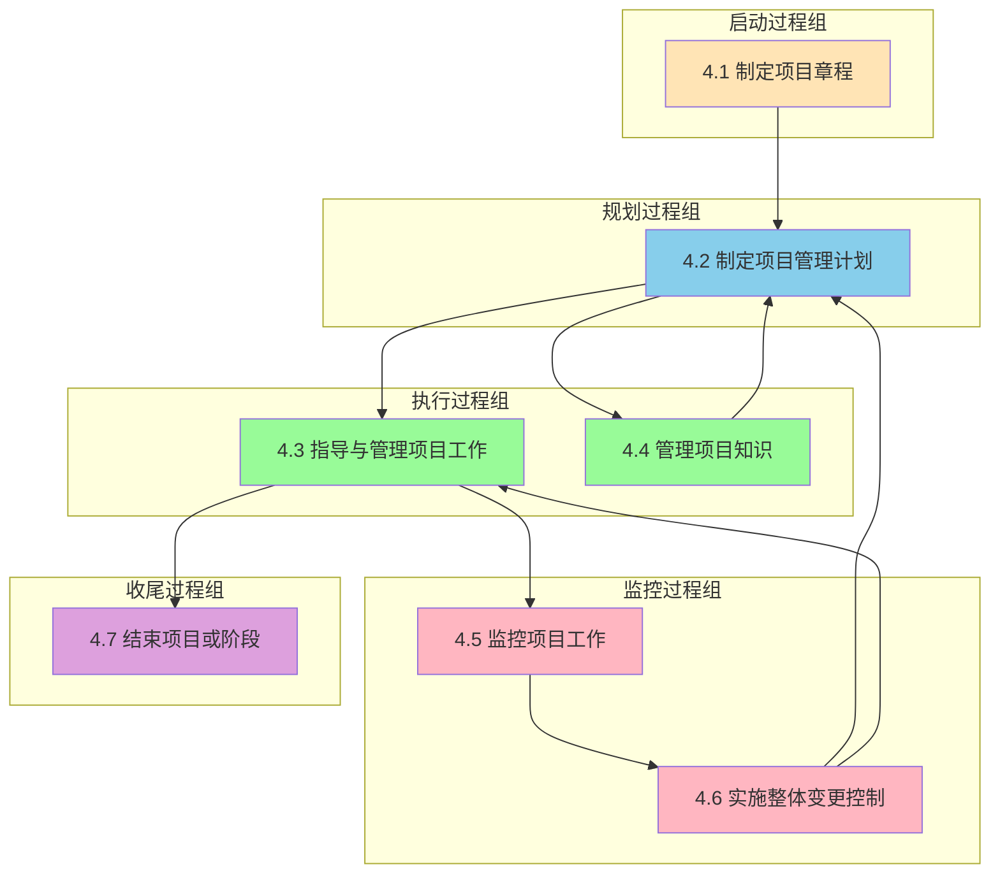
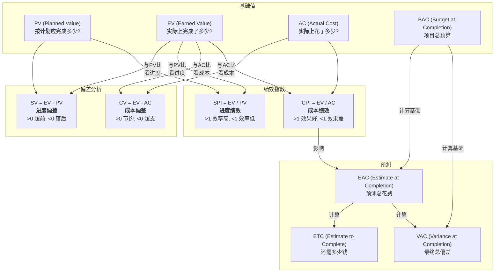
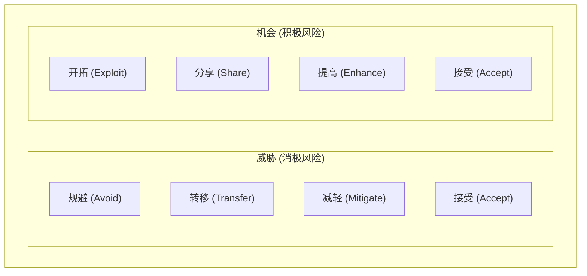

> [上一章：01-人员域核心考点精解](01-人员域核心考点精解.md) | [返回目录](../README.md) | [下一章：03-商业环境域核心考点精解](03-商业环境域核心考点精解.md)

---
# 过程域核心考点精解

> 过程域在PMP考试中占比 **50%**，是项目管理的“硬核技术”。本篇笔记将以“十大知识领域”为框架，为您系统性地梳理每个领域下最高频的“考点”，涵盖其核心流程、关键工具和技术，并融入敏捷视角。

---

## 1. 整合管理

> **“人话”解读**: 整合管理是项目经理的“主线任务”，是把所有其他知识领域的工作“粘合”在一起的胶水，确保项目从始至终协调一致。

### 1.1 项目章程
- **A. 定义**: 一份由项目发起人或类似层级人员批准发布的，**正式授权项目存在**并**授权项目经理使用组织资源**的文件。
- **B. 核心作用**: 标志着项目的“合法身份”，是项目经理的“授权委托书”。
- **C. 考试应用**: 题目中问“项目经理被任命后，首先应该做什么？”，答案通常是“参考或制定项目章程”。

### 1.2 变更控制流程
- **A. 流程**: 1. 提交变更请求 -> 2. 记录到变更日志 -> 3. 评估变更影响 -> 4. 提交给**变更控制委员会(CCB)**审批 -> 5. 批准后，更新项目计划和基准 -> 6. 通知干系人。
- **B. 核心**: **任何变更都不能由项目经理私自决定**，必须通过正式流程。CCB是正式的决策机构。
- **C. 考试应用**: 任何情景下的变更请求，正确做法都是“遵循变更控制流程”。

### 1.3 整合管理数据流图
**PMBOK6 整合管理数据流图**:


---

## 2. 范围管理

> **“人话”解读**: 确保项目“做且只做”范围以内的工作。**多做**了客户没要求的功能叫“**镀金**”；范围在失控中一点点**变多**叫“**范围蔓延**”。项目经理两手都要抓，两手都要硬。

### 2.1 WBS (工作分解结构)
- **A. 定义**: 一种将项目总范围和可交付成果，逐层分解为更小、更易于管理的部分的**层级结构**。
- **B. 100%原则**: WBS必须包含**全部**项目工作，不多也不少。所有子项的工作之和必须等于其父项的工作。
- **C. 最低层**: WBS的最低层被称为“**工作包**”，它是可以被估算、排期和分配的基本工作单元。
- **D. WBS词典**: 对WBS中每个工作包的详细文字描述，说明了工作内容、验收标准等。

### 2.2 确认范围 vs. 控制质量
- **A. 核心区别**: “控制质量”是**对内**检查可交付成果是否**正确**（符合技术规范）；“确认范围”是**对外**与客户一起**正式验收**可交付成果，看其是否**可接受**。
- **B. 关系**: 通常先进行内部的“控制质量”，确保成果正确无误后，再提交给客户去“确认范围”。

---

## 3. 进度管理

> **“人话”解读**: 确保项目“准时完工”。

### 3.1 关键路径法
- **A. 定义**: 关键路径是项目中**总持续时间最长**的一条路径，它决定了项目的**最短总工期**。
- **B. 总浮动时间 (Total Float)**: 活动在不延误项目完工日期的前提下可以推迟的时间。关键路径上的活动，其总浮动时间为 **零**。
- **C. 自由浮动时间 (Free Float)**: 活动在不延误任何紧后活动最早开始日期的前提下可以推迟的时间。
- **D. 关键路径法示例图**:
    ```mermaid
    graph LR
        Start((开始)) --> A["活动A<br>3天"]
        Start --> B["活动B<br>2天"]
        A --> C["活动C<br>4天"]
        B --> D["活动D<br>5天"]
        C --> E["活动E<br>2天"]
        D --> E
        E --> End((结束))
    ```
    **关键路径计算示例**:
    - **路径1**: Start → A(3) → C(4) → E(2) → End = **9天** ⭐ 关键路径
    - **路径2**: Start → B(2) → D(5) → E(2) → End = **9天** ⭐ 关键路径
- **E. 考试应用**: 
    - 任何在关键路径上的活动的延误，都会直接导致整个项目工期的延误。
    - 项目经理应重点监控关键路径上的活动。
    - 利用非关键路径上的浮动时间来优化资源分配。

### 3.2 进度压缩技术
- **A. 赶工 (Crashing)**: **增加资源**来缩短活动持续时间。例如：增加人力、使用更高效的设备。**特点：增加成本**。
- **B. 快速跟进 (Fast Tracking)**: 将原本顺序执行的活动，改为**并行执行**。例如：设计和开发同时进行。**特点：增加风险**。
- **C. 考试应用**: 当需要缩短工期时，优先考虑对关键路径上的活动使用这两种技术。

---

## 4. 成本管理

> **“人话”解读**: 确保项目“不超支”。

### 4.1 挣值管理 (EVM)

**核心概念关系图**:


- **A. 核心三值**:
    - **PV (计划价值)**: **“应该做多少”**。
    - **AC (实际成本)**: **“实际花多少”**。
    - **EV (挣值)**: **“实际做多少”**。
- **B. 偏差与绩效**:
    - **SV = EV - PV**: > 0 进度超前。
    - **CV = EV - AC**: > 0 成本节约。
    - **SPI = EV / PV**: > 1 进度效率高。
    - **CPI = EV / AC**: > 1 资金使用效率高。
- **C. 预测**:
    - **EAC = BAC / CPI**: 预测项目总花费。

---

## 5. 质量管理

> **“人话”解读**: 确保项目产出“符合要求、客户满意”。

### 5.1 质量成本 (CoQ)
- **A. 一致性成本 (预防)**: 预防和评估缺陷的成本。
    - **预防成本**: 培训、流程优化。
    - **评估成本**: 测试、检查。
- **B. 非一致性成本 (补救)**: 缺陷导致的花费。
    - **内部失败成本**: 返工、废品。
    - **外部失败成本**: 保修、客户投诉。
- **C. 考试应用**: PMP推崇 **优先投入一致性成本**。

---

## 6. 风险管理

> **“人话”解读**: 识别、分析和应对项目中的“不确定性”。

### 6.1 风险应对策略

**风险应对策略矩阵**:

- **A. 应对威胁**:
    - **规避**: 消除威胁。
    - **转移**: 转移给第三方 (如买保险)。
    - **减轻**: 降低概率或影响。
    - **接受**: 接受风险。
- **B. 应对机会**:
    - **开拓**: 确保机会100%发生。
    - **分享**: 与第三方共享。
    - **提高**: 提升概率或影响。
    - **接受**: 顺其自然。

---

## 7. 采购管理

> **“人话”解读**: 管理好项目中的“买买买”。

### 7.1 合同类型
- **A. 总价合同**: 价格固定，**风险在卖方**。
- **B. 成本补偿合同**: 实报实销+利润，**风险在买方**。
- **C. 工料合同**: 按单价付费，**风险共担**。

---

## 8. 应试技巧

### 8.1 核心记忆口诀
- **EVM**: "挣值是核心, 与AC比成本, 与PV比进度"。
- **进度压缩**: "有钱赶工, 没钱快跟"。
- **风险应对**: 威胁: **避转减接**; 机会: **开共提接**。
- **冲突解决**: **合作 > 妥协 > 包容 > 撤退 > 强迫**。

### 8.2 高频考点提醒
- **变更**: 必须走CCB流程。
- **项目启动后**: 先看项目章程。
- **发现问题**: 先记录到问题日志。

---
> [上一章：01-人员域核心考点精解](01-人员域核心考点精解.md) | [返回目录](../README.md) | [下一章：03-商业环境域核心考点精解](03-商业环境域核心考点精解.md)