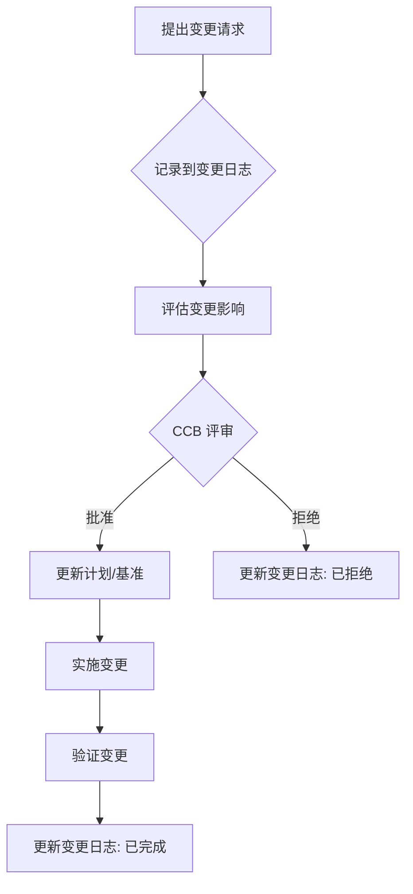
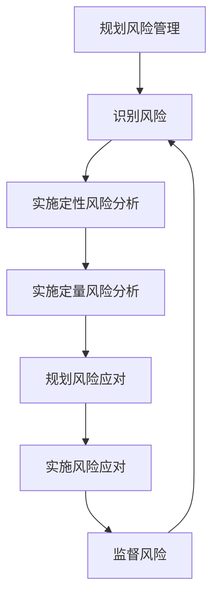

> [上一章：01-人员域核心考点精解](01-人员域核心考点精解.md) | [返回目录](../README.md) | [下一章：03-商业环境域核心考点精解](03-商业环境域核心考点精解.md)

---

# 02-过程域核心考点精解.md

> **过程域 (Process)** 是PMP考试的绝对核心，占比高达 **50%**。它涵盖了项目从启动到收尾的全过程技术活动。掌握此域的关键在于，不仅要理解传统预测型项目管理的 **“精确规划”**，更要掌握敏捷与混合型项目管理的 **“适应与交付价值”**。本笔记将以独特的 **“预测型 vs. 敏捷/混合”** 双重视角，助您通关过程域。

---

## 模块一：整合管理 (Integration Management)

> 整合管理是项目经理的专属职责，是所有其他管理活动的“粘合剂”。核心是确保项目各部分协调一致，向着共同的目标前进。

### 核心知识点

- **项目章程 (Project Charter)**: **正式授权项目和项目经理** 的文件。它由项目外部的发起人或PMO发布，明确了项目的高层级信息，如项目目的、可衡量的目标、主要干系人、总体风险和项目经理的责权。
- **项目管理计划 (Project Management Plan)**: 一份 **综合性** 的文件，整合了所有子管理计划（如范围、进度、成本计划等）和基准，是指导项目执行、监控和收尾的“总纲”。
- **整体变更控制 (Integrated Change Control)**: 项目中 **所有变更** 都必须通过一个正式、集中的流程来评审和批准。核心机构是 **变更控制委员会 (CCB)**。流程：**提出变更请求 -> 评估影响 -> CCB审批 -> 更新变更日志 -> 通知干系人**。

- **经验教训 (Lessons Learned)**: 在项目全生命周期中 **持续不断** 地识别、记录和分享从项目中获得的知识。

### PMP备考与应试策略

- **掌握程度**: **精通级别**。整合管理是PM的核心工作，必考。
- **常考题型**:
  - “项目经理张三被任命负责一个新项目，他首先应该做什么？” -> **寻找或制定项目章程**。
  - “一个干系人绕过你，直接让团队成员修改了一个功能，你应该怎么办？” -> **立即叫停，并要求他/她遵循项目的整体变更控制流程**。
  - “项目进行到一半，你发现了一个可以优化流程的方法，你应该记录在哪里？” -> **经验教训登记册**。
- **解题思路**:
  - **授权优先**: 没有项目章程，项目经理就没有正式授权，不能动用资源。
  - **流程至上**: 任何变更都必须走流程，无论大小、好坏。PM的职责是 **维护流程**。
  - **持续学习**: 经验教训不是项目收尾时才做，而是贯穿始终。

---

## 模块二：范围管理 (Scope Management)

> 范围管理的核心是 **“做且只做该做的事”**。它分为 **产品范围**（交付成果的特性和功能）和 **项目范围**（为交付产品范围所必须做的工作）。

### 视角一：预测型方法 (Predictive Approach)

- **核心知识点**:

  - **WBS (工作分解结构)**: **范围管理的核心工具**。将项目可交付成果和项目工作 **逐层分解** 成更小、更易于管理的部分。最底层是 **工作包 (Work Package)**。
  - **100%原则**: WBS必须包含 **全部** 的项目工作，不多也不少。
  - **范围基准 (Scope Baseline)**: 经过批准的 **项目范围说明书、WBS 和 WBS词典** 的总和。是衡量范围绩效的依据。
  - **确认范围 (Validate Scope)**: 与 **客户或发起人** 一起 **正式验收** 已完成的可交付成果的过程。这是一个外部的、正式的过程。
  - **控制范围 (Control Scope)**: 监督项目和产品的范围状态，管理范围基准的变更。防止 **范围蔓延 (Scope Creep)** (未经控制的范围扩大)。
- **重难点解析**:

  - **确认范围 vs. 控制质量**: **控制质量** 是内部团队检查可交付成果是否正确、无缺陷；**确认范围** 是外部客户来验收可交付成果是否满足其需求。**顺序上，先有内部的质量控制，再有外部的范围确认**。

| 对比维度     | 控制质量 (Control Quality)               | 确认范围 (Validate Scope)                        |
| :------------- | :----------------------------------------- | :------------------------------------------------- |
| **目的**     | 检查可交付成果的**正确性**，确保其无缺陷 | 检查可交付成果的**可接受性**，获得客户的正式验收 |
| **对象**     | 可交付成果 vs. 质量标准                  | 已验证的可交付成果 vs. 范围基准                  |
| **参与方**   | **内部** 团队 (项目团队, QA)             | **外部** 客户、发起人                            |
| **发生时间** | 在“确认范围”之前，或并行               | 在“控制质量”之后                               |
| **关注点**   | “我们把东西做对了吗？”                 | “我们做了对的东西吗？”                         |
| **输出**     | 质量控制测量结果,**已验证的可交付成果**  | **已被接受的可交付成果**, 变更请求               |

### 视角二：敏捷/混合方法 (Agile/Hybrid Approach)

- **核心知识点**:
  - **产品待办列表 (Product Backlog)**: **敏捷范围管理的“唯一权威来源”**。它是一个动态的、按优先级排序的需求列表，包含了所有期望产品具有的功能、特性、修复等。由 **产品负责人 (PO)** 负责管理。
  - **用户故事 (User Story)**: 一种轻量级的需求描述方式，格式为：“**作为一个 <角色>, 我想要 <功能>, 以便 <价值>**”。
  - **INVEST原则**: 好的用户故事应遵循此原则：**独立、可协商、有价值、可估算、小、可测试**。
  - **迭代/Sprint评审会 (Iteration/Sprint Review)**: 敏捷中的 **“确认范围”** 活动。在每个迭代结束时，开发团队向干系人 **演示** 可工作的软件增量，并获取反馈。这是一个非正式的、频繁的验收过程。
  - **范围管理方式**: 敏捷 **拥抱变化**。范围不是在项目初期就完全锁定的，而是通过产品待办列表进行持续的调整和优化，以响应客户反馈和市场变化，最大化交付价值。

### PMP备考与应试策略

- **掌握程度**: **精通级别**。范围管理是“铁三角”之一，预测型和敏捷的方法都非常重要。
- **常考题型**:
  - “WBS的最低层是什么？” -> **工作包**。
  - “客户在项目中期要求增加一个功能，你应该参考哪个文件来评估影响？” -> **范围基准**。
  - “在敏捷项目中，由谁来决定需求的优先级？” -> **产品负责人 (PO)**。
  - “敏捷团队在每个Sprint结束时邀请干系人参加会议，演示产品功能，这个活动叫什么？” -> **Sprint评审会**。
- **解题思路**:
  - 看到 **WBS、基准、范围蔓延**，联想 **预测型**。
  - 看到 **待办列表(Backlog)、用户故事、产品负责人(PO)、评审会(Review)**，联想 **敏捷**。
  - 考试非常喜欢对比 **“确认范围”** 和 **“控制质量”**，务必分清 **“对内检查”** 和 **“对外验收”** 的区别。
  - 理解敏捷范围管理的核心思想：范围是 **动态演进** 的，优先级是 **价值驱动** 的。

---

## 模块三：进度管理 (Schedule Management)

> 进度管理的核心是在批准的时间内完成项目。

### 视角一：预测型方法 (Predictive Approach)

- **核心知识点**:
  - **关键路径法 (Critical Path Method - CPM)**: **进度管理的核心技术**。关键路径是项目中 **最长** 的一条路径，它决定了项目的 **最短总工期**。
  - **浮动时间 (Float/Slack)**: 活动可以延迟而不影响项目总工期的时间。**关键路径上的活动的浮动时间为零**。
  - **进度压缩技术**:
    - **赶工 (Crashing)**: **增加资源** (如增加人手、加班) 来缩短活动工期。会导致 **成本增加**。
    - **快速跟进 (Fast Tracking)**: 将原本顺序执行的活动改为 **并行执行**。会 **增加风险**。

| 对比维度     | 赶工 (Crashing)             | 快速跟进 (Fast Tracking) |
| :------------- | :---------------------------- | :------------------------- |
| **核心动作** | **增加资源** (如加人、加班) | 将串行活动改为**并行**   |
| **主要影响** | **成本增加**                | **风险增加**             |
| **适用活动** | 通常用于关键路径上的活动    | 可以并行执行的活动       |
| **决策考量** | 当预算充足时                | 当风险可控时             |

- **资源优化技术**:
    - **资源平衡 (Resource Leveling)**: 为了解决资源过载或关键资源在同一时间需求量过大的问题而调整进度。**可能会改变关键路径，延长工期**。
    - **资源平滑 (Resource Smoothing)**: 在活动的浮动时间内调整活动，以优化资源使用。**不会改变关键路径，不延长工期**。
### 视角二：敏捷/混合方法 (Agile/Hybrid Approach)

- **核心知识点**:
  - **时间盒 (Timeboxing)**: 敏捷中的所有活动都发生在有固定长度的时间盒内。最重要的时间盒是 **迭代/Sprint**。
  - **发布规划 (Release Planning)**: 规划下一个产品版本要交付哪些功能，通常跨越多个迭代。
  - **迭代规划 (Iteration Planning)**: 在每个迭代开始时，团队从产品待办列表中选择最高优先级的条目，承诺在本迭代中完成。
  - **速率 (Velocity)**: 衡量一个敏捷团队在单个迭代中完成工作（通常以故事点衡量）的平均速率。它是 **预测未来** 的关键指标。例如，如果团队平均速率是30个故事点/迭代，那么一个60故事点的功能大约需要2个迭代完成。
  - **燃尽图/燃起图 (Burndown/Burnup Chart)**: **可视化** 进度跟踪工具。燃尽图显示 **剩余工作量**，燃起图显示 **已完成工作量**。

### PMP备考与应试策略

- **掌握程度**: **精通级别**。关键路径的计算和敏捷中的速率是高频考点。
- **常考题型**:
  - **计算题**: 给出活动网络图，要求找出关键路径和总工期。
  - **情景题**: “项目经理需要缩短工期，但预算非常紧张，他应该优先考虑哪种方法？” -> **快速跟进** (因为赶工要花钱)。
  - **情景题**: “项目进度落后，但项目经理被告知绝不能再延长总工期，他应该使用哪种资源优化技术？” -> **资源平滑** (因为资源平衡可能延长工期)。
  - **敏捷题**: “一个敏捷团队完成了3个迭代，分别完成了25、30、28个故事点，请问他们的平均速率是多少？” -> **(25+30+28)/3 = 27.67**。
- **解题思路**:
  - **关键路径是核心**: 任何关于进度的题目，都要先思考对关键路径的影响。
  - **区分进度压缩和资源优化**: 前者是为了缩短工期，后者是为了解决资源问题。
  - **理解速率是历史平均值**: 速率是基于 **过去** 的表现来 **预测未来**，它是一个经验数据，不是承诺。

---

## 模块四：成本管理 (Cost Management)

> 成本管理的核心是在批准的预算内完成项目。在现代PMP考试中，EVM（挣值管理）是过程域中 **最重要的计算题考点**。

### 视角一：预测型方法 (Predictive Approach)

- **核心知识点**:
  - **估算技术**: 类比估算、参数估算、自下而上估算、三点估算(PERT公式: `(O+4M+P)/6`)。
  - **成本基准 (Cost Baseline)**: 经过批准的、按时间段分配的项目预算，是衡量成本绩效的依据。
  - **挣值管理 (Earned Value Management - EVM)**: **必考内容**。整合了范围、进度和成本数据，用于评估项目绩效和预测未来趋势。
    - **三大基本指标**:
      - **PV (Planned Value)**: 到目前为止，**计划** 要完成多少工作？(计划的预算)
      - **EV (Earned Value)**: 到目前为止，**实际** 完成了多少工作？(完成工作的预算)
      - **AC (Actual Cost)**: 到目前为止，**实际** 花了多少钱？
    - **两大偏差分析**:
      - **CV (成本偏差) = EV - AC**。>0代表成本节约，<0代表成本超支。
      - **SV (进度偏差) = EV - PV**。>0代表进度提前，<0代表进度落后。
    - **两大绩效指数**:
      - **CPI (成本绩效指数) = EV / AC**。>1代表资金使用效率高，<1代表效率低。**CPI是项目经理最重要的绩效指标**。
      - **SPI (进度绩效指数) = EV / PV**。>1代表进度效率高，<1代表效率低。
    - **两大未来预测**:
      - **EAC (完工估算)**: 预测项目全部完成时大概要花多少钱。
        - `EAC = BAC / CPI` (如果相信目前的状况会 **持续** 下去 - **典型偏差**)
        - `EAC = AC + (BAC - EV)` (如果相信未来的表现会按 **原计划** 进行 - **非典型偏差**)
      - **TCPI (完工尚需绩效指数)**: 为了在某个预算目标（如BAC或EAC）内完工，未来必须达到的成本效率。

### 视角二：敏捷/混合方法 (Agile/Hybrid Approach)

- **核心知识点**:
  - **关注点转移**: 敏捷不强调在项目初期就制定详细的、固定的预算。其核心是 **价值驱动**。
  - **轻量级估算**: 使用故事点等相对估算方法，快速评估工作量。
  - **价值分析**: 在每个迭代结束时，通过评审会向干系人展示可工作的软件，验证已完成工作的 **商业价值**。关注“我们花的钱是否创造了客户需要的东西？”
  - **风险驱动的预算**: 预算可能被用来资助“探针(Spike)”或原型开发，以降低高风险条目的不确定性。

### PMP备考与应试策略

- **掌握程度**: **精通级别**。EVM的公式必须 **滚瓜烂熟**，并能深刻理解每个指标的业务含义。
- **常考题型**:
  - **直接计算题**: 给出PV, EV, AC，要求计算CV, SV, CPI, SPI，并判断项目状态（如“成本超支，进度提前”）。
  - **预测题**: 给出BAC和当前绩效，要求计算EAC。题目会通过“项目经理认为当前偏差在未来会继续”这样的描述来暗示你使用哪个EAC公式。
- **解题思路**:
  - **先算偏差和指数**: 拿到题目，先把CV, SV, CPI, SPI算出来。
  - **解读状态**: 根据正负号和与1的大小关系，快速判断项目状态。
  - **看清预测条件**: 计算EAC时，仔细阅读题目描述，判断是“典型”还是“非典型”偏差。如果没有特别说明，**默认按“典型”情况（即`EAC = BAC / CPI`）计算**。
  - **敏捷成本思维**: 敏捷项目中的成本问题，答案倾向于“与产品负责人讨论功能的商业价值”、“优先交付高价值的功能”。

---

## 模块五：质量管理 (Quality Management)

> 质量管理的核心是确保项目满足其预定的需求和期望。PMP强调 **质量是规划出来的，而不是检验出来的**，预防胜于检查。

### 视角一：预测型方法 (Predictive Approach)

- **核心知识点**:
  - **质量成本 (Cost of Quality, COQ)**:
    - **一致性成本 (好钱)**: 为“第一次就做对”而花的钱。
      - **预防成本**: 培训、流程文档化、设备维护等。**这是回报率最高的投资**。
      - **评估成本**: 测试、检验、审计等。
    - **非一致性成本 (坏钱)**: 因为“没有第一次就做对”而花的钱。
      - **内部失败成本**: 返工、废品等 (在交付给客户前发现)。
      - **外部失败成本**: 保修、投诉、品牌损失等 (在交付给客户后发现)。**这是最昂贵的成本**。
  - **七大基本质量工具**:
    - **因果图 (鱼骨图)**: 分析问题产生的根本原因。
    - **流程图**: 显示过程中各步骤的顺序和关系。
    - **核查表**: 用于收集数据的清单。
    - **帕累托图**: “80/20”法则，识别出导致大多数问题的少数关键原因。
    - **直方图**: 显示数据分布的频率。
    - **控制图**: **高频考点**。用于监控一个过程是否稳定、受控。包含 **控制上限(UCL)、控制下限(LCL)和均值**。**“失控”的信号**：**1. 某个数据点超出控制界限；2. 连续7个点落在均值的同一侧 (七点规则)**。
    - **散点图**: 显示两个变量之间是否存在关联关系。
  - **管理质量 vs. 控制质量**:
    - **管理质量 (Manage Quality)**: 关注 **过程**。是 **过程审计**，确保你正在使用正确的流程和标准来工作。
    - **控制质量 (Control Quality)**: 关注 **结果**。是 **产品检验**，检查可交付成果是否符合质量标准。

### 视角二：敏捷/混合方法 (Agile/Hybrid Approach)

- **核心知识点**:
  - **质量内建 (Built-in Quality)**: 质量是 **整个团队** 的责任，从一开始就构建在产品中，而不是项目结束时才由测试人员来“测试”质量。
  - **完成的定义 (Definition of Done - DoD)**: **敏捷质量管理的核心**。它是一个团队共同承诺的、可检验的清单，一个用户故事只有满足了DoD中的所有标准（如“代码已评审”、“自动化测试已通过”、“已部署到测试环境”），才能被认为是“完成”。
  - **持续集成 (Continuous Integration - CI)**: 开发人员频繁地（每天多次）将代码变更集成到中央仓库，并自动运行构建和测试。这能尽早发现集成错误。
  - **测试驱动开发 (TDD)**: “先红后绿再重构”。先编写一个失败的自动化测试用例（红），然后编写最少的代码让测试通过（绿），最后重构代码。
  - **持续改进 (Kaizen)**: 通过 **Sprint回顾会** 等活动，团队定期反思“我们如何能做得更好？”，不断优化开发过程和质量实践。

### PMP备考与应试策略

- **掌握程度**: **熟练掌握**。必须能区分COQ的四种成本，理解控制图的“七点规则”，并深刻理解敏捷的“质量内建”思想。
- **常考题型**:
  - “公司投入资金对员工进行项目管理流程培训，这属于哪种质量成本？” -> **预防成本**。
  - “控制图上显示，连续8个数据点都在均值线以上，这意味着什么？” -> **过程已失控，需要调查原因**。
  - “在敏捷项目中，如何确保每个迭代交付的功能都具有可接受的质量？” -> **遵循团队共同制定的“完成的定义”(DoD)**。
- **解题思路**:
  - **预防是王道**: 任何关于质量改进的题目，优先选择与“预防”相关的选项。
  - **过程优先于结果**: PMP认为，好的过程才能产出好的结果。因此，“审计过程”通常优于“检查产品”。
  - **敏捷质量是全员、全程、内置的**: 敏捷题中，质量问题的答案倾向于“团队责任”、“自动化测试”、“持续集成”和“改进DoD”。

---

## 模块六：风险管理 (Risk Management)

> 风险是 **“不确定的事件或条件，一旦发生，会对一个或多个项目目标造成积极或消极的影响”**。PMP强调项目经理必须 **主动地、系统地** 管理风险，而不是被动地“救火”。

### 视角一：预测型方法 (Predictive Approach)

- **核心知识点**:
  - **风险分类**: **积极风险 (机会)** 和 **消极风险 (威胁)**。
  - **风险管理流程**: 规划 -> 识别 -> 定性分析 -> 定量分析 -> 规划应对 -> 实施应对 -> 监督。

- **定性风险分析**: 使用 **概率-影响矩阵** 对已识别的风险进行评估和排序，以确定其优先级。这是一个快速、主观的过程。
- **定量风险分析**: 对高优先级的风险进行数值分析，如 **EMV (预期货币价值) = 风险概率 × 风险影响（金额）**。用于评估项目的总体风险敞口和成本/进度应急储备。
- **风险应对策略 (高频考点)**:
    - **针对威胁 (消极风险)**:
        - **规避 (Avoid)**: 消除威胁，通常通过改变项目计划来实现 (如取消高风险活动)。**上上策**。
        - **转移 (Transfer)**: 将风险的后果连同应对责任转移给第三方 (如购买保险、签订外包合同)。
        - **减轻 (Mitigate)**: 采取措施降低风险的 **概率** 或 **影响** (如增加测试、使用更成熟的技术)。
        - **接受 (Accept)**: 不采取任何行动。可以是 **主动接受** (建立应急储备) 或 **被动接受** (顺其自然)。
    - **针对机会 (积极风险)**:
        - **开拓 (Exploit)**: 确保机会百分之百发生 (如投入最优秀的资源)。
        - **分享 (Share)**: 与第三方合作，共享机会带来的收益 (如成立合资公司)。
        - **提高 (Enhance)**: 提高机会的 **概率** 或 **影响** (如增加宣传力度)。
        - **接受 (Accept)**: 不主动去追求机会，但如果发生就顺势利用。
### 视角二：敏捷/混合方法 (Agile/Hybrid Approach)

- **核心知识点**:
  - **风险即不确定性**: 敏捷将风险视为不确定性，并通过其核心实践来系统性地降低不确定性。
  - **短迭代与快速反馈**: 这是敏捷 **最强大** 的风险管理工具。通过在短时间内交付小批量、可工作的产品增量，团队可以快速获得市场和技术的反馈，从而迅速调整方向，避免了在错误方向上投入过多时间和成本的巨大风险。
  - **风险调整的待办列表 (Risk-Adjusted Backlog)**: 产品负责人(PO)在对产品待办列表进行排序时，不仅考虑功能的 **价值**，也考虑其 **风险**。高风险的条目可能会被提前处理，以便尽早暴露和解决问题。
  - **探针 (Spikes)**: 一种有严格时间盒的研究性用户故事，其目的不是交付功能，而是获取知识、回答问题或解决技术难题，从而降低不确定性。

### PMP备考与应试策略

- **掌握程度**: **精通级别**。风险应对策略的区分和选择是必考内容。
- **常考题型**:
  - **策略选择题**: 描述一个具体的风险，问应采取哪种应对策略。例如，“一个关键设备有10%的故障率，一旦故障将导致100万损失。项目经理花费5万元购买了备用设备，这是哪种策略？” -> **减轻** (降低了影响)。“项目经理为避免雨季影响施工，将项目整体推迟一个月，这是哪种策略？” -> **规避**。
  - **敏捷风险题**: “一个敏捷项目在开发一个创新功能时不确定技术是否可行，团队应该怎么做？” -> **安排一个技术探针(Spike)来做预研**。
- **解题思路**:
  - **分析动作的目的**: 判断策略的关键是看动作的 **最终目的** 是什么。是为了“彻底消除”？“转移给别人”？还是“降低概率/影响”？
  - **分清威胁与机会**: 注意题目问的是应对威胁还是机会，不要选错类别。
  - **敏捷风险管理是“做”出来的**: 敏捷不是通过写大量的风险文档来管理风险，而是通过 **短迭代、快速交付、持续反馈** 等具体行动来不断降低不确定性。

---

## 模块七：采购管理 (Procurement Management)

> 采购管理涉及从项目外部获取货物、服务或成果的过程。

### 核心知识点

- **合同类型 (高频考点)**: 合同类型的选择取决于 **工作范围的明确程度**，并直接决定了 **买卖双方的风险分配**。
  - **总价合同 (Fixed-Price, FP)**:
    - **适用场景**: 工作范围非常明确、稳定。
    - **风险分配**: **卖方风险最大**，买方风险最小。卖方必须在固定价格内完成所有工作。
    - **常见类型**: FFP (固定总价合同)。
  - **成本补偿合同 (Cost-Reimbursable, CR)**:
    - **适用场景**: 工作范围不明确、易变。
    - **风险分配**: **买方风险最大**，卖方风险最小。买方需要支付卖方的所有合法实际成本，外加一笔费用（利润）。
    - **常见类型**: CPFF (成本加固定费用), CPIF (成本加激励费用), CPAF (成本加奖励费用)。
  - **工料合同 (Time & Material, T&M)**:
    - **适用场景**: 无法快速确定工作范围和工作量，通常用于短期或小规模合作。
    - **风险分配**: **风险由双方共同承担**。它兼具总价合同（单价固定）和成本补偿合同（总量不固定）的特点。
- **采购流程**: 规划采购 -> 实施采购 (发建议邀请书RFP/报价邀请书RFQ -> 投标人会议 -> 评估建议书 -> 选定卖方 -> 授予合同) -> 控制采购 (监督合同履行、处理变更和索赔) -> 结束采购。
- **自制或外购分析 (Make-or-Buy Analysis)**: 决定某项工作是由项目团队自己完成，还是从外部采购。

### 敏捷环境下的采购

- **挑战**: 传统的、范围写死的总价合同与敏捷“拥抱变化”的核心思想相悖。
- **解决方案**: 采用更灵活的 **敏捷合同**，如：
  - **价值导向的合同**: 按交付的商业价值付费。
  - **增量交付合同**: 将大合同分解为多个小阶段，每个阶段结束时根据结果决定是否继续下一阶段。
  - **强调合作关系**: 合同条款更侧重于建立买卖双方的协作伙伴关系，而不是严格的条款约束。

### PMP备考与应试策略

- **掌握程度**: **熟练掌握**。必须能根据项目范围的明确程度，判断哪种合同类型最合适，并理解其中的风险分配。
- **常考题型**:
  - **合同选择题**: “一个研发项目的范围在初期非常不确定，作为买方，为了降低风险，你应该避免使用哪种合同类型？” -> **总价合同 (FP)**。
  - **风险分析题**: “在成本补偿合同中，哪一方承担了主要的成本超支风险？” -> **买方**。
- **解题思路**:
  - **合同选择的核心 = 范围清晰度**。范围清晰，选总价；范围模糊，选成本补偿。
  - **风险分配是反向的**: 对买方风险大的合同，就是对卖方风险小的合同，反之亦然。
  - **敏捷采购要灵活**: 敏捷项目相关的采购问题，答案倾向于选择更具 **协作性、灵活性和适应性** 的合同选项。

---

> [上一章：01-人员域核心考点精解](01-人员域核心考点精解.md) | [返回目录](../README.md) | [下一章：03-商业环境域核心考点精解](03-商业环境域核心考点精解.md)
