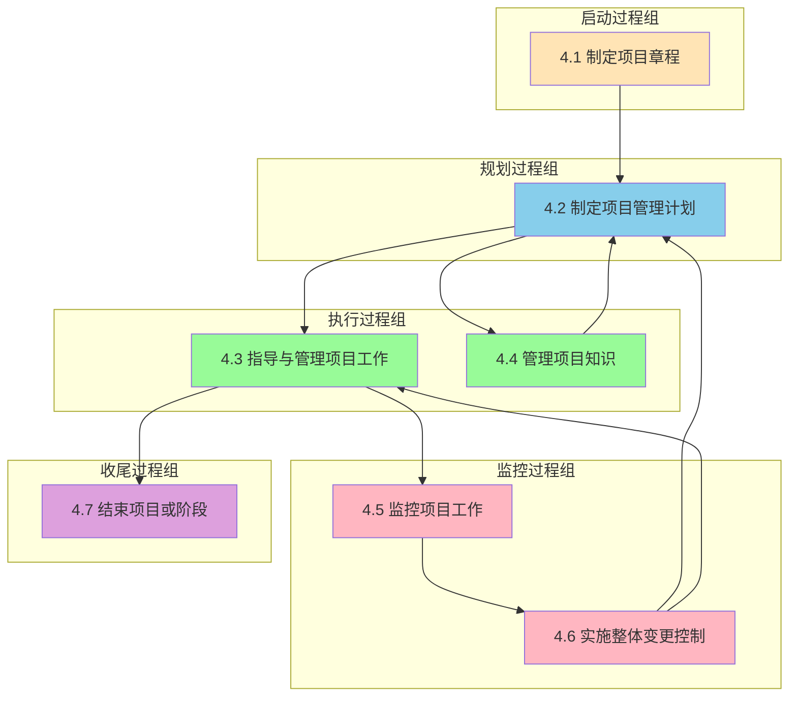
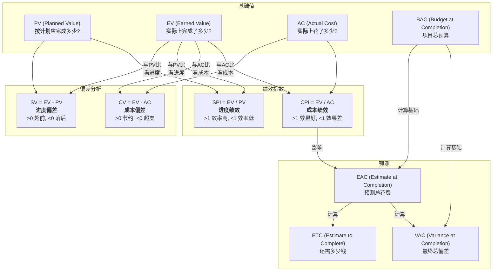
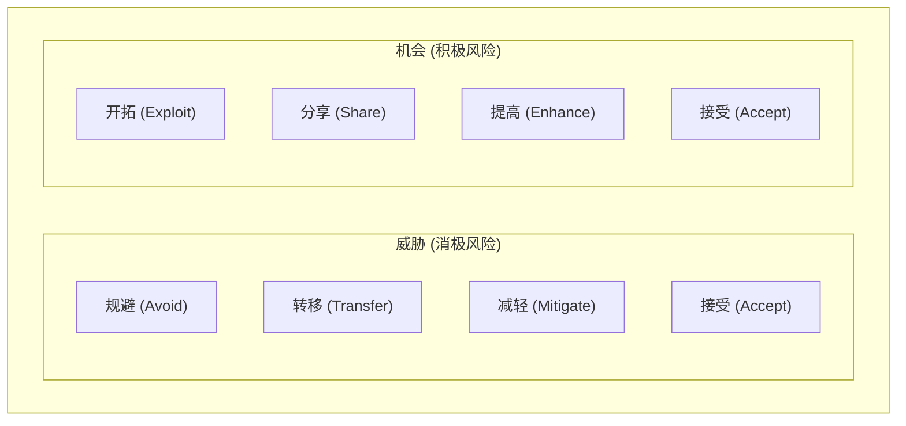

> [上一章：01-人员域核心考点精解](01-人员域核心考点精解.md) | [返回目录](../README.md) | [下一章：03-商业环境域核心考点精解](03-商业环境域核心考点精解.md)

---
# 过程域核心考点精解

> 过程域在PMP考试中占比 **50%**，是项目管理的“硬核技术”。本篇笔记将以“十大知识领域”为框架，为您系统性地梳理每个领域下最高频的“考点”，涵盖其核心流程、关键工具和技术，并融入敏捷视角。

---

## 1. 整合管理

> **“人话”解读**: 整合管理是项目经理的“主线任务”，是把所有其他知识领域的工作“粘合”在一起的胶水，确保项目从始至终协调一致。

### 1.1 项目章程
- **A. 定义**: 一份由项目发起人或类似层级人员批准发布的，**正式授权项目存在**并**授权项目经理使用组织资源**的文件。
- **B. 核心作用**: 标志着项目的“合法身份”，是项目经理的“授权委托书”。
- **C. 考试应用**: 题目中问“项目经理被任命后，首先应该做什么？”，答案通常是“参考或制定项目章程”。

### 1.2 变更控制流程
- **A. 流程**: 1. 提交变更请求 -> 2. 记录到变更日志 -> 3. 评估变更影响 -> 4. 提交给**变更控制委员会(CCB)**审批 -> 5. 批准后，更新项目计划和基准 -> 6. 通知干系人。
- **B. 核心**: **任何变更都不能由项目经理私自决定**，必须通过正式流程。CCB是正式的决策机构。
- **C. 考试应用**: 任何情景下的变更请求，正确做法都是“遵循变更控制流程”。

### 1.3 整合管理数据流图
**PMBOK6 整合管理数据流图**:


---

## 2. 范围管理

> **“人话”解读**: 确保项目“做且只做”范围以内的工作。**多做**了客户没要求的功能叫“**镀金**”；范围在失控中一点点**变多**叫“**范围蔓延**”。项目经理两手都要抓，两手都要硬。

### 2.1 收集需求
- **A. 定义**: 确定、记录并管理干系人的需求和期望的过程。这是项目成功的基石。
- **B. 主要方法**:
    - **访谈 (Interviews)**: 与干系人一对一或小组交流，深入了解需求。
    - **焦点小组 (Focus Groups)**: 召集预定的干系人和主题专家，讨论产品、服务或成果的期望。
    - **引导式研讨会 (Facilitated Workshops)**: 召集关键干系人，通过结构化会议快速定义产品需求。
    - **头脑风暴 (Brainstorming)**: 团队成员自由提出想法，用于生成大量创意。
    - **问卷调查 (Questionnaires and Surveys)**: 适用于从大量干系人那里高效收集信息。
    - **标杆对照 (Benchmarking)**: 将项目或产品的实践与类似项目的实践进行比较，以识别最佳实践。
    - **原型法 (Prototyping)**: 制作产品、服务或成果的部分模型，用于获取干系人反馈。
    - **观察法 (Observation)**: 直接观察个人在工作中的行为，以了解其需求。
- **C. 考试应用**: 题目中问“如何获取干系人需求？”，答案通常是上述方法之一。

### 2.2 需求分类
- **A. 业务需求 (Business Requirements)**: 描述组织整体的高层级需求，解释“为什么”做项目。
  - *示例: 为了将市场占有率提升10%，需要开发一个新的在线销售平台。*
- **B. 相关方需求 (Stakeholder Requirements)**: 描述某个或某类相关方的需求，是从他们的视角出发的期望。
  - *示例: 市场部需要新平台能自动生成销售报表。*
- **C. 解决方案需求 (Solution Requirements)**: 描述产品的具体特性和功能，分为：
  - **功能需求**: 产品的行为，如“用户应能将商品添加到购物车”。
  - **非功能需求**: 产品的质量特征，如“网站页面加载时间不得超过2秒”。
- **D. 过渡和就绪需求 (Transition and Readiness Requirements)**: 描述项目成果上线所需要的临时性能力。
  - *示例: 需要将旧系统的用户数据迁移到新系统中；需要对员工进行新系统操作培训。*
- **E. 项目需求 (Project Requirements)**: 描述项目本身必须满足的行动或条件。
  - *示例: 项目预算不得超过100万；项目必须在6个月内完成。*
- **F. 质量需求 (Quality Requirements)**: 描述可交付成果必须满足的质量标准。
  - *示例: 产品的返修率必须低于1%。*

### 2.3 WBS (工作分解结构)
- **A. 定义**: 一种将项目总范围和可交付成果，逐层分解为更小、更易于管理的部分的**层级结构**。
- **B. 100%原则**: WBS必须包含**全部**项目工作，不多也不少。所有子项的工作之和必须等于其父项的工作。
- **C. 最低层**: WBS的最低层被称为“**工作包**”，它是可以被估算、排期和分配的基本工作单元。
- **D. WBS词典**: 对WBS中每个工作包的详细文字描述，说明了工作内容、验收标准等。

### 2.4 确认范围 vs. 控制质量
- **A. 核心区别**: “控制质量”是**对内**检查可交付成果是否**正确**（符合技术规范）；“确认范围”是**对外**与客户一起**正式验收**可交付成果，看其是否**可接受**。
- **B. 关系**: 通常先进行内部的“控制质量”，确保成果正确无误后，再提交给客户去“确认范围”。

### 2.5 范围与进度的衔接
- **A. 核心流程**: 项目管理工作流中，范围和进度两大知识领域紧密相连，遵循着清晰的先后顺序：**项目范围说明书 -> WBS -> 活动清单**。
- **B. 考点解析**:
    - **定义活动**（属于进度管理）过程，其最重要的输入就是**WBS**（范围管理的输出）。
    - WBS又是基于**项目范围说明书**创建的。
    - 因此，在被问及“定义活动”的前提条件时，需要向前追溯，找到WBS和项目范围说明书。

---

## 3. 进度管理

> **“人话”解读**: 确保项目“准时完工”。

### 3.1 关键路径法
- **A. 定义**: 关键路径是项目中**总持续时间最长**的一条路径，它决定了项目的**最短总工期**。
- **B. 总浮动时间 (Total Float)**: 活动在不延误项目完工日期的前提下可以推迟的时间。关键路径上的活动，其总浮动时间为 **零**。
- **C. 自由浮动时间 (Free Float)**: 活动在不延误任何紧后活动最早开始日期的前提下可以推迟的时间。
- **D. 关键路径法示例图**:
    ```mermaid
    graph LR
        Start((开始)) --> A["活动A<br>3天"]
        Start --> B["活动B<br>2天"]
        A --> C["活动C<br>4天"]
        B --> D["活动D<br>5天"]
        C --> E["活动E<br>2天"]
        D --> E
        E --> End((结束))
    ```
    **关键路径计算示例**:
    - **路径1**: Start → A(3) → C(4) → E(2) → End = **9天** ⭐ 关键路径
    - **路径2**: Start → B(2) → D(5) → E(2) → End = **9天** ⭐ 关键路径
- **E. 考试应用**: 
    - 任何在关键路径上的活动的延误，都会直接导致整个项目工期的延误。
    - 项目经理应重点监控关键路径上的活动。
    - 利用非关键路径上的浮动时间来优化资源分配。

### 3.2 进度压缩技术
- **A. 赶工 (Crashing)**: **增加资源**来缩短活动持续时间。例如：增加人力、使用更高效的设备。**特点：增加成本**。
- **B. 快速跟进 (Fast Tracking)**: 将原本顺序执行的活动，改为**并行执行**。例如：设计和开发同时进行。**特点：增加风险**。
- **C. 考试应用**: 当需要缩短工期时，优先考虑对关键路径上的活动使用这两种技术。当题目中出现“确保项目快速交付价值”等要求时，核心思路就是**识别关键路径**并对其进行**进度压缩**。

### 3.3 资源对进度的影响：布鲁克斯法则
- **A. 核心概念**: 向一个已经延误的项目（尤其是软件项目）增加人力，非但不能缩短工期，反而可能使其进一步延误。
- **B. 原因**:
    - **学习曲线**: 新加入的成员需要时间来熟悉项目和技术。
    - **沟通成本**: 团队人数增加，沟通路径呈指数级增长，导致协调和管理成本剧增。
    - **带教成本**: 现有核心成员需要抽出时间来培训新人，导致自身生产力下降。
- **C. 考试应用**: 当题目描述一个项目已经延误，并询问“增加资源”是否是好办法时，需要保持警惕。正确答案往往是负面的，即指出增加资源**可能**会导致情况恶化。

---

## 4. 成本管理

> **“人话”解读**: 确保项目“不超支”。

### 4.1 挣值管理 (EVM)

**核心概念关系图**:


- **A. 核心三值**:
    - **PV (计划价值)**: **“应该做多少”**。
    - **AC (实际成本)**: **“实际花多少”**。
    - **EV (挣值)**: **“实际做多少”**。
- **B. 偏差与绩效**:
    - **SV = EV - PV**: > 0 进度超前。
    - **CV = EV - AC**: > 0 成本节约。
    - **SPI = EV / PV**: > 1 进度效率高。
    - **CPI = EV / AC**: > 1 资金使用效率高。
- **C. 预测**:
    - **EAC = BAC / CPI**: 预测项目总花费。

### 4.2 成本估算技术
- **A. 参数估算 (Parametric Estimating)**
    - **定义**: 利用**历史数据**中的统计关系和其他变量（如：每平方米的建造成本）来估算当前活动的成本。
    - **核心**: 基础是可量化的**历史数据**和**统计模型**。
    - **示例**: 如果历史数据显示，建设一个数据中心的平均成本是每平方米1000元，那么一个200平方米的新数据中心，其参数估算成本就是20万元。

- **B. 三点估算 (Three-Point Estimating)**
    - **定义**: 通过考虑估算中的不确定性和风险，提高估算准确性的一种方法。它综合了三种估算值：
        - **最可能成本 (cM)**: 基于实际情况，最有可能的成本。
        - **最乐观成本 (cO)**: 一切顺利进行时的最佳成本。
        - **最悲观成本 (cP)**: 出现各种不利情况时的最差成本。
    - **公式**:
        - **三角分布**: `(cO + cM + cP) / 3`
        - **贝塔分布 (PERT)**: `(cO + 4cM + cP) / 6` (PMP考试中更常用)

### 4.3 EVM指标解读与储备分析
- **A. 指标稳定性**:
    - **完工预算 (BAC)**: 作为项目的成本**基准**，除非有正式批准的变更，否则在项目期间应保持**不变**。
    - **预测性指标 (EAC, ETC, TCPI)**: 这些指标会根据项目的实际绩效（如CPI）**动态变化**，用于持续预测项目未来的成本表现。
- **B. CPI的精确含义**:
    - CPI (成本绩效指数) = EV / AC。其最准确的解释是“**每花费1元钱，完成了价值多少钱的工作**”，它衡量的是资金的**使用效率**。
- **C. 储备分析的流程区分**:
    - **估算成本**过程：分析**应急储备**（针对“已知-未知”风险）。
    - **制定预算**过程：分析**管理储备**（针对“未知-未知”风险）。
    - **控制成本**过程：**监督**应急储备和管理储备的使用情况。

---

## 5. 质量管理

> **“人话”解读**: 确保项目产出“符合要求、客户满意”。

### 5.1 质量成本 (CoQ)
- **A. 一致性成本 (预防)**: 预防和评估缺陷的成本。
    - **预防成本**: 培训、流程优化。
    - **评估成本**: 测试、检查。
- **B. 非一致性成本 (补救)**: 缺陷导致的花费。
    - **内部失败成本**: 返工、废品。
    - **外部失败成本**: 保修、客户投诉。
- **C. 考试应用**: 
    - PMP推崇 **优先投入一致性成本**。
    - **面向X的设计 (DfX)** 旨在优化产品特定特性，可能会为了提升质量而增加预防或评估成本，因此**不一定**会降低总质量成本。

### 5.2 核心质量工具与理念

#### A. 控制图 (Control Chart)
- **定义**: 一种按时间顺序展现过程数据的图表，用于监控过程是否稳定、是否在可接受的限制范围内运行。
- **核心构成**:
    - **中心线 (CL)**: 过程的均值或中值。
    - **控制上限 (UCL)** 和 **控制下限 (LCL)**: 在过程稳定（仅受随机因素影响）时，99.73%的数据点应落在此区间内。这个区间由过程本身的数据计算得出，代表“**系统的声音**”。
    - **规格上限 (USL)** 和 **规格下限 (LSL)**: 由客户需求或合同规定，代表“**客户的声音**”。**注意：规格限不应画在控制图上**。
- **失控判据 (高频考点)**:
    - **超出控制限**: 任何一个数据点落在UCL或LCL之外。
    - **七点规则 (Rule of Seven)**: 连续 **7个** 数据点落在中心线的同一侧。这表明过程已出现非随机的、系统性的变异，即使所有点仍在控制限内，也视为**过程失控**。
- **示例图**:
    ```mermaid
    graph TD
        subgraph 控制图示例
            direction LR
            A[数据点] -- 落在 --> B((控制限内<br>但连续7点在上方))
            B -- 导致 --> C{过程失控}
            C -- 需要 --> D(立即调查原因)
        end
    ```
- **考试应用**: 遇到“七点规则”的情景，正确的做法是**立即调查原因**，而不是等到产品出现缺陷或超出规格限。通常是在不停止生产的情况下进行分析。

#### B. 质量改进工具
- **1. PDCA循环 (戴明环)**: 最基础、最核心的持续改进模型。
    - **Plan (计划)**: 识别改进机会，制定计划。
    - **Do (执行)**: 小范围试行计划。
    - **Check (检查)**: 评估试行结果，与预期目标对比。
    - **Act (行动)**: 如果成功，则将变更标准化、全面推广；如果不成功，则总结教训，开始新的循环。
- **2. 质量七工具 (7 Basic Quality Tools)**: 一套用于发现和解决质量问题的数据分析工具集。
    - **因果图 (鱼骨图)**: 用于识别问题的根本原因。
    - **流程图**: 用于展示过程步骤，分析流程瓶颈。
    - **核查表 (计数表)**: 用于系统地收集数据。
    - **帕累托图 (80/20法则)**: 用于识别造成大多数问题的少数关键原因。
    - **直方图**: 用于展示数据的频率分布。
    - **控制图**: 用于监控过程的稳定性。
    - **散点图**: 用于分析两个变量之间的关系。

#### C. 面向X的设计 (Design for X, DfX)
- **定义**: 一套技术指南，旨在设计产品时，从项目生命周期的早期阶段就考虑“X”这个特定目标，从而对最终特性进行优化。
- **“X”的含义**: X可以代表产品的任何一种特性，例如：
    - **可靠性 (Reliability)**
    - **可制造性 (Manufacturability)**
    - **可装配性 (Assembly)**
    - **可测试性 (Testability)**
    - **安全性 (Safety)**
- **核心目标**: 提升产品质量、提高客户满意度、或优化特定性能。
- **与成本的关系**: DfX**不以降低成本为直接目标**。例如，为了提高可靠性，可能会选用更昂贵的组件，这会增加**一致性成本**（预防成本），从而可能导致总质量成本上升。

#### D. 结构化问题解决方法
- **定义**: 一种系统化的、逻辑严谨的流程，用于确保问题得到根本性的解决。
- **核心步骤 (高频考点)**:
    1.  **定义问题**: 清晰、准确地描述问题是什么。
    2.  **分析根本原因**: 使用因果图等工具，找到导致问题的根本原因，而不仅仅是表面现象。
    3.  **生成可能的解决方案**: 针对根本原因，通过头脑风暴等方法提出多种解决方案。
    4.  **选择最佳解决方案**: 评估各种方案的可行性、成本和效益，选择最优方案。
    5.  **执行解决方案**: 将选定的方案付诸实施。
    6.  **验证解决方案的有效性**: 检查实施后的结果，确认问题是否已被真正解决，并达到预期效果。这是流程的**闭环**，至关重要。

---

## 6. 风险管理

> **“人话”解读**: 识别、分析和应对项目中的“不确定性”。

### 6.1 风险应对策略

**风险应对策略矩阵**:

- **A. 应对威胁**:
    - **规避**: 消除威胁。
    - **转移**: 转移给第三方 (如买保险)。
    - **减轻**: 降低概率或影响。
    - **接受**: 接受风险。
- **B. 应对机会**:
    - **开拓**: 确保机会100%发生。
    - **分享**: 与第三方共享。
    - **提高**: 提升概率或影响。
    - **接受**: 顺其自然。

---

## 7. 采购管理

> **“人话”解读**: 管理好项目中的“买买买”。

### 7.1 合同类型
- **A. 总价合同**: 价格固定，**风险在卖方**。
- **B. 成本补偿合同**: 实报实销+利润，**风险在买方**。
- **C. 工料合同**: 按单价付费，**风险共担**。

---

## 8. 应试技巧

### 8.1 核心记忆口诀
- **EVM**: "挣值是核心, 与AC比成本, 与PV比进度"。
- **进度压缩**: "有钱赶工, 没钱快跟"。
- **风险应对**: 威胁: **避转减接**; 机会: **开共提接**。
- **冲突解决**: **合作 > 妥协 > 包容 > 撤退 > 强迫**。

### 8.2 高频考点提醒
- **变更**: 必须走CCB流程。
- **项目启动后**: 先看项目章程。
- **发现问题**: 先记录到问题日志。

---
> [上一章：01-人员域核心考点精解](01-人员域核心考点精解.md) | [返回目录](../README.md) | [下一章：03-商业环境域核心考点精解](03-商业环境域核心考点精解.md)