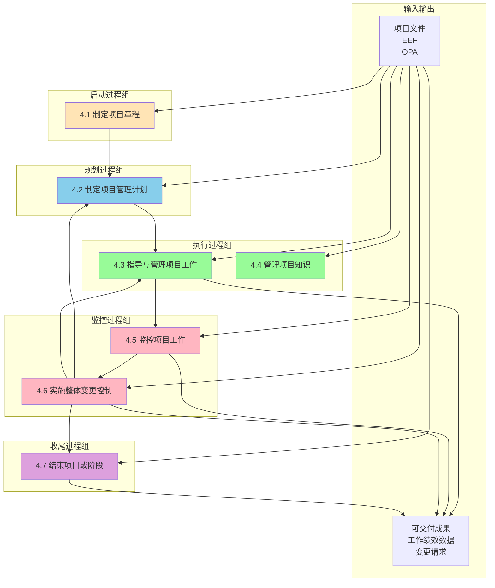

> [上一章：01-人员域核心考点精解](01-人员域核心考点精解.md) | [返回目录](../README.md) | [下一章：03-商业环境域核心考点精解](03-商业环境域核心考点精解.md)

---
# 02-过程域核心考点精解

> 过程域在PMP考试中占比 **50%**，是项目管理的“硬核技术”。本篇笔记将以“十大知识领域”为框架，为您系统性地梳理每个领域下最高频的“考点”，涵盖其核心流程、关键工具和技术，并融入敏捷视角。

---

## 1. 整合管理 (Integration Management)
> **“人话”解读**: 整合管理是项目经理的“主线任务”，是把所有其他知识领域的工作“粘合”在一起的胶水，确保项目从始至终协调一致。

- **考点：项目章程 (Project Charter)**
    - **A. 定义**: 一份由项目发起人或类似层级人员批准发布的，**正式授权项目存在**并**授权项目经理使用组织资源**的文件。
    - **B. 核心作用**: 标志着项目的“合法身份”，是项目经理的“授权委托书”。
    - **C. 考试应用**: 题目中问“项目经理被任命后，首先应该做什么？”，答案通常是“参考或制定项目章程”。

- **考点：变更控制流程 (Change Control Flow)**
    - **A. 流程**: 1. 提交变更请求 -> 2. 记录到变更日志 -> 3. 评估变更影响 -> 4. 提交给**变更控制委员会(CCB)**审批 -> 5. 批准后，更新项目计划和基准 -> 6. 通知干系人。
    - **B. 核心**: **任何变更都不能由项目经理私自决定**，必须通过正式流程。CCB是正式的决策机构。
    - **C. 考试应用**: 任何情景下的变更请求，正确做法都是“遵循变更控制流程”。

### 整合管理数据流图

**PMBOK6 整合管理数据流图**:


**整合管理核心数据流**:

1. **项目章程** (4.1) → **项目管理计划** (4.2)
2. **项目管理计划** (4.2) → **指导与管理项目工作** (4.3)
3. **指导与管理项目工作** (4.3) → **监控项目工作** (4.5)
4. **监控项目工作** (4.5) → **实施整体变更控制** (4.6)
5. **实施整体变更控制** (4.6) → **更新项目管理计划** (4.2)
6. **实施整体变更控制** (4.6) → **指导与管理项目工作** (4.3)
7. **实施整体变更控制** (4.6) → **结束项目或阶段** (4.7)

**关键输入输出**:
- **输入**: 项目章程、项目管理计划、项目文件、EEF、OPA
- **输出**: 可交付成果、工作绩效数据、工作绩效信息、变更请求、项目管理计划更新

**考试要点**:
- 整合管理贯穿项目全生命周期
- 变更控制是整合管理的核心
- 所有过程都需要整合管理的协调---

## 2. 范围管理 (Scope Management)
> **“人话”解读**: 确保项目“不多做，也不少做”，不多做叫“镀金”，不少做叫“范围蔓延”。

- **考点：WBS (工作分解结构)**
    - **A. 定义**: 一种将项目总范围和可交付成果，逐层分解为更小、更易于管理的部分的**层级结构**。
    - **B. 100%原则**: WBS必须包含**全部**项目工作，不多也不少。所有子项的工作之和必须等于其父项的工作。
    - **C. 最低层**: WBS的最低层被称为“**工作包**”，它是可以被估算、排期和分配的基本工作单元。
    - **D. WBS词典**: 对WBS中每个工作包的详细文字描述，说明了工作内容、验收标准等。

### 考点：确认范围 vs. 控制质量
- **A. 核心区别**: “控制质量”是**对内**检查可交付成果是否**正确**（符合技术规范）；“确认范围”是**对外**与客户一起**正式验收**可交付成果，看其是否**可接受**。
- **B. 关系**: 通常先进行内部的“控制质量”，确保成果正确无误后，再提交给客户去“确认范围”。

---

## 3. 进度管理 (Schedule Management)
> **“人话”解读**: 确保项目“准时完工”。

- **考点：关键路径法 (Critical Path Method - CPM)**
    - **A. 定义**: 关键路径是项目中**总持续时间最长**的一条路径，它决定了项目的**最短总工期**。
    - **B. 总浮动时间 (Total Float)**: 活动在不延误项目完工日期的前提下可以推迟的时间。关键路径上的活动，其总浮动时间为 **零**。
    - **C. 自由浮动时间 (Free Float)**: 活动在不延误任何紧后活动最早开始日期的前提下可以推迟的时间。
        - **计算公式**: 自由浮动时间 = 紧后活动最早开始时间 - 本活动最早完成时间 - 1
        - **理解**: 自由浮动时间 ≤ 总浮动时间
        - **应用**: 自由浮动时间是项目经理可以"自由支配"的缓冲时间，使用它不会影响其他活动
    - **D. 关键路径法示例图**:
    
    ```mermaid
    graph LR
        Start((开始)) --> A[活动A<br/>3天]
        Start --> B[活动B<br/>2天]
        A --> C[活动C<br/>4天]
        B --> D[活动D<br/>5天]
        C --> E[活动E<br/>2天]
        D --> E
        E --> End((结束))
        
        style A fill:#FFB6C1
        style C fill:#FFB6C1
        style E fill:#FFB6C1
        style B fill:#90EE90
        style D fill:#90EE90
        
        classDef critical fill:#FFB6C1,stroke:#FF1493,stroke-width:3px
        classDef noncritical fill:#90EE90,stroke:#32CD32,stroke-width:2px
        
        class A,C,E critical
        class B,D noncritical
    ```
    
    **关键路径计算示例**:
    - **路径1** (红色): Start → A(3天) → C(4天) → E(2天) → End = **9天** ⭐ 关键路径
    - **路径2** (绿色): Start → B(2天) → D(5天) → E(2天) → End = **9天** ⭐ 关键路径
    
    **浮动时间分析**:
    - 活动A、C、E: 总浮动时间 = **0天** (在关键路径上)
    - 活动B、D: 总浮动时间 = **0天** (在关键路径上)
    - 本例中两条路径长度相同，都是关键路径
    
    - **E. 考试应用**: 
        - 任何在关键路径上的活动的延误，都会直接导致整个项目工期的延误
        - 项目经理应重点监控关键路径上的活动
        - 利用非关键路径上的浮动时间来优化资源分配

- **考点：进度压缩技术 (Schedule Compression)**
    - **A. 赶工 (Crashing)**: **增加资源**来缩短活动持续时间。例如：增加人力、使用更高效的设备。**特点：增加成本**。
    - **B. 快速跟进 (Fast Tracking)**: 将原本顺序执行的活动，改为**并行执行**。例如：设计和开发同时进行。**特点：增加风险**。
    - **C. 考试应用**: 当需要缩短工期时，优先考虑对关键路径上的活动使用这两种技术。

---

## 4. 成本管理 (Cost Management)
> **“人话”解读**: 确保项目“不超支”。

- **考点：挣值管理 (EVM - Earned Value Management)**

    **核心概念关系图**:
    ```mermaid
    graph TB
        subgraph 基础值
            PV[PV 计划价值<br/>应该完成多少钱]
            EV[EV 挣值<br/>实际完成多少钱]
            AC[AC 实际成本<br/>实际花费多少钱]
            BAC[BAC 完工预算<br/>项目总预算]
        end
        
        subgraph 偏差分析
            SV[SV = EV - PV<br/>进度偏差]
            CV[CV = EV - AC<br/>成本偏差]
        end
        
        subgraph 绩效指数
            SPI[SPI = EV / PV<br/>进度绩效指数]
            CPI[CPI = EV / AC<br/>成本绩效指数]
        end
        
        subgraph 预测指标
            EAC[EAC = BAC / CPI<br/>完工估算]
            ETC[ETC = EAC - AC<br/>完工尚需估算]
            VAC[VAC = BAC - EAC<br/>完工偏差]
            TCPI["TCPI = (BAC-EV)/(BAC-AC)<br/>完工绩效指数"]
        end
        
        EV --> SV
        PV --> SV
        EV --> CV
        AC --> CV
        
        EV --> SPI
        PV --> SPI
        EV --> CPI
        AC --> CPI
        
        BAC --> EAC
        CPI --> EAC
        EAC --> ETC
        AC --> ETC
        BAC --> VAC
        EAC --> VAC
        
        BAC --> TCPI
        EV --> TCPI
        AC --> TCPI
    ```

    - **A. 基础值**:
        - **PV (计划价值)**: 到目前为止，**计划**要完成多少钱的工作？
        - **EV (挣值)**: 到目前为止，**实际**完成了多少钱的工作？
        - **AC (实际成本)**: 到目前为止，**实际**花了多少钱？
        - **BAC (完工预算)**: 项目总预算
    - **B. 偏差分析**:
        - **进度偏差 (SV) = EV - PV**: >0 进度超前, <0 进度落后。
        - **成本偏差 (CV) = EV - AC**: >0 成本节约, <0 成本超支。
    - **C. 绩效指数**:
        - **进度绩效指数 (SPI) = EV / PV**: >1 进度超前, <1 进度落后。
        - **成本绩效指数 (CPI) = EV / AC**: >1 成本节约, <1 成本超支。
    - **D. 预测指标**:
        - **完工估算 (EAC) = BAC / CPI**: 预测项目全部完成时要花多少钱（假设未来以当前成本效率继续）
        - **完工尚需估算 (ETC) = EAC - AC**: 剩余工作还需要多少钱
        - **完工偏差 (VAC) = BAC - EAC**: 完工时预计节约或超支的金额
        - **完工绩效指数 (TCPI) = (BAC - EV) / (BAC - AC)**: 剩余工作必须达到的成本绩效指数（按BAC）
        - **完工绩效指数 (TCPI) = (BAC - EV) / (EAC - AC)**: 剩余工作必须达到的成本绩效指数（按EAC）
    - **E. TCPI详解**:
        - **含义**: 为了实现特定的管理目标（BAC或EAC），剩余资源的使用必须达到的成本绩效指数
        - **解读**: 
          - TCPI > 1：需要比当前更高效才能达成目标（困难）
          - TCPI < 1：可以比当前效率低也能达成目标（容易）
          - TCPI = 1：维持当前效率即可达成目标
        - **应用场景**: 当CPI < 1时，用TCPI判断是否还能在预算内完成
        - **考试示例**: BAC=100万，EV=40万，AC=50万
          - CPI = 40/50 = 0.8（超支）
          - TCPI = (100-40)/(100-50) = 1.2
          - 解读：剩余工作需达到1.2的成本绩效（比当前0.8高50%），才能在预算内完成，非常有挑战性

- **考点：EVM的“旅行记忆法”**
    - **场景**: 你计划中午12点开车到300公里处(PV)，但实际只到了250公里处(EV)，为此花了300元的油钱(AC)。
    - **解读**: 进度落后 (EV < PV)，成本超支 (EV < AC)。这是一趟又慢又贵的旅行！

---

## 5. 质量管理 (Quality Management)
> **“人话”解读**: 确保项目产出“符合要求、客户满意”。

- **考点：质量成本 (Cost of Quality - CoQ)**
    - **A. 一致性成本 (花钱预防)**: 为了**预防和评估**缺陷而付出的成本。
        - **预防成本**: 培训、流程优化、使用好设备。
        - **评估成本**: 测试、检查、审计。
    - **B. 非一致性成本 (出问题后花钱补救)**: 因为**内部或外部发现**缺陷而付出的成本。
        - **内部失败成本**: 返工、废品。
        - **外部失败成本**: 保修、客户投诉、品牌损失。
    - **C. 考试应用**: PMP推崇 **优先投入一致性成本（特别是预防成本）**，因为这远比处理失败的成本要低。

---

## 6. 风险管理 (Risk Management)
> **“人话”解读**: 识别、分析和应对项目中的“不确定性”。

- **考点：风险应对策略**

    **风险应对策略矩阵**:
    ```mermaid
    graph TB
        subgraph 威胁应对策略
            A1[规避 Avoid<br/>消除威胁]
            A2[转移 Transfer<br/>转给第三方]
            A3[减轻 Mitigate<br/>降低概率/影响]
            A4[接受 Accept<br/>不采取行动]
        end
        
        subgraph 机会应对策略
            O1[开拓 Exploit<br/>确保发生]
            O2[分享 Share<br/>与第三方合作]
            O3[提高 Enhance<br/>增加概率/影响]
            O4[接受 Accept<br/>不主动追求]
        end
        
        style A1 fill:#ff9999
        style A2 fill:#ffcc99
        style A3 fill:#ffff99
        style A4 fill:#cccccc
        style O1 fill:#99ff99
        style O2 fill:#99ccff
        style O3 fill:#cc99ff
        style O4 fill:#cccccc
    ```

    - **A. 应对威胁 (消极风险)**:
        - **规避 (Avoid)**: 完全消除威胁，如改变项目计划。
        - **转移 (Transfer)**: 将风险的后果和应对责任转移给第三方，如购买保险、签订外包合同。
        - **减轻 (Mitigate)**: 将风险发生的概率或影响降低到可接受的水平。
        - **接受 (Accept)**: 不采取任何行动。可以是主动接受（设立应急储备），也可以是被动接受。
    - **B. 应对机会 (积极风险)**:
        - **开拓 (Exploit)**: 确保机会百分之百发生。
        - **分享 (Share)**: 与第三方合作，共享机会带来的收益。
        - **提高 (Enhance)**: 提高机会发生的概率或影响。
        - **接受 (Accept)**: 不主动追求，但机会来了也不拒绝。

---

## 7. 采购管理 (Procurement Management)
> **“人话”解读**: 管理好项目中的“买买买”。

- **考点：合同类型**
    - **A. 总价合同 (Fixed-Price)**: 整体价格固定。**风险主要在卖方**。适用于范围非常明确的工作。
    - **B. 成本补偿合同 (Cost-Reimbursable)**: 买方向卖方支付所有实际成本，外加一笔费用（利润）。**风险主要在买方**。适用于范围不明确的工作。
    - **C. 工料合同 (Time & Material - T&M)**: 按单价（如每小时/每天）和材料量付费。是以上两者的**混合体**。

- **考点：合同类型的“饭店记忆法”**
    - **总价合同**: 去饭店点888元的固定套餐，风险由饭店（卖方）承担。
    - **成本补偿合同**: 请私厨上门做菜，所有材料和工时都报销，风险由你（买方）承担。

**真题示例**: 
采购项目结束后，为避免问题重演应采取什么措施?
A. 记录问题日志  
B. 召开问题讨论会  
C. 合同执行阶段考虑问题  
D. 进行采购审计  
**答案**: D  
**解析**: 采购审计可系统识别问题，形成经验教训，防止未来重复发生。

---

*（注：为保持核心考点的聚焦，本篇笔记对资源、沟通、干系人管理等领域的提炼已融入其他相关笔记中，如人员域和总览文件。）*

---

## 🎯 应试技巧与记忆口诀

### 核心记忆口诀

**EVM挣值管理**:
- "挣值EV是核心,与AC比成本,与PV比进度"
- EV > AC = 成本节约; EV > PV = 进度超前

**进度压缩技术**:
- "有钱赶工,没钱快速跟进"
- 赶工增加成本,快速跟进增加风险

**资源优化技术**:
- "不能延期用平滑,可以延期用平衡"
- 资源平滑(不改变关键路径),资源平衡(可能改变关键路径)

**沟通渠道计算**:
- "N×(N-1)÷2,人数越多越复杂"
- 10人团队 = 45条沟通渠道

**风险应对策略**:
- 威胁: **避转减接** (避免、转移、减轻、接受)
- 机会: **开共提接** (开拓、分享、提高、接受)

**冲突解决方法**:
- "合妥包撤强" - 合作/解决问题 > 妥协 > 包容 > 撤退 > 强迫
- PMP推崇合作解决,避免强迫和撤退

**塔克曼团队阶梯**:
- "形震规成解" - 形成→震荡→规范→成熟→解散
- 领导风格: 指令→教练→支持→授权

### 高频考点提醒

**必须走变更流程的情况**:
1. 项目范围变更
2. 项目预算变更
3. 项目进度变更
4. 质量标准变更
5. 关键资源变更

**项目经理必须做的第一件事**:
---

## ✅ 学习自检清单

完成本章学习后，请检查您是否掌握了以下核心知识点：

- [ ] 理解整合管理7个过程的顺序和关系
- [ ] 掌握项目章程的关键内容和作用
- [ ] 理解变更控制流程的完整步骤
- [ ] 掌握关键路径法的计算和应用
- [ ] 理解挣值管理各指标的含义和计算
- [ ] 掌握进度压缩技术的两种方法及区别
- [ ] 理解质量成本的分类和应用原则
- [ ] 掌握风险应对策略的分类和选择

> **学习建议**: 对于未掌握的知识点，建议回到相应章节重新学习，并结合实际项目经验进行思考。1. 项目启动后 → 查看项目章程
2. 收到变更请求 → 提交变更控制流程
3. 发现问题 → 记录到问题日志
4. 团队冲突 → 私下解决(私聊优于公聊)

**需要记录到变更日志的**:
1. 所有变更请求
2. 变更请求状态
3. 变更请求审批结果

### 考试答题技巧

**情景题万能解法**:
1. **先看问题**: 明确问的是什么
2. **再看角色**: 确定谁在做决策
3. **看选项**: 排除明显错误的
4. **用原则**: 应用PMP思维(团队、沟通、变更控制)
5. **选最佳**: 选择最符合PMP理念的

**高频正确选项特征**:
- 主动沟通、积极协调
- 遵循变更控制流程
- 关注团队建设和赋能
- 重视干系人参与
- 基于数据做决策

**高频错误选项特征**:
- 独断专行、命令控制
- 忽视变更控制流程
- 被动等待、逃避责任
- 忽视团队成员感受
- 凭感觉做决策

> **记忆小贴士**: PMP考试考查的是现代项目管理思维,强调协作、沟通、变更管理和团队赋能。任何体现这些理念的选项通常都是正确答案。

---
> [上一章：01-人员域核心考点精解](01-人员域核心考点精解.md) | [返回目录](../README.md) | [下一章：03-商业环境域核心考点精解](03-商业环境域核心考点精解.md)

