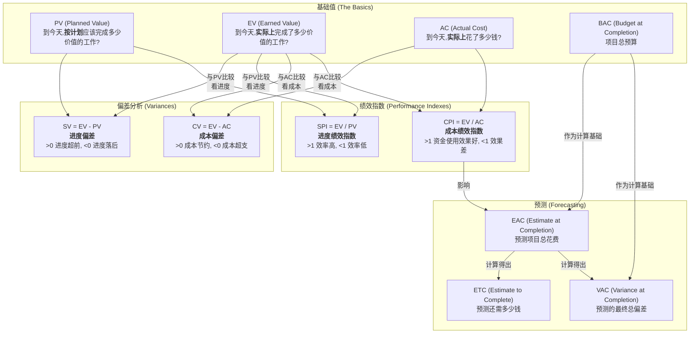
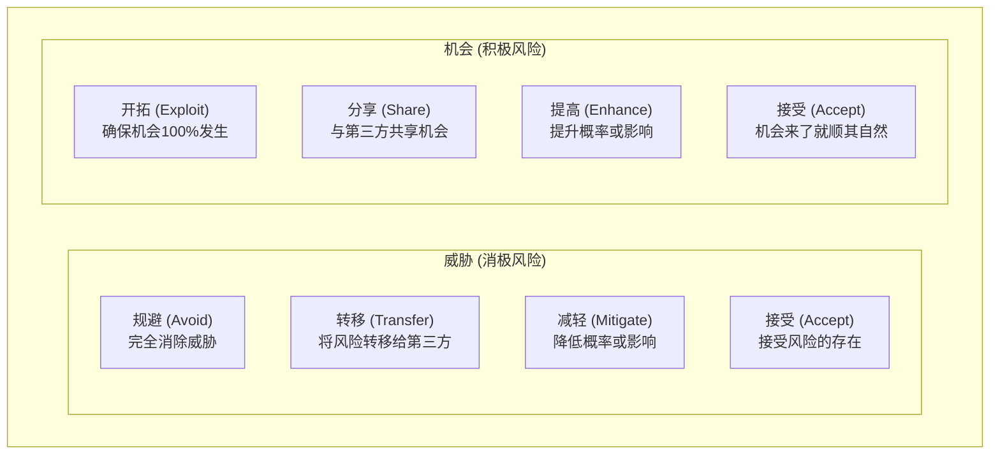

> [上一章：01-人员域核心考点精解](01-人员域核心考点精解.md) | [返回目录](../README.md) | [下一章：03-商业环境域核心考点精解](03-商业环境域核心考点精解.md)

---
# 过程域核心考点精解

> 过程域在PMP考试中占比 **50%**，是项目管理的“硬核技术”。本篇笔记将以“十大知识领域”为框架，为您系统性地梳理每个领域下最高频的“考点”，涵盖其核心流程、关键工具和技术，并融入敏捷视角。

---

## 1. 整合管理 (Integration Management)
> **“人话”解读**: 整合管理是项目经理的“主线任务”，是把所有其他知识领域的工作“粘合”在一起的胶水，确保项目从始至终协调一致。

### 1.1 考点：项目章程 (Project Charter)
- **A. 定义**: 一份由项目发起人或类似层级人员批准发布的，**正式授权项目存在**并**授权项目经理使用组织资源**的文件。
- **B. 核心作用**: 标志着项目的“合法身份”，是项目经理的“授权委托书”。
- **C. 考试应用**: 题目中问“项目经理被任命后，首先应该做什么？”，答案通常是“参考或制定项目章程”。

### 1.2 考点：变更控制流程 (Change Control Flow)
- **A. 流程**: 1. 提交变更请求 -> 2. 记录到变更日志 -> 3. 评估变更影响 -> 4. 提交给**变更控制委员会(CCB)**审批 -> 5. 批准后，更新项目计划和基准 -> 6. 通知干系人。
- **B. 核心**: **任何变更都不能由项目经理私自决定**，必须通过正式流程。CCB是正式的决策机构。
- **C. 考试应用**: 任何情景下的变更请求，正确做法都是“遵循变更控制流程”。

### 1.3 整合管理数据流图
**PMBOK6 整合管理数据流图**:


**整合管理核心数据流**:
1.  **项目章程** (4.1) → **项目管理计划** (4.2)
2.  **项目管理计划** (4.2) → **指导与管理项目工作** (4.3)
3.  **指导与管理项目工作** (4.3) → **监控项目工作** (4.5)
4.  **监控项目工作** (4.5) → **实施整体变更控制** (4.6)
5.  **实施整体变更控制** (4.6) → **更新项目管理计划** (4.2)
6.  **实施整体变更控制** (4.6) → **指导与管理项目工作** (4.3)
7.  **实施整体变更控制** (4.6) → **结束项目或阶段** (4.7)

**关键输入输出**:
-   **输入**: 项目章程、项目管理计划、项目文件、EEF、OPA
-   **输出**: 可交付成果、工作绩效数据、工作绩效信息、变更请求、项目管理计划更新

**考试要点**:
-   整合管理贯穿项目全生命周期
-   变更控制是整合管理的核心
-   所有过程都需要整合管理的协调

---

## 2. 范围管理 (Scope Management)
> **“人话”解读**: 确保项目“做且只做”范围以内的工作。**多做**了客户没要求的功能叫“**镀金**”；范围在失控中一点点**变多**叫“**范围蔓延**”。项目经理两手都要抓，两手都要硬。

### 2.1 考点：WBS (工作分解结构)
- **A. 定义**: 一种将项目总范围和可交付成果，逐层分解为更小、更易于管理的部分的**层级结构**。
- **B. 100%原则**: WBS必须包含**全部**项目工作，不多也不少。所有子项的工作之和必须等于其父项的工作。
- **C. 最低层**: WBS的最低层被称为“**工作包**”，它是可以被估算、排期和分配的基本工作单元。
- **D. WBS词典**: 对WBS中每个工作包的详细文字描述，说明了工作内容、验收标准等。

### 2.2 考点：确认范围 vs. 控制质量
- **A. 核心区别**: “控制质量”是**对内**检查可交付成果是否**正确**（符合技术规范）；“确认范围”是**对外**与客户一起**正式验收**可交付成果，看其是否**可接受**。
- **B. 关系**: 通常先进行内部的“控制质量”，确保成果正确无误后，再提交给客户去“确认范围”。

---

## 3. 进度管理 (Schedule Management)
> **“人话”解读**: 确保项目“准时完工”。

### 3.1 考点：关键路径法 (Critical Path Method - CPM)
- **A. 定义**: 关键路径是项目中**总持续时间最长**的一条路径，它决定了项目的**最短总工期**。
- **B. 总浮动时间 (Total Float)**: 活动在不延误项目完工日期的前提下可以推迟的时间。关键路径上的活动，其总浮动时间为 **零**。
- **C. 自由浮动时间 (Free Float)**: 活动在不延误任何紧后活动最早开始日期的前提下可以推迟的时间。
    - **计算公式**: 自由浮动时间 = 紧后活动最早开始时间 - 本活动最早完成时间 - 1
    - **理解**: 自由浮动时间 ≤ 总浮动时间
    - **应用**: 自由浮动时间是项目经理可以"自由支配"的缓冲时间，使用它不会影响其他活动
- **D. 关键路径法示例图**:
    
    ```mermaid
    graph LR
        Start((开始)) --> A["活动A<br>3天"]
        Start --> B["活动B<br>2天"]
        A --> C["活动C<br>4天"]
        B --> D["活动D<br>5天"]
        C --> E["活动E<br>2天"]
        D --> E
        E --> End((结束))

        linkStyle 0 stroke-width:2px,stroke:red,fill:none;
        linkStyle 1 stroke-width:2px,stroke:blue,fill:none;
        linkStyle 2 stroke-width:2px,stroke:red,fill:none;
        linkStyle 3 stroke-width:2px,stroke:blue,fill:none;
        linkStyle 4 stroke-width:2px,stroke:red,fill:none;
        linkStyle 5 stroke-width:2px,stroke:blue,fill:none;
        linkStyle 6 stroke-width:2px,stroke:red,fill:none;
    ```
    
    **关键路径计算示例**:
    - **路径1** (红色): Start → A(3天) → C(4天) → E(2天) → End = **9天** ⭐ 关键路径
    - **路径2** (蓝色): Start → B(2天) → D(5天) → E(2天) → End = **9天** ⭐ 关键路径
    
    **浮动时间分析**:
    - 由于两条路径长度相等且为最长，**所有活动都在关键路径上**。
    - 因此，本示例中所有活动（A, B, C, D, E）的**总浮动时间均为0**。
    
- **E. 考试应用**: 
    - 任何在关键路径上的活动的延误，都会直接导致整个项目工期的延误
    - 项目经理应重点监控关键路径上的活动
    - 利用非关键路径上的浮动时间来优化资源分配

### 3.2 考点：进度压缩技术 (Schedule Compression)
- **A. 赶工 (Crashing)**: **增加资源**来缩短活动持续时间。例如：增加人力、使用更高效的设备。**特点：增加成本**。
- **B. 快速跟进 (Fast Tracking)**: 将原本顺序执行的活动，改为**并行执行**。例如：设计和开发同时进行。**特点：增加风险**。
- **C. 考试应用**: 当需要缩短工期时，优先考虑对关键路径上的活动使用这两种技术。

---

## 4. 成本管理 (Cost Management)
> **“人话”解读**: 确保项目“不超支”。

### 4.1 考点：挣值管理 (EVM - Earned Value Management)

**核心概念关系图**:


- **A. 核心三值 (The 3 Core Values)**:
    - **PV (计划价值 Planned Value)**: **“应该做多少”**。截止到某个时间点，**按计划**应该完成的工作的预算价值。
    - **AC (实际成本 Actual Cost)**: **“实际花多少”**。截止到该时间点，为完成工作所**实际发生**的总成本。它与完成了多少工作无关，只看花了多少钱。
    - **EV (挣值 Earned Value)**: **“实际做多少”**。截止到该时间点，**实际完成**的工作的预算价值。它是衡量项目真实进展的标尺。

- **B. EV 与 AC 的核心区别 (关键考点)**:
    - 假设你请人粉刷一堵墙，预算(PV)是100元。
    - **场景1**: 工人干完了整堵墙(EV=100元)，但他实际只花了80元买涂料和工时(AC=80元)。这时 `EV > AC`，说明项目**成本节约**了。
    - **场景2**: 工人只刷了一半(EV=50元)，但因为买了昂贵的涂料，已经花了80元(AC=80元)。这时 `EV < AC`，说明项目**成本超支**了。
    - **结论**: AC只关心“花了多少钱”，而EV关心“这些钱换来了多少价值”，两者的比较才能看出成本绩效。

- **C. 偏差与绩效**:
    - **进度偏差 (SV) = EV - PV**: 正为超前，负为落后。
    - **成本偏差 (CV) = EV - AC**: 正为节约，负为超支。
    - **进度绩效指数 (SPI) = EV / PV**: >1代表进度快，<1代表进度慢。
    - **成本绩效指数 (CPI) = EV / AC**: >1代表资金使用效率高（省钱），<1代表效率低（超支）。

- **D. 案例详解**:
    - **背景**: 一个项目总预算(BAC)为 **1000万**，计划工期 **100天**。
    - **检查点**: 第 **50天**。
    - **实际情况**: 项目团队报告已花费(AC) **600万**，完成了全部工作的 **40%**。

    - **计算过程**:
        1.  **PV (计划价值)**: 到第50天，应该完成多少工作？
            - `PV = 总预算 * 计划完成比例 = 1000万 * (50天 / 100天) = 500万`
            - *解读: 按计划，今天应该花掉500万，完成50%的工作。*

        2.  **EV (挣值)**: 实际完成了多少价值的工作？
            - `EV = 总预算 * 实际完成比例 = 1000万 * 40% = 400万`
            - *解读: 实际上，我们只完成了相当于预算中400万价值的工作。*

        3.  **AC (实际成本)**:
            - `AC = 600万` (这是已知条件)
            - *解读: 为了完成这40%的工作，我们已经花掉了600万。*

    - **分析结论**:
        - **成本偏差 (CV)**: `CV = EV - AC = 400万 - 600万 = -200万`
            - *结论: **成本超支200万**。*
        - **进度偏差 (SV)**: `SV = EV - PV = 400万 - 500万 = -100万`
            - *结论: **进度落后**，落后了相当于100万预算的工作量。*
        - **成本绩效指数 (CPI)**: `CPI = EV / AC = 400 / 600 = 0.67`
            - *结论: 每花费1元钱，只产生0.67元的价值，资金使用**效率很低**。*
        - **进度绩效指数 (SPI)**: `SPI = EV / PV = 400 / 500 = 0.8`
            - *结论: 项目的推进速度只有计划的80%，**进度缓慢**。*

- **E. 预测指标 (Forecasting)**:
    - **完工估算 (EAC)**: 照此效率下去，项目总花费会是多少？
        - `EAC = BAC / CPI = 1000万 / 0.67 ≈ 1492万`
        - *预测: 项目最终可能要花费1492万，远超预算。*
    - **完工尚需估算 (ETC)**: 完成剩余工作还需多少钱？
        - `ETC = EAC - AC = 1492万 - 600万 = 892万`
    - **完工偏差 (VAC)**: 最终会超支多少？
        - `VAC = BAC - EAC = 1000万 - 1492万 = -492万`

### 4.2 考点：EVM的“旅行记忆法”
- **场景**: 你计划中午12点开车到300公里处(PV)，但实际只到了250公里处(EV)，为此花了300元的油钱(AC)。
- **解读**: 进度落后 (EV < PV)，成本超支 (EV < AC)。这是一趟又慢又贵的旅行！

---

## 5. 质量管理 (Quality Management)
> **“人话”解读**: 确保项目产出“符合要求、客户满意”。

### 5.1 考点：质量成本 (Cost of Quality - CoQ)
- **A. 一致性成本 (花钱预防)**: 为了**预防和评估**缺陷而付出的成本。
    - **预防成本**: 培训、流程优化、使用好设备。
    - **评估成本**: 测试、检查、审计。
- **B. 非一致性成本 (出问题后花钱补救)**: 因为**内部或外部发现**缺陷而付出的成本。
    - **内部失败成本**: 返工、废品。
    - **外部失败成本**: 保修、客户投诉、品牌损失。
- **C. 考试应用**: PMP推崇 **优先投入一致性成本（特别是预防成本）**，因为这远比处理失败的成本要低。

---

## 6. 风险管理 (Risk Management)
> **“人话”解读**: 识别、分析和应对项目中的“不确定性”。

### 6.1 考点：风险应对策略

**风险应对策略矩阵**:


- **A. 应对威胁 (消极风险)**:
    - **规避 (Avoid)**: 完全消除威胁，如改变项目计划。
    - **转移 (Transfer)**: 将风险的后果和应对责任转移给第三方，如购买保险、签订外包合同。
    - **减轻 (Mitigate)**: 将风险发生的概率或影响降低到可接受的水平。
    - **接受 (Accept)**: 不采取任何行动。可以是主动接受（设立应急储备），也可以是被动接受。
- **B. 应对机会 (积极风险)**:
    - **开拓 (Exploit)**: 确保机会百分之百发生。
    - **分享 (Share)**: 与第三方合作，共享机会带来的收益。
    - **提高 (Enhance)**: 提高机会发生的概率或影响。
    - **接受 (Accept)**: 不主动追求，但机会来了也不拒绝。

---

## 7. 采购管理 (Procurement Management)
> **“人话”解读**: 管理好项目中的“买买买”。

### 7.1 考点：合同类型
- **A. 总价合同 (Fixed-Price)**: 整体价格固定。**风险主要在卖方**。适用于范围非常明确的工作。
- **B. 成本补偿合同 (Cost-Reimbursable)**: 买方向卖方支付所有实际成本，外加一笔费用（利润）。**风险主要在买方**。适用于范围不明确的工作。
- **C. 工料合同 (Time & Material - T&M)**: 按单价（如每小时/每天）和材料量付费。是以上两者的**混合体**。

### 7.2 考点：合同类型的“饭店记忆法”
- **总价合同**: 去饭店点888元的固定套餐，风险由饭店（卖方）承担。
- **成本补偿合同**: 请私厨上门做菜，所有材料和工时都报销，风险由你（买方）承担。

**真题示例**: 
采购项目结束后，为避免问题重演应采取什么措施?
A. 记录问题日志  
B. 召开问题讨论会  
C. 合同执行阶段考虑问题  
D. 进行采购审计  
**答案**: D  
**解析**: 采购审计可系统识别问题，形成经验教训，防止未来重复发生。

---

*（注：为保持核心考点的聚焦，本篇笔记对资源、沟通、干系人管理等领域的提炼已融入其他相关笔记中，如人员域和总览文件。）*

---

## 8. 应试技巧与记忆口诀

### 8.1 核心记忆口诀

**EVM挣值管理**:
- "挣值EV是核心,与AC比成本,与PV比进度"
- EV > AC = 成本节约; EV > PV = 进度超前

**进度压缩技术**:
- "有钱赶工,没钱快速跟进"
- 赶工增加成本,快速跟进增加风险

**资源优化技术**:
- "不能延期用平滑,可以延期用平衡"
- 资源平滑(不改变关键路径),资源平衡(可能改变关键路径)

**沟通渠道计算**:
- "N×(N-1)÷2,人数越多越复杂"
- 10人团队 = 45条沟通渠道

**风险应对策略**:
- 威胁: **避转减接** (避免、转移、减轻、接受)
- 机会: **开共提接** (开拓、分享、提高、接受)

**冲突解决方法**:
- "合妥包撤强" - 合作/解决问题 > 妥协 > 包容 > 撤退 > 强迫
- PMP推崇合作解决,避免强迫和撤退

### 8.2 高频考点提醒

**必须走变更流程的情况**:
1. 项目范围变更
2. 项目预算变更
3. 项目进度变更
4. 质量标准变更
5. 关键资源变更

**项目经理必须做的第一件事**:
---

## 9. 学习自检清单

完成本章学习后，请检查您是否掌握了以下核心知识点：

- [ ] 理解整合管理7个过程的顺序和关系
- [ ] 掌握项目章程的关键内容和作用
- [ ] 理解变更控制流程的完整步骤
- [ ] 掌握关键路径法的计算和应用
- [ ] 理解挣值管理各指标的含义和计算
- [ ] 掌握进度压缩技术的两种方法及区别
- [ ] 理解质量成本的分类和应用原则
- [ ] 掌握风险应对策略的分类和选择

> **学习建议**: 对于未掌握的知识点，建议回到相应章节重新学习，并结合实际项目经验进行思考。1. 项目启动后 → 查看项目章程
2. 收到变更请求 → 提交变更控制流程
3. 发现问题 → 记录到问题日志
4. 团队冲突 → 私下解决(私聊优于公聊)

**需要记录到变更日志的**:
1. 所有变更请求
2. 变更请求状态
3. 变更请求审批结果

### 9.1 考试答题技巧

**情景题万能解法**:
1. **先看问题**: 明确问的是什么
2. **再看角色**: 确定谁在做决策
3. **看选项**: 排除明显错误的
4. **用原则**: 应用PMP思维(团队、沟通、变更控制)
5. **选最佳**: 选择最符合PMP理念的

**高频正确选项特征**:
- 主动沟通、积极协调
- 遵循变更控制流程
- 关注团队建设和赋能
- 重视干系人参与
- 基于数据做决策

**高频错误选项特征**:
- 独断专行、命令控制
- 忽视变更控制流程
- 被动等待、逃避责任
- 忽视团队成员感受
- 凭感觉做决策

> **记忆小贴士**: PMP考试考查的是现代项目管理思维,强调协作、沟通、变更管理和团队赋能。任何体现这些理念的选项通常都是正确答案。

---
> [上一章：01-人员域核心考点精解](01-人员域核心考点精解.md) | [返回目录](../README.md) | [下一章：03-商业环境域核心考点精解](03-商业环境域核心考点精解.md)

