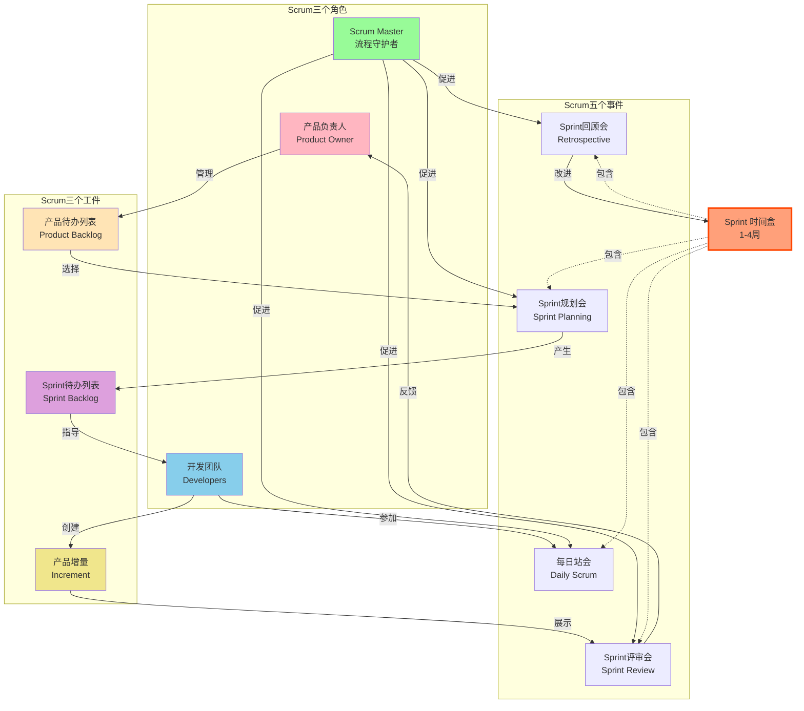

> [上一章：03-商业环境域核心考点精解](03-商业环境域核心考点精解.md) | [返回目录](../README.md) | [下一章：05-高频工具技术与模型汇总](05-高频工具技术与模型汇总.md)

---
# 敏捷与混合方法深度解析

> 在当前的PMP考试中，敏捷和混合方法的占比已超过 **50%**。不理解敏捷，就不可能通过PMP考试。本篇笔记将为您系统性地梳理敏捷的核心思想、主流框架和混合应用，并全部以“考点”形式呈现，助您掌握PMP考试的“半壁江山”。

---

## 1. 敏捷宣言

### 1.1 四大价值观
敏捷宣言是敏捷思维的基石，定义了敏捷的核心价值取向：

| 更看重 | | 次之 |
|---|---|---|
| **个体和互动** | **高于** | 流程和工具 |
| **可工作的软件** | **高于** | 详尽的文档 |
| **客户合作** | **高于** | 合同谈判 |
| **响应变化** | **高于** | 遵循计划 |

**深度解读**：

- **1. 个体和互动 > 流程和工具**
    - **含义**: 人比工具更重要。敏捷强调团队成员之间的直接沟通和协作，而不是依赖复杂的流程或工具。
    - **应用**: 面对面交谈优于邮件；团队自组织优于严格层级。
    - **常见误区**: ❌ 不是说不需要工具，而是工具应服务于人。

- **2. 可工作的软件 > 详尽的文档**
    - **含义**: 产品价值体现在可用功能上，而非厚厚的文档。
    - **应用**: 每个Sprint交付可演示的产品增量；文档以"足够"为原则。
    - **常见误区**: ❌ 不是不写文档，而是文档应简洁、必要。

- **3. 客户合作 > 合同谈判**
    - **含义**: 与客户建立伙伴关系，共同探索需求，而非通过合同条款争执。
    - **应用**: 产品负责人持续参与；频繁的Sprint评审。
    - **常见误区**: ❌ 不是不要合同，而是合同应支持协作。

- **4. 响应变化 > 遵循计划**
    - **含义**: 拥抱变化，而非僵化执行初始计划。
    - **应用**: 产品待办列表随时调整；每个Sprint重新规划。
    - **常见误区**: ❌ 不是没有计划，而是计划应动态可调。

### 1.2 十二条原则
这12条原则将4大价值观具体化，按类别分组：

- **客户价值类（原则1-3）**：
    1. 持续交付有价值的软件以满足客户
    2. 欣然面对需求变化，即使在开发后期
    3. 经常交付可工作的软件（几星期或一两个月）

- **团队协作类（原则4-6）**：
    4. 业务人员和开发人员必须相互合作
    5. 激发个体的斗志，提供所需环境和支援，辅以信任
    6. 面对面交谈是最有效的沟通方式

- **技术实践类（原则7-10）**：
    7. 可工作的软件是进度的首要度量标准
    8. 敏捷过程倡导可持续开发，维持稳定步调
    9. 坚持不懈地追求技术卓越和良好设计
    10. 以简洁为本，极力减少不必要工作量

- **持续改进类（原则11-12）**：
    11. 最好的架构、需求和设计出自自组织团队
    12. 团队定期反思如何提高成效并调整

**考试应用**: 题目中体现灵活性、沟通、交付价值和适应变化的选项，通常比强调严格流程、文档和计划的选项更优。

---

## 2. 经验过程控制

- **A. 定义**: 敏捷是基于“经验”而非“精确预测”的。它通过短周期的“尝试-反馈-调整”来应对不确定性。
- **B. 三大支柱**:
    1.  **透明 (Transparency)**: 将影响结果的重要方面显性化，让所有干系人都能看到。例如：公开的任务板、燃尽图。
    2.  **检视 (Inspection)**: 频繁地检视项目进展和产品，以尽早发现偏差。例如：每日站会、Sprint评审会。
    3.  **适应 (Adaptation)**: 当检视发现偏差时，立即进行调整。例如：在回顾会上制定改进项、调整产品待办列表。

---

## 3. Scrum框架 (3-5-3结构)

**Scrum框架全景图**:

### 3.1 3个角色
- **A. 产品负责人 (Product Owner - PO)**: **价值的化身**。唯一职责是 **最大化产品价值**。他负责创建、维护和排序 **产品待办列表 (Product Backlog)**，并对内容和优先级拥有最终决定权。
- **B. Scrum Master (SM)**: **仆人式领导** 和 **流程的守护者**。负责确保Scrum被正确执行，通过 **移除障碍**、引导会议、保护团队来为团队服务。他不是团队的管理者。
- **C. 开发团队 (Developers)**: **价值的创造者**。一个 **自组织、跨职能** 的团队，作为一个整体对交付高质量的产品增量负责。他们决定“如何”以及“完成多少”工作。

### 3.2 5个事件
- **A. Sprint**: Scrum的核心，一个不超过1个月的 **时间盒**，期间会创建一个“完成的”、可用的产品增量。
- **B. Sprint规划会 (Sprint Planning)**: 在Sprint开始时召开，规划本Sprint要完成的工作。产出 **Sprint目标** 和 **Sprint待办列表**。
- **C. 每日站会 (Daily Scrum)**: **为开发团队服务** 的15分钟短会。团队成员同步进度，规划接下来24小时的工作，识别障碍。
- **D. Sprint评审会 (Sprint Review)**: 在Sprint结束时召开，**检视产品增量**。开发团队向干系人演示工作成果，并收集反馈。这是一个关于 **产品** 的会议。
- **E. Sprint回顾会 (Sprint Retrospective)**: 在评审会后、下个Sprint开始前召开，**检视过程**。整个Scrum团队一起反思“什么做得好、什么可以改进”。这是一个关于 **流程和人** 的会议。

### 3.3 3个工件
- **A. 产品待办列表 (Product Backlog)**: 包含所有产品需求的 **唯一、动态、有序的列表**，由PO负责。
- **B. Sprint待办列表 (Sprint Backlog)**: 开发团队为当前Sprint选择要做的任务清单，以及实现Sprint目标的计划。
- **C. 产品增量 (Increment)**: Sprint中所有完成的产品待办列表项的总和，它必须符合 **完成的定义(DoD)**，并且处于 **可用状态**。

---

## 4. 看板方法

### 4.1 Kanban核心定义
- **核心思想**: 专注于可视化工作流程、优化流动效率的方法，强调平稳、持续地交付价值。
- **与Scrum区别**: Scrum是时间盒迭代（固定Sprint周期和规定的角色、事件）；Kanban是持续流动（无固定迭代周期，不规定角色和事件），更灵活。

### 4.2 Kanban六个核心实践
- **1. 可视化工作流程 (Visualize)**
    - 使用看板（Kanban Board）将工作的每一步都可视化。
    - 典型看板列：待办 → 分析 → 开发 → 测试 → 完成。
    - 每个工作项用卡片表示，在看板上移动。

- **2. 限制在制品 (Limit WIP)** - **看板的精髓**
    - 为流程中的某些或所有步骤设置可同时处理的任务数量上限。
    - **WIP越低，任务的平均完成时间（前置时间）就越短**。
    - 当某列达到WIP限制，必须先完成现有工作才能拉入新工作。
    - **目的**: 识别瓶颈，防止多任务切换。

- **3. 管理流动 (Manage Flow)**
    - 监控和优化工作项从开始到完成的流动速度。
    - 关注减少等待时间和阻塞。
    - 目标：平滑、快速、可预测的流动。

- **4. 明确流程策略 (Make Policies Explicit)**
    - 公开透明的工作规则（"完成的定义"、"何时可拉入新任务"）。
    - 让所有团队成员理解并遵循规则。

- **5. 建立反馈循环 (Feedback Loops)**
    - 定期评审会议（每日站会、补充会议、交付计划评审）。
    - 基于数据和指标讨论，及时调整。

- **6. 协作改进 (Improve Collaboratively)**
    - 使用科学方法进行持续改进。
    - 团队共同识别和实施改进措施。

### 4.3 Kanban核心指标
- **前置时间 (Lead Time)**: 从工作项进入系统到完成的总时间。
- **周期时间 (Cycle Time)**: 从开始工作到完成的时间。
- **吞吐量 (Throughput)**: 单位时间内完成的工作项数量。
- **在制品数量 (WIP)**: 当前正在进行中的工作项数量。

### 4.4 Kanban vs Scrum对比

| 维度 | Scrum | Kanban |
|------|-------|--------|
| 迭代 | 固定时间盒（Sprint） | 持续流动，无固定迭代 |
| 角色 | 明确3个角色（PO/SM/Dev） | 无强制角色要求 |
| 变更 | Sprint内不允许变更 | 可随时变更优先级 |
| 承诺 | 承诺Sprint目标 | 承诺持续交付 |
| 度量 | 速率（Velocity） | 前置/周期时间 |
| WIP限制 | 间接（Sprint容量） | 明确的WIP限制 |

**考试应用**: 
- "瓶颈"、"堆积" → 设置WIP限制
- "持续交付"、"无固定迭代" → Kanban
- "流动效率" → 管理流动

---

## 5. 敏捷估算与度量

- **A. 用户故事 (User Story)**: 一种从用户视角描述需求的简短格式：“**作为<用户角色>，我想要<功能>，以便<实现价值>**”。
- **B. 故事点 (Story Point)**: 一种相对估算单位，用于评估完成一个用户故事所需的 **工作量、复杂度和不确定性** 的总和，而不是具体的时间。
- **C. 规划扑克 (Planning Poker)**: 一种基于共识的估算技术。团队成员匿名出牌（斐波那契数列），然后讨论并最终达成对一个用户故事故事点的共识估算。
- **D. 速率 (Velocity)**: 开发团队在一个Sprint中平均能完成的故事点总数。用于 **预测未来** 的工作能力，而不是作为绩效考核工具。
- **E. 燃尽图 (Burndown Chart)**: 一种可视化图表，显示了在Sprint期间 **剩余工作量** 的变化趋势。用于跟踪进度和预测是否能按时完成Sprint目标。

---

## 6. 混合型方法

- **A. 核心思想**: “没有最好的，只有最合适的”。将 **预测型** 和 **适应型** 方法结合使用，以应对复杂的项目环境。
- **B. 常见组合**: 
    - **预测型 + 敏捷开发**: 项目的总体规划、设计和审批阶段采用预测型方法，但具体的产品开发过程采用敏捷的迭代方式进行。例如：大型建筑项目中的软件系统开发。
    - **敏捷 + 部分预测型实践**: 在一个敏捷项目中，为满足合规性或治理要求，引入一些预测型的工具，如正式的风险登记册或阶段关口评审。
- **C. 考试应用**: PMP考试非常青睐 **混合思维**。当题目描述一个复杂的、既有明确要求又有不确定性的项目时，最佳答案往往不是纯粹的预测型或纯粹的敏捷，而是两者的结合。

---

## 7. 敏捷项目管理实践

### 7.1 具有待办列表的迭代型进度计划
- **A. 定义**: 这是一种在适应型生命周期（如敏捷）中常见的进度管理方法。它不预先详细定义所有活动，而是将需求记录在待办列表（Backlog）中，并以一系列固定的迭代周期（Sprint）来逐步开发和交付。
- **B. 核心特征**:
    - **价值驱动**: 工作的优先级由待办列表中的业务价值决定。
    - **增量交付**: 在每个迭代结束时交付一个可用的产品增量。
    - **适应性**: 允许在迭代之间调整计划和优先级，以响应变化和反馈。

### 7.2 滚动式规划 (Rolling Wave Planning)
- **A. 定义**: 一种渐进明细的规划技术。近期要完成的工作会被详细规划，而远期的工作则只保持在较高层级。随着项目向前推进，工作细节会逐渐清晰和具体化。
- **B. 在敏捷中的应用**:
    - **发布规划 (Release Planning)**: 对未来几个月的发布做高层级的规划。
    - **迭代规划 (Sprint Planning)**: 对接下来一到四周的迭代做非常详细的规划。
    - **关系**: 滚动式规划是实现迭代型进度计划的**核心技术**。

### 7.3 需求实践：用户故事与待办列表
- **A. 用户故事 (User Stories)**: 在敏捷中，需求通常不写成详细的规格文档，而是以用户故事的形式来表达，简洁地描述用户、功能和价值。
- **B. 待办列表优化 (Backlog Refinement/Grooming)**:
    - **定义**: 这是一个持续性的活动，产品负责人和开发团队一起审查、估算和排序待办列表中的条目。
    - **目的**: 确保待办列表顶部的用户故事足够清晰、具体，并为下一个迭代做好了准备（Ready）。
    - **与计划的关系**: 待办列表的优先级排序和优化，直接决定了迭代型进度计划中“接下来做什么”，是价值交付顺序的根本依据。

---

> [上一章：03-商业环境域核心考点精解](03-商业环境域核心考点精解.md) | [返回目录](../README.md) | [下一章：05-高频工具技术与模型汇总](05-高频工具技术与模型汇总.md)
