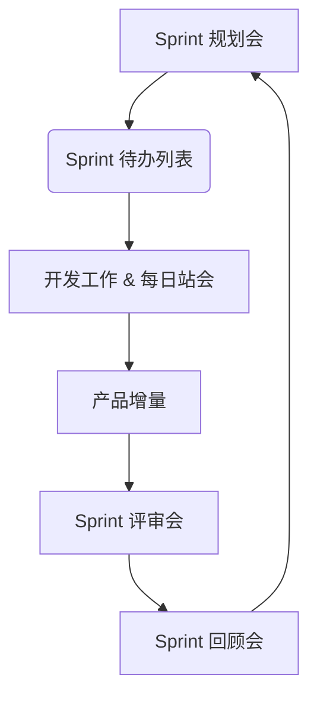

> [上一章：03-商业环境域核心考点精解](03-商业环境域核心考点精解.md) | [返回目录](../README.md) | [下一章：05-高频工具技术与模型汇总](05-高频工具技术与模型汇总.md)

---
# 04-敏捷与混合方法深度解析.md

> 在当前的PMP考试中，敏捷和混合方法的占比已超过50%。不理解敏捷，就不可能通过PMP考试。本篇笔记旨在为您系统性地梳理敏捷的核心思想、主流框架和混合应用，助您掌握PMP考试的“半壁江山”。

---

## 模块一：敏捷的核心思想 (Agile Mindset)

> 敏捷首先是一种 **思维模式**，其次才是一套方法或实践。

### 1.1 敏捷宣言 (Agile Manifesto)

- **核心内容**: 2001年发布，包含4个核心价值观。
    1.  **个体和互动** 高于 流程和工具
    2.  **工作的软件** 高于 详尽的文档
    3.  **客户合作** 高于 合同谈判
    4.  **响应变化** 高于 遵循计划
- **PMP备考策略**: 必须深刻理解“高于”的含义。它并非否定右项的价值，而是强调在面临权衡时， **优先考虑左项**。例如，当流程阻碍了团队成员的有效沟通时，应优先优化沟通，而不是死守流程。

### 1.2 敏捷十二原则 (12 Principles)

- **核心内容**: 是对敏捷宣言的具体阐述。其中最常考的原则包括：
    - **最高优先级** 是通过尽早、持续地交付有价值的软件来使客户满意。
    - **欢迎需求变更**，即使在开发后期。敏捷过程利用变化来为客户创造竞争优势。
    - **频繁地交付** 可工作的软件，从几周到几个月，倾向于更短的周期。
    - 项目的成功依赖于 **自组织的团队**。
    - **可持续的开发速度**。项目干系人应该能够长期保持稳定的节奏。
    - 定期地，团队要反思如何能变得更加高效，并相应地调整自己的行为（**回顾与改进**）。

### 1.3 经验过程控制 (Empirical Process Control)

- **核心内容**: 敏捷是基于“经验”而非“精确预测”的。它依赖于三个支柱：
    1.  **透明 (Transparency)**: 将影响结果的重要方面显性化，让所有干系人都能看到，如任务板、燃尽图。
    2.  **检视 (Inspection)**: 频繁地检视项目进展和产品，以尽早发现偏差，如每日站会、Sprint评审会。
    3.  **适应 (Adaptation)**: 当检视发现偏差时，立即进行调整，如在回顾会上制定改进项、在规划会上调整计划。

---

## 模块二：Scrum 框架 (The Scrum Framework)

> Scrum是当前最流行的敏捷框架，是一个 **轻量级** 的框架，旨在帮助团队应对复杂问题并交付最高价值的产品。其结构为 **3-5-3**。

### 2.1 三个角色 (3 Roles)

- **产品负责人 (Product Owner - PO)**: **价值的化身**。
    - **唯一职责**: 最大化产品的价值。
    - **核心工作**: 负责 **创建、维护和排序产品待办列表 (Product Backlog)**。他是该列表的唯一负责人。
    - **考试要点**: PO是连接开发团队和业务干系人的桥梁，他决定“做什么”，但不干涉“怎么做”。
- **Scrum Master (SM)**: **仆人式领导和流程的守护者**。
    - **职责**: 确保Scrum被正确理解和执行。他通过 **移除障碍、引导会议、保护团队** 来为团队服务。
    - **考试要点**: SM不是团队的管理者，他不分配任务，也不对产品成败负责。他是一个 **教练** 和 **引导者**。
- **开发团队 (Developers)**: **价值的创造者**。
    - **特征**: **自组织、跨职能**。团队作为一个整体对交付高质量的产品增量负责。
    - **考试要点**: 团队决定“怎么做”以及在一个Sprint中能完成“多少工作”。

### 2.2 五个事件 (5 Events) - 均为时间盒

1.  **Sprint**: Scrum的核心，一个不超过1个月的时间盒，期间会创建一个“完成的”、可用的产品增量。
2.  **Sprint规划会 (Sprint Planning)**: 在Sprint开始时召开，规划本Sprint要完成的工作。产出 **Sprint目标** 和 **Sprint待办列表**。
3.  **每日站会 (Daily Scrum)**: **为开发团队服务** 的15分钟短会。团队成员同步进度，规划接下来24小时的工作，识别障碍。SM确保会议召开，但会议主角是开发团队。
4.  **Sprint评审会 (Sprint Review)**: 在Sprint结束时召开，**检视产品增量**。开发团队向干系人演示工作成果，并收集反馈。这是一个非正式的会议，不是状态报告会。
5.  **Sprint回顾会 (Sprint Retrospective)**: **检视过程**。在评审会后、下个Sprint开始前召开。整个Scrum团队（PO, SM, Developers）一起反思“什么做得好、什么可以改进、下个Sprint要尝试什么”。

### 2.3 三个工件 (3 Artifacts)

1.  **产品待办列表 (Product Backlog)**: 包含所有产品需求的 **唯一、动态、有序的列表**。
2.  **Sprint待办列表 (Sprint Backlog)**: 由 **Sprint目标** 和为实现目标而选出的 **产品待办列表项**，以及交付增量的 **可行计划** 构成。是开发团队的实时工作计划。
3.  **产品增量 (Increment)**: Sprint中所有完成的产品待办列表项的总和，它必须符合 **完成的定义(DoD)**，并且处于 **可用状态**。

---

## 模块三：看板方法 (Kanban Method)

> 看板是一个专注于 **可视化工作流程、限制在制品(WIP)、优化流动效率** 的方法。

- **核心实践**:
    - **可视化工作流**: 使用看板（Kanban Board）将工作的每一步（如“待办”、“开发中”、“测试中”、“已完成”）都可视化出来。
    - **限制在制品 (Limit WIP)**: **看板的精髓**。为流程中的某些或所有步骤设置一个可以同时处理的任务数量上限。**WIP越低，任务的平均完成时间（前置时间）就越短，流动效率越高**。
    - **管理流动**: 监控、度量和报告工作流经每个状态的情况，识别瓶颈并加以改进。
    - **累计流量图 (CFD)**: 是看板中重要的度量工具，可以显示不同状态下的任务数量、WIP、前置时间等。
- **与Scrum的对比**:
    - **节奏**: Scrum是 **时间盒迭代** (如2周一个Sprint)，看板是 **持续流动**。
    - **角色**: Scrum有明确的3个角色，看板没有规定角色。
    - **变更**: Scrum中，Sprint一旦开始，范围不应有大的变更；看板则允许在任何时候引入新任务，只要WIP允许。

| 对比维度 | Scrum | Kanban |
| :--- | :--- | :--- |
| **核心理念** | 基于 **时间盒迭代** 交付价值 | 基于 **持续流动** 交付价值 |
| **节奏** | 固定的Sprint周期 (如2-4周) | 持续流，无固定迭代周期 |
| **角色** | 规定3个角色 (PO, SM, 开发团队) | 不规定角色，可沿用现有角色 |
| **关键指标** | 速率 (Velocity) | 前置时间 (Lead Time), 吞吐量 (Throughput) |
| **变更处理** | Sprint期间范围保持稳定 | 可在任意时间引入新工作项 (只要WIP允许) |
| **会议** | 规定5个正式事件 | 不规定会议，鼓励按需召开 |
| **改进时机** | 主要在Sprint回顾会 | 随时可以进行 |

---

## 模块四：混合与裁剪 (Hybrid & Tailoring)

- **核心思想**: “没有最好的，只有最合适的”。PMP考试不认为敏捷是“银弹”，而是强调应根据项目环境（如需求稳定性、组织文化、风险高低）来 **裁剪 (Tailor)** 最合适的方法。
- **混合模型 (Hybrid Model)**: 将预测型和敏捷方法结合使用。常见的混合模式：
    - **预测型+敏捷开发**: 项目的总体规划、预算和高阶里程碑使用预测型方法确定，但具体的产品开发过程采用敏捷的迭代方式进行。
    - **敏捷+部分预测型实践**: 在一个敏捷项目中，引入一些预测型的工具，如为满足合规性要求而进行的正式风险评估和文档记录。
- **PMP备考策略**: 考试非常青睐 **混合思维**。当题目描述一个复杂的、既有明确要求又有不确定性的项目时，最佳答案往往不是纯粹的预测型或纯粹的敏捷，而是两者的结合。例如，“在一个大型建筑项目中，设计和审批阶段采用瀑布模型，但内部装修和软件系统开发采用Scrum”。

---
> [上一章：03-商业环境域核心考点精解](03-商业环境域核心考点精解.md) | [返回目录](../README.md) | [下一章：05-高频工具技术与模型汇总](05-高频工具技术与模型汇总.md)

