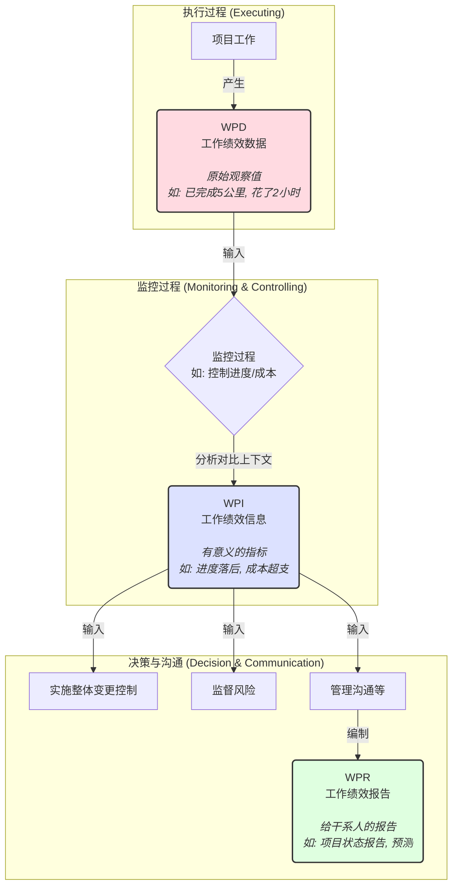

> [上一章：05-高频工具技术与模型汇总](05-高频工具技术与模型汇总.md) | [返回目录](../README.md) | [下一章：10-PMBOK6与过程组-精解](10-PMBOK6与过程组-精解.md)

---
# 06-PMP核心概念辨析与记忆技巧.md

> 告别死记硬背，让PMP学习变得有趣又有料！本笔记是您攻克PMP难点、理清易混淆概念的“秘密武器”。

---

## 模块一：易混淆概念对对碰

### 1.1 确认范围 vs. 控制质量

| 对比维度 | **控制质量 (Control Quality)** | **确认范围 (Validate Scope)** | 一句话区分 |
| :--- | :--- | :--- | :--- |
| **核心目的** | 检查产品是否 **正确** (符合技术规范) | 检查产品是否 **可接受** (满足客户需求) | **对内检查** vs. **对外验收** |
| **参与方** | **内部** 项目团队、QA | **外部** 客户、发起人 | 自己人看 vs. 给客户看 |
| **关注点** | “我们把东西做对了吗？” | “我们做了对的东西吗？” | 过程正确 vs. 结果满意 |
| **发生顺序** | 通常在“确认范围”**之前** | 通常在“控制质量”**之后** | 先自检，再送审 |

### 1.2 赶工 vs. 快速跟进

| 对比维度 | **赶工 (Crashing)** | **快速跟进 (Fast Tracking)** | 一句话区分 |
| :--- | :--- | :--- | :--- |
| **核心动作** | **增加资源**，用钱换时间 | **并行活动**，用风险换时间 | **花钱** vs. **冒险** |
| **主要影响** | **成本增加** | **风险增加** | 多花预算 vs. 多担风险 |
| **适用场景** | 关键路径上，且预算充足 | 活动可并行，且风险可控 | 有钱任性 vs. 胆大心细 |

### 1.3 资源平衡 vs. 资源平滑

| 对比维度 | **资源平衡 (Resource Leveling)** | **资源平滑 (Resource Smoothing)** | 一句话区分 |
| :--- | :--- | :--- | :--- |
| **核心目的** | 解决 **资源过载** 或稀缺的根本矛盾 | 在不改变关键路径的前提下优化资源使用 | **为了人**，可以动时间 |
| **对关键路径** | **可能改变** 关键路径，**延长** 总工期 | **绝不改变** 关键路径，不延长总工期 | **会**延长工期 vs. **不**延长工期 |
| **使用时机** | 当资源可用性是首要制约因素时 | 当总工期是首要制约因素时 | 人手是死命令 vs. 工期是死命令 |

### 1.4 事业环境因素(EEF) vs. 组织过程资产(OPA)

| 对比维度 | **事业环境因素 (EEF)** | **组织过程资产 (OPA)** | 一句话区分 |
| :--- | :--- | :--- | :--- |
| **能否控制** | 项目团队 **无法控制** | 组织 **内部拥有**，团队可更新 | **外部的**规矩 vs. **内部的**财富 |
| **来源** | 内部或外部 | 仅内部 | 天生的 vs. 自家的 |
| **例子** | 组织文化、市场情况、法律法规 | 模板、流程、经验教训知识库 | 公司氛围 vs. 公司文件 |
| **如何对待** | **必须遵守** 的“游戏规则” | **可以利用和贡献** 的“工具箱” | 适应它 vs. 使用它 |

---

## 模块二：PMP“人话”记忆法

### 2.1 挣值管理(EVM)的“旅行记忆法”

想象你正在进行一场精心计划的自驾游：

- **计划价值 (PV)**: 按计划，**中午12点** 你应该开到 **300公里** 处的服务区。
- **挣值 (EV)**: 实际到了中午12点，你只开到了 **250公里** 处。
- **实际成本 (AC)**: 为了开这250公里，你实际花了 **300元** 的油钱。

**分析一下你的旅行状态:**
- **进度偏差 (SV = EV - PV)**: `250 - 300 = -50`。负数，说明你 **进度落后** 了。
- **成本偏差 (CV = EV - AC)**: `250 - 300 = -50`。负数，说明你 **成本超支** 了 (本该花250元的油钱，却花了300元)。
- **结论**: 这是一趟又慢又贵的旅行！

### 2.2 合同类型的“饭店记忆法”

你要请客吃饭，有两种选择：

- **总价合同 (Fixed Price)**:
  - **场景**: 你去一家明码标价的饭店，点了一个 **888元的套餐**。
  - **分析**: 不管厨师用什么材料，花了多少时间，最后你都只付888元。如果菜做砸了，或者成本超了，**风险由饭店（卖方）承担**。
  - **适用**: 需求非常明确（菜单固定）。

- **成本补偿合同 (Cost Reimbursable)**:
  - **场景**: 你请一位顶级私厨来家里做菜，说：“你看着最好的买，做你拿手的，**所有材料费和你的工时费我都报销**。”
  - **分析**: 厨师（卖方）没有风险，因为所有成本都由你出。但你可能最后发现这顿饭花了8888元，**风险由你（买方）承担**。
  - **适用**: 需求不明确（想吃点好的，但具体吃啥不确定）。

---

## 模块三：核心数据流图解升级版

这张图清晰地展示了项目数据是如何从原始的“数据”演变为用于决策的“报告”，以及它们在关键监控过程中的流动关系。

---
> [上一章：05-高频工具技术与模型汇总](05-高频工具技术与模型汇总.md) | [返回目录](../README.md) | [下一章：10-PMBOK6与过程组-精解](10-PMBOK6与过程组-精解.md)
