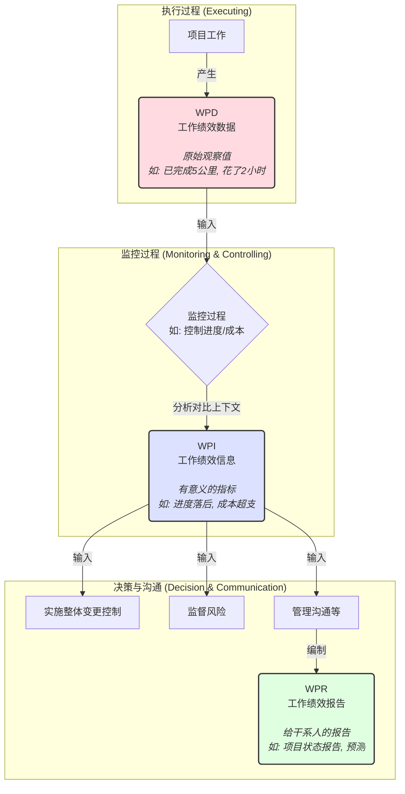

> [上一章：05-高频工具技术与模型汇总](05-高频工具技术与模型汇总.md) | [返回目录](../README.md) | [下一章：07-PMP核心文档指南](07-PMP核心文档指南.md)

---
# 06-PMP核心概念辨析与记忆技巧.md

> 告别死记硬背，让PMP学习变得有趣又有料！本笔记是您攻克PMP难点、理清易混淆概念的“秘密武器”。

---

## 模块一：易混淆概念对对碰

### 1.1 确认范围 vs. 控制质量

| 对比维度 | **控制质量 (Control Quality)** | **确认范围 (Validate Scope)** | 一句话区分 |
| :--- | :--- | :--- | :--- |
| **核心目的** | 检查产品是否 **正确** (符合技术规范) | 检查产品是否 **可接受** (满足客户需求) | **对内检查** vs. **对外验收** |
| **参与方** | **内部** 项目团队、QA | **外部** 客户、发起人 | 自己人看 vs. 给客户看 |
| **关注点** | “我们把东西做对了吗？” | “我们做了对的东西吗？” | 过程正确 vs. 结果满意 |
| **发生顺序** | 通常在“确认范围”**之前** | 通常在“控制质量”**之后** | 先自检，再送审 |

### 1.2 赶工 vs. 快速跟进

| 对比维度 | **赶工 (Crashing)** | **快速跟进 (Fast Tracking)** | 一句话区分 |
| :--- | :--- | :--- | :--- |
| **核心动作** | **增加资源**，用钱换时间 | **并行活动**，用风险换时间 | **花钱** vs. **冒险** |
| **主要影响** | **成本增加** | **风险增加** | 多花预算 vs. 多担风险 |
| **适用场景** | 关键路径上，且预算充足 | 活动可并行，且风险可控 | 有钱任性 vs. 胆大心细 |

### 1.3 资源平衡 vs. 资源平滑

| 对比维度 | **资源平衡 (Resource Leveling)** | **资源平滑 (Resource Smoothing)** | 一句话区分 |
| :--- | :--- | :--- | :--- |
| **核心目的** | 解决 **资源过载** 或稀缺的根本矛盾 | 在不改变关键路径的前提下优化资源使用 | **为了人**，可以动时间 |
| **对关键路径** | **可能改变** 关键路径，**延长** 总工期 | **绝不改变** 关键路径，不延长总工期 | **会**延长工期 vs. **不**延长工期 |
| **使用时机** | 当资源可用性是首要制约因素时 | 当总工期是首要制约因素时 | 人手是死命令 vs. 工期是死命令 |

### 1.4 事业环境因素(EEF) vs. 组织过程资产(OPA)

这两个概念是PMP考试中输入(Inputs)部分的常客，必须彻底搞懂。

#### 1.4.1 核心区别对比表

| 对比维度 | **事业环境因素 (EEF)**   Enterprise Environmental Factors | **组织过程资产 (OPA)**   Organizational Process Assets | 一句话区分 |
| :--- | :--- | :--- | :--- |
| **定义** | 项目团队 **无法控制** 的，对项目产生影响、限制或指令的条件。 | 组织 **内部拥有** 的，用于执行项目的计划、过程、政策、程序和知识库。 | **环境** vs. **资产** |
| **控制权** | **无** (只能适应) | **有** (可以裁剪、更新) | 被动接受 vs. 主动利用 |
| **来源** | 组织 **内部** 或 **外部** | 仅限组织 **内部** | 天生的/环境的 vs. 积累的/自家的 |
| **能否更新** | 项目团队 **不能** 更新 (例如不能修改法律) | 项目团队 **应当** 更新 (例如贡献经验教训) | 不可变 vs. 可增值 |
| **隐喻** | 空气、天气、地形、法律、公司制度 | 图书馆、工具箱、模板库、历史档案 | 必须面对的现实 vs. 可用的遗产 |

#### 1.4.2 详细分类与清单 (What are they?)

**A. 事业环境因素 (EEFs) - “限制与环境”**

EEF 是你必须在其中工作的“环境”，通常是你无法改变的客观条件。

*   **组织内部 EEFs**:
    *   **组织文化、结构和治理**: 愿景、价值观、等级制度、管理风格。
    *   **设施和资源的地理分布**: 虚拟团队、多地办公、工厂位置。
    *   **基础设施**: 现有设施、设备、IT硬件、可用通道。
    *   **信息技术软件**: 进度计划软件工具、配置管理系统、在线自动化系统。
    *   **资源可用性**: 合同和采购制约因素、已批准的供应商、分包商。
    *   **员工能力**: 现有员工的专业知识、技能、能力、特定知识。

*   **组织外部 EEFs**:
    *   **市场条件**: 竞争对手、市场份额、品牌认知度。
    *   **社会和文化影响**: 政治风气、行为规范、道德观念。
    *   **法律限制**: 国家或地方法律法规、安全性、数据保护。
    *   **商业数据库**: 标杆对照结果、标准化的成本估算数据、行业风险研究资料。
    *   **学术研究**: 行业研究、出版物、标杆对照结果。
    *   **政府或行业标准**: 监管机构条例、产品标准、质量标准、工艺标准。
    *   **财务考虑因素**: 货币汇率、利率、通货膨胀率、关税、地理位置。
    *   **物理环境要素**: 工作环境条件、天气、自然灾害。

**B. 组织过程资产 (OPAs) - “流程与知识”**

OPA 是组织积累下来的“财富”，你可以拿来用，用完还得给它添砖加瓦。

*   **过程、政策与程序** (通常由PMO更新，项目团队进行裁剪):
    *   **启动与规划**: 组织标准政策（如HR政策、健康安全政策）、产品和项目生命周期、**模板**（如章程、计划、登记册模板）。
    *   **执行与监控**: 变更控制程序、财务控制程序、问题与缺陷管理程序、资源分配程序。
    *   **收尾**: 项目收尾指南、移交程序。

*   **组织知识库** (项目团队在项目中会频繁更新):
    *   **经验教训知识库**: 过去项目的成败经验。
    *   **配置管理知识库**: 各种文件、代码的版本和基准。
    *   **财务数据库**: 预算、实际成本、工时记录。
    *   **历史信息与档案**: 以往所有项目的记录、文件、收尾资料。
    *   **测量指标数据库**: 过程和产品的测量数据。

#### 1.4.3 黄金判别法则 (How to distinguish?)

遇到题目区分不清时，问自己三个问题：

1.  **“它是系统/软件/环境吗？”**
    *   如果是（如PMIS系统本身、市场行情、公司文化），那是 **EEF**。
2.  **“它是模板/文件/历史记录吗？”**
    *   如果是（如风险登记册模板、过往项目档案），那是 **OPA**。
3.  **“项目结束后，我需要更新它吗？”**
    *   如果需要更新并归档（如经验教训、历史数据），它是 **OPA**。
    *   如果我无权修改，只能遵守（如政府法规、公司HR制度），它是 **EEF**。

> **特别注意**: **PMIS (项目管理信息系统)** 本身通常被视为 **EEF** (因为它是买来的软件或既定的系统环境)，但里面的 **数据记录** 和 **历史文件** 是 **OPA**。

### 1.5 管理团队 vs. 控制资源

| 对比维度 | **管理团队 (Manage Team)** | **控制资源 (Control Resources)** | 一句话区分 |
| :--- | :--- | :--- | :--- |
| **管理对象** | **人** (Human Resources) | **物** (Physical Resources) | 管人 vs. 管物 |
| **核心关注** | 团队氛围、冲突、士气、绩效评价 | 资源的使用量、分配、短缺/剩余 | 人心齐不齐 vs. 东西够不够 |
| **主要技能** | 软技能 (情商、沟通、领导力) | 硬数据分析 (绩效审查、趋势分析) | 谈心 vs. 算账 |
| **所属过程组** | **执行** 过程组 | **监控** 过程组 | 带着大家干 vs. 盯着物资看 |
| **典型产出** | 团队绩效评价、更低的离职率 | 工作绩效信息、变更请求 | 更好的团队 vs. 纠偏的计划 |

---

## 模块二：PMP“人话”记忆法

### 2.1 挣值管理(EVM)的“旅行记忆法”

想象你正在进行一场精心计划的自驾游：

- **计划价值 (PV)**: 按计划，**中午12点** 你应该开到 **300公里** 处的服务区。
- **挣值 (EV)**: 实际到了中午12点，你只开到了 **250公里** 处。
- **实际成本 (AC)**: 为了开这250公里，你实际花了 **300元** 的油钱。

**分析一下你的旅行状态:**
- **进度偏差 (SV = EV - PV)**: `250 - 300 = -50`。负数，说明你 **进度落后** 了。
- **成本偏差 (CV = EV - AC)**: `250 - 300 = -50`。负数，说明你 **成本超支** 了 (本该花250元的油钱，却花了300元)。
- **结论**: 这是一趟又慢又贵的旅行！

### 2.2 合同类型的“饭店记忆法”

你要请客吃饭，有两种选择：

- **总价合同 (Fixed Price)**:
  - **场景**: 你去一家明码标价的饭店，点了一个 **888元的套餐**。
  - **分析**: 不管厨师用什么材料，花了多少时间，最后你都只付888元。如果菜做砸了，或者成本超了，**风险由饭店（卖方）承担**。
  - **适用**: 需求非常明确（菜单固定）。

- **成本补偿合同 (Cost Reimbursable)**:
  - **场景**: 你请一位顶级私厨来家里做菜，说：“你看着最好的买，做你拿手的，**所有材料费和你的工时费我都报销**。”
  - **分析**: 厨师（卖方）没有风险，因为所有成本都由你出。但你可能最后发现这顿饭花了8888元，**风险由你（买方）承担**。
  - **适用**: 需求不明确（想吃点好的，但具体吃啥不确定）。

---

## 模块三：核心数据流图解升级版

这张图清晰地展示了项目数据是如何从原始的“数据”演变为用于决策的“报告”，以及它们在关键监控过程中的流动关系。

```mermaid
graph TD
    subgraph "执行过程 (Executing)"
        A[项目工作] --产生--> B(WPD<br>工作绩效数据<br><br><i>原始观察值<br>如: 已完成5公里, 花了2小时</i>);
    end

    subgraph "监控过程 (Monitoring & Controlling)"
        B --输入--> C{监控过程<br>如: 控制进度/成本};
        C --分析对比上下文--> D(WPI<br>工作绩效信息<br><br><i>有意义的指标<br>如: 进度落后, 成本超支</i>);
    end

    subgraph "决策与沟通 (Decision & Communication)"
        D --输入--> E[实施整体变更控制];
        D --输入--> F[监督风险];
        D --输入--> G[管理沟通等];
        G --编制--> H(WPR<br>工作绩效报告<br><br><i>给干系人的报告<br>如: 项目状态报告, 预测</i>);
    end

    style B fill:#ffdae1,stroke:#333,stroke-width:2px
    style D fill:#dce1ff,stroke:#333,stroke-width:2px
    style H fill:#dfffe0,stroke:#333,stroke-width:2px
```

---
> [上一章：05-高频工具技术与模型汇总](05-高频工具技术与模型汇总.md) | [返回目录](../README.md) | [下一章：07-PMP核心文档指南](07-PMP核心文档指南.md)
