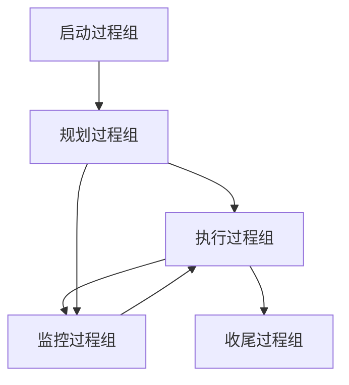
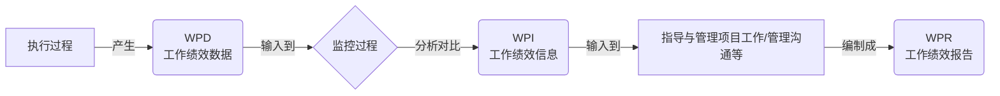

> [上一章：08-开发方法与生命周期详解](08-开发方法与生命周期详解.md) | [返回目录](../README.md) | [下一章：10-PMBOK7-精解](10-PMBOK7-精解.md)

---
# 09-PMBOK®第六版与过程组 精解

> **版本**: 4.0  
> **核心教材**: PMBOK Guide 第6版  
> **最后更新**: 2025-10-20

> 本笔记旨在为您系统性地梳理《PMBOK®指南》第六版及《过程组：实践指南》的核心知识。掌握由 **五大过程组** 和 **十大知识领域** 构成的 **49个过程** 矩阵，是理解预测型项目管理方法的基石，也是PMP考试的重要基础。

---

## 模块一：核心框架概述

PMBOK®第六版的核心是将项目管理工作看作一系列相互关联的过程的集合。

### 1.1 五大过程组 (The 5 Process Groups)

过程组是项目管理活动的逻辑分组，体现了项目从开始到结束的动态流程。

1.  **启动 (Initiating)**: 定义一个新项目或新阶段，授权其开始。
2.  **规划 (Planning)**: 明确项目范围，优化目标，并为实现目标制定行动方案。
3.  **执行 (Executing)**: 完成项目管理计划中确定的工作，以满足项目要求。
4.  **监控 (Monitoring & Controlling)**: 跟踪、审查和调整项目进展与绩效，识别并启动必要的变更。
5.  **收尾 (Closing)**: 正式完成或结束项目、阶段或合同。

### 1.2 十大知识领域 (The 10 Knowledge Areas)

知识领域是按所需知识对项目管理过程进行的划分，代表了项目经理需要掌握的专业领域。

1.  **整合管理** (Integration)
2.  **范围管理** (Scope)
3.  **进度管理** (Schedule)
4.  **成本管理** (Cost)
5.  **质量管理** (Quality)
6.  **资源管理** (Resource)
7.  **沟通管理** (Communications)
8.  **风险管理** (Risk)
9.  **采购管理** (Procurement)
10. **干系人管理** (Stakeholder)

---

## 模块二：49个过程全景矩阵

下表是PMP考纲中最重要的图表之一，它将十大知识领域与五大过程组结合在一起，构成了49个具体的过程。

| **知识领域** | **启动过程组** | **规划过程组** | **执行过程组** | **监控过程组** | **收尾过程组** |
| :--- | :--- | :--- | :--- | :--- | :--- |
| **4. 整合管理** | 4.1 制定项目章程 | 4.2 制定项目管理计划 | 4.3 指导与管理项目工作 4.4 管理项目知识 | 4.5 监控项目工作 4.6 实施整体变更控制 | 4.7 结束项目或阶段 |
| **5. 范围管理** | | 5.1-5.4 规划/收集/定义/创建WBS | | 5.5 确认范围 5.6 控制范围 | |
| **6. 进度管理** | | 6.1-6.5 规划/定义/排序/估算/制定 | | 6.6 控制进度 | |
| **7. 成本管理** | | 7.1-7.3 规划/估算/制定 | | 7.4 控制成本 | |
| **8. 质量管理** | | 8.1 规划质量管理 | 8.2 管理质量 | 8.3 控制质量 | |
| **9. 资源管理** | | 9.1-9.2 规划/估算 | 9.3 获取资源 9.4 建设团队 9.5 管理团队 | 9.6 控制资源 | |
| **10. 沟通管理** | | 10.1 规划沟通管理 | 10.2 管理沟通 | 10.3 监督沟通 | |
| **11. 风险管理** | | 11.1-11.5 规划/识别/分析(定性/定量)/规划应对 | 11.6 实施风险应对 | 11.7 监督风险 | |
| **12. 采购管理** | | 12.1 规划采购管理 | 12.2 实施采购 | 12.3 控制采购 | |
| **13. 干系人管理** | 13.1 识别干系人 | 13.2 规划干系人参与 | 13.3 管理干系人参与 | 13.4 监督干系人参与 | |

---

## 模块三：核心数据流与概念图解

### 3.1 核心数据流: WPD -> WPI -> WPR

-   **工作绩效数据 (WPD)**: 原始观察结果 (如：完成了5公里)。
-   **工作绩效信息 (WPI)**: 经过分析的绩效数据 (如：进度落后)。
-   **工作绩效报告 (WPR)**: 用于决策的报告 (如：项目状态报告)。

### 3.2 EEF vs. OPA

| 对比维度 | 事业环境因素 (EEF) | 组织过程资产 (OPA) |
| :--- | :--- | :--- |
| **核心特征** | 项目团队 **无法控制** 的 | 组织 **内部拥有** 的资产 |
| **来源** | 内部或外部 | 仅内部 |
| **项目经理** | **必须遵守** | **可以并应当更新** |

---

## 模块四：十大知识领域暨49个过程ITTOs详解

> **重要性标记**:
> - ⭐ **非常重要**: PMP考试高频考点，必须熟练掌握。
> - ✅ **比较重要**: 考试中经常出现，需要重点理解。
> - ⚪ **一般**: 理解即可，考查频率较低。

---

### 4. 项目整合管理 (Project Integration Management)

#### 4.1 制定项目章程 (Develop Project Charter)
- **输入 (Inputs)**
    - 商业文件 (Business Documents) ⭐
        - 商业论证 (Business Case)
        - 效益管理计划 (Benefits Management Plan)
    - 协议 (Agreements) ✅
    - 事业环境因素 (EEFs) ⚪
    - 组织过程资产 (OPAs) ⚪
- **工具与技术 (Tools & Techniques)**
    - 专家判断 (Expert Judgment) ⭐
    - 数据收集 (Data Gathering) ✅
        - 头脑风暴 (Brainstorming)
        - 焦点小组 (Focus Groups)
        - 访谈 (Interviews)
    - 人际与团队技能 (Interpersonal and Team Skills) ✅
        - 冲突管理 (Conflict Management)
        - 引导 (Facilitation)
        - 会议管理 (Meeting Management)
    - 会议 (Meetings) ✅
- **输出 (Outputs)**
    - **项目章程 (Project Charter)** ⭐⭐⭐
    - 假设日志 (Assumption Log) ✅

#### 4.2 制定项目管理计划 (Develop Project Management Plan)
- **输入 (Inputs)**
    - 项目章程 (Project Charter) ⭐
    - 其他过程的输出 (Outputs from other processes) ⭐ (所有子计划和基准)
    - 事业环境因素 (EEFs) ⚪
    - 组织过程资产 (OPAs) ⚪
- **工具与技术 (Tools & Techniques)**
    - 专家判断 (Expert Judgment) ✅
    - 数据收集 (Data Gathering) (核对单) ⚪
    - 人际与团队技能 (Interpersonal and Team Skills) ⚪
    - 会议 (Meetings) ✅
- **输出 (Outputs)**
    - **项目管理计划 (Project Management Plan)** ⭐⭐⭐

#### 4.3 指导与管理项目工作 (Direct and Manage Project Work)
- **输入 (Inputs)**
    - 项目管理计划 (Project Management Plan) ⭐
    - 项目文件 (Project Documents) (变更日志, 经验教训登记册) ✅
    - **批准的变更请求 (Approved Change Requests)** ⭐
    - 事业环境因素 (EEFs) ⚪
    - 组织过程资产 (OPAs) ⚪
- **工具与技术 (Tools & Techniques)**
    - 专家判断 (Expert Judgment) ⚪
    - 项目管理信息系统 (PMIS) ✅
    - 会议 (Meetings) ⚪
- **输出 (Outputs)**
    - **可交付成果 (Deliverables)** ⭐⭐⭐
    - **工作绩效数据 (Work Performance Data - WPD)** ⭐⭐
    - 问题日志 (Issue Log) ✅
    - 变更请求 (Change Requests) ✅
    - 项目管理计划/文件更新 ⚪

#### 4.4 管理项目知识 (Manage Project Knowledge)
- **输入 (Inputs)**
    - 项目管理计划 (Project Management Plan) ⚪
    - 项目文件 (Project Documents) ⚪
    - 可交付成果 (Deliverables) ⚪
    - 事业环境因素 (EEFs) ⚪
    - 组织过程资产 (OPAs) ✅
- **工具与技术 (Tools & Techniques)**
    - 专家判断 (Expert Judgment) ⚪
    - 知识管理 (Knowledge Management) ✅
    - 信息管理 (Information Management) ⚪
    - 人际与团队技能 (Interpersonal and Team Skills) ✅
- **输出 (Outputs)**
    - **经验教训登记册 (Lessons Learned Register)** ⭐⭐
    - 项目管理计划更新 ⚪
    - 组织过程资产更新 (OPAs Updates) ✅

#### 4.5 监控项目工作 (Monitor and Control Project Work)
- **输入 (Inputs)**
    - 项目管理计划 (Project Management Plan) ⭐
    - 项目文件 (Project Documents) ✅
    - **工作绩效信息 (Work Performance Information - WPI)** ⭐⭐
    - 协议 (Agreements) ⚪
    - 事业环境因素 (EEFs) ⚪
    - 组织过程资产 (OPAs) ⚪
- **工具与技术 (Tools & Techniques)**
    - 专家判断 (Expert Judgment) ⚪
    - 数据分析 (Data Analysis) ⭐
        - 挣值分析 (Earned Value Analysis)
        - 偏差分析 (Variance Analysis)
        - 趋势分析 (Trend Analysis)
    - 决策 (Decision Making) ⚪
    - 会议 (Meetings) ✅
- **输出 (Outputs)**
    - **工作绩效报告 (Work Performance Reports - WPR)** ⭐⭐
    - **变更请求 (Change Requests)** ⭐
    - 项目管理计划/文件更新 ⚪

#### 4.6 实施整体变更控制 (Perform Integrated Change Control)
- **输入 (Inputs)**
    - 项目管理计划 (Project Management Plan) (变更管理计划) ⭐
    - 项目文件 (Project Documents) (变更日志) ✅
    - **工作绩效报告 (Work Performance Reports - WPR)** ⭐
    - **变更请求 (Change Requests)** ⭐⭐⭐
    - 事业环境因素 (EEFs) ⚪
    - 组织过程资产 (OPAs) ⚪
- **工具与技术 (Tools & Techniques)**
    - 专家判断 (Expert Judgment) ✅
    - 变更控制工具 (Change Control Tools) ✅
    - 数据分析 (Data Analysis) ⚪
    - 决策 (Decision Making) (投票) ✅
    - 会议 (Meetings) (CCB会议) ⭐
- **输出 (Outputs)**
    - **批准的变更请求 (Approved Change Requests)** ⭐⭐
    - 项目管理计划/文件更新 (变更日志更新) ✅

#### 4.7 结束项目或阶段 (Close Project or Phase)
- **输入 (Inputs)**
    - 项目章程 (Project Charter) ✅
    - 项目管理计划 (Project Management Plan) ✅
    - 项目文件 (Project Documents) ⚪
    - **验收的可交付成果 (Accepted Deliverables)** ⭐⭐
    - 商业文件 (Business Documents) ⚪
    - 协议 (Agreements) ⚪
    - 采购文档 (Procurement Documentation) ⚪
    - 组织过程资产 (OPAs) ⚪
- **工具与技术 (Tools & Techniques)**
    - 专家判断 (Expert Judgment) ✅
    - 数据分析 (Data Analysis) ⚪
    - 会议 (Meetings) ✅
- **输出 (Outputs)**
    - **最终产品、服务或成果移交 (Final Product, Service, or Result Transition)** ⭐⭐
    - 最终报告 (Final Report) ✅
    - **组织过程资产更新 (OPAs Updates)** ⭐ (经验教训最终版)

---

### 5. 项目范围管理 (Project Scope Management)

#### 5.1 规划范围管理 (Plan Scope Management)
- **输入**: 项目章程 ⭐, 项目管理计划, EEFs, OPAs
- **工具**: 专家判断, 数据分析, 会议
- **输出**: **范围管理计划** ⭐, **需求管理计划** ⭐

#### 5.2 收集需求 (Collect Requirements)
- **输入**: 项目章程 ⭐, 项目管理计划, 项目文件, 商业文件, 协议, EEFs, OPAs
- **工具**: 专家判断, **数据收集** (头脑风暴, 访谈, 焦点小组, 问卷调查, 标杆对照) ⭐, **数据分析** (文件分析) ✅, **决策** (投票, 多标准决策分析) ✅, **数据表现** (亲和图, 思维导图) ✅, **人际与团队技能** (名义小组技术, 观察/交谈, 引导) ⭐, **原型法** ⭐, **上下文关系图** ⚪
- **输出**: **需求文件** ⭐, **需求跟踪矩阵** ⭐

#### 5.3 定义范围 (Define Scope)
- **输入**: 项目章程 ⭐, 项目管理计划 (范围管理计划), 项目文件 (需求文件), EEFs, OPAs
- **工具**: 专家判断, **数据分析** (备选方案分析) ✅, **决策** (多标准决策分析) ✅, 人际与团队技能 (引导), **产品分析** ⭐
- **输出**: **项目范围说明书 (Project Scope Statement)** ⭐⭐⭐

#### 5.4 创建WBS (Create WBS)
- **输入**: 项目管理计划 (范围管理计划), 项目文件 (项目范围说明书) ⭐, EEFs, OPAs
- **工具**: 专家判断, **分解 (Decomposition)** ⭐⭐⭐, 会议
- **输出**: **范围基准 (Scope Baseline)** ⭐⭐⭐ (包括范围说明书, WBS, WBS词典)

#### 5.5 确认范围 (Validate Scope)
- **输入**: 项目管理计划, 项目文件 (需求跟踪矩阵), **核实的可交付成果 (Verified Deliverables)** ⭐⭐, 工作绩效数据 (WPD)
- **工具**: **检查 (Inspection)** ⭐⭐, 决策 (投票)
- **输出**: **验收的可交付成果 (Accepted Deliverables)** ⭐⭐, 工作绩效信息 (WPI), 变更请求

#### 5.6 控制范围 (Control Scope)
- **输入**: 项目管理计划 (范围基准) ⭐, 项目文件, **工作绩效数据 (WPD)** ⭐, OPAs
- **工具**: **数据分析 (偏差分析, 趋势分析)** ⭐
- **输出**: 工作绩效信息 (WPI), **变更请求** ⭐, 项目管理计划/文件更新

---

### 6. 项目进度管理 (Project Schedule Management)

#### 6.1 规划进度管理
- **输入**: 项目章程, 项目管理计划, EEFs, OPAs
- **工具**: 专家判断, 数据分析, 会议
- **输出**: **进度管理计划** ⭐

#### 6.2 定义活动
- **输入**: 项目管理计划 (进度管理计划, 范围基准) ⭐, EEFs, OPAs
- **工具**: **分解** ⭐, **滚动式规划** ✅, 专家判断, 会议
- **输出**: **活动清单** ⭐, **活动属性** ✅, **里程碑清单** ✅

#### 6.3 排列活动顺序
- **输入**: 项目管理计划, 项目文件 (活动清单, 活动属性) ⭐, EEFs, OPAs
- **工具**: **紧前关系绘图法 (PDM)** ⭐, **确定和整合依赖关系** (强制性, 酌情性, 外部, 内部) ⭐, **提前量和滞后量** ✅, PMIS
- **输出**: **项目进度网络图** ⭐

#### 6.4 估算活动持续时间
- **输入**: 项目管理计划, 项目文件 (活动清单, 活动属性, 资源需求, RBS) ⭐, EEFs, OPAs
- **工具**: 专家判断, **类比估算** ✅, **参数估算** ✅, **三点估算** ⭐, **自下而上估算** ⭐, 数据分析 (备选方案分析, 储备分析), 决策, 会议
- **输出**: **持续时间估算** ⭐, **估算依据** ✅

#### 6.5 制定进度计划
- **输入**: 项目管理计划, 项目文件, 协议, EEFs, OPAs
- **工具**: **进度网络分析** ⭐, **关键路径法** ⭐⭐, **资源优化** (资源平衡, 资源平滑) ⭐, 数据分析 (假设情景分析, 模拟) ✅, **提前量和滞后量** ✅, **进度压缩** (赶工, 快速跟进) ⭐⭐, PMIS, **敏捷发布规划** ✅
- **输出**: **进度基准** ⭐⭐⭐, **项目进度计划** ⭐⭐, 进度数据, 项目日历

#### 6.6 控制进度
- **输入**: 项目管理计划 (进度基准) ⭐, 项目文件, **工作绩效数据 (WPD)** ⭐, OPAs
- **工具**: 数据分析 (挣值分析, 迭代燃尽图, 绩效审查, 趋势分析, 偏差分析, 假设情景分析) ⭐, **关键路径法** ⭐, **进度压缩** ⭐, 资源优化, PMIS
- **输出**: 工作绩效信息 (WPI), **变更请求** ⭐, 项目管理计划/文件更新

---

### 7. 项目成本管理 (Project Cost Management)

#### 7.1 规划成本管理
- **输入**: 项目章程, 项目管理计划, EEFs, OPAs
- **工具**: 专家判断, 数据分析, 会议
- **输出**: **成本管理计划** ⭐

#### 7.2 估算成本
- **输入**: 项目管理计划 (成本管理计划, 范围基准), 项目文件 (经验教训, 风险登记册) ⭐, EEFs, OPAs
- **工具**: 专家判断, **类比估算** ✅, **参数估算** ✅, **三点估算** ⭐, **自下而上估算** ⭐, 数据分析 (储备分析, 质量成本), PMIS, 决策
- **输出**: **成本估算** ⭐, **估算依据** ✅

#### 7.3 制定预算
- **输入**: 项目管理计划 (成本管理计划, 范围基准), 项目文件 (成本估算, 估算依据) ⭐, 商业文件, 协议, EEFs, OPAs
- **工具**: 专家判断, **成本汇总** ⭐, 数据分析 (储备分析) ✅, **历史信息审核** ✅, **资金限制平衡** ✅
- **输出**: **成本基准** ⭐⭐⭐, **项目资金需求** ✅

#### 7.4 控制成本
- **输入**: 项目管理计划 (成本基准) ⭐, 项目文件, **项目资金需求** ✅, **工作绩效数据 (WPD)** ⭐, OPAs
- **工具**: 专家判断, **数据分析 (挣值分析 - EVM)** ⭐⭐⭐, **完工尚需绩效指数 (TCPI)** ⭐, 偏差分析, 趋势分析, PMIS
- **输出**: 工作绩效信息 (WPI), **变更请求** ⭐, 项目管理计划/文件更新

---

### 8. 项目质量管理 (Project Quality Management)

#### 8.1 规划质量管理
- **输入**: 项目章程, 项目管理计划, 项目文件, EEFs, OPAs
- **工具**: 专家判断, **数据收集** (标杆对照) ✅, **数据分析** (成本效益分析, 质量成本) ⭐, 决策, **数据表现** (流程图, 思维导图) ✅, 测试与检查的规划
- **输出**: **质量管理计划** ⭐, **质量测量指标** ⭐

#### 8.2 管理质量
- **输入**: 项目管理计划 (质量管理计划) ⭐, 项目文件, OPAs
- **工具**: **数据收集** (核对单) ✅, **数据分析** (根本原因分析) ⭐, **决策**, **数据表现** (因果图, 流程图, 直方图, 帕累托图, 散点图) ⭐, **审计** ⭐, **面向X的设计 (DfX)** ✅, **问题解决** ⭐
- **输出**: **质量报告** ✅, **测试与评估文件** ✅, 变更请求

#### 8.3 控制质量
- **输入**: 项目管理计划, 项目文件, **批准的变更请求** ✅, **可交付成果** ⭐⭐, 工作绩效数据 (WPD), EEFs, OPAs
- **工具**: **数据收集** (核查表, 统计抽样) ✅, **检查** ⭐, **测试/产品评估** ⭐, **数据表现** (控制图, 散点图) ⭐, 会议
- **输出**: **质量控制测量结果** ✅, **核实的可交付成果** ⭐⭐, 工作绩效信息 (WPI), 变更请求

---

### 9. 项目资源管理 (Project Resource Management)

#### 9.1 规划资源管理
- **输入**: 项目章程, 项目管理计划, 项目文件, EEFs, OPAs
- **工具**: 专家判断, 数据表现 (层级图, 职责分配矩阵-RACI) ⭐, 组织理论, 会议
- **输出**: **资源管理计划** ⭐, **团队章程** ⭐

#### 9.2 估算活动资源
- **输入**: 项目管理计划, 项目文件 (活动清单, 活动属性) ⭐, EEFs, OPAs
- **工具**: 专家判断, 自下而上估算, 类比估算, 参数估算, 数据分析, PMIS, 会议
- **输出**: **资源需求** ⭐, **估算依据** ✅, **资源分解结构 (RBS)** ✅

#### 9.3 获取资源
- **输入**: 项目管理计划, 项目文件 (资源需求, 资源日历) ⭐, EEFs (集体劳资协议) ✅, OPAs
- **工具**: **决策** (多标准决策分析) ✅, 人际与团队技能 (谈判), **预分派** ✅, **虚拟团队** ✅
- **输出**: **实物资源分配单** ✅, **项目团队派工单** ⭐, **资源日历** ⭐

#### 9.4 建设团队
- **输入**: 项目管理计划, 项目文件 (团队章程, 项目团队派工单) ⭐, EEFs, OPAs
- **工具**: **集中办公** ✅, **虚拟团队** ✅, 沟通技术, **人际与团队技能** (冲突管理, 激励, 团队建设) ⭐, **认可与奖励** ⭐, **培训** ✅, 个人与团队评估
- **输出**: **团队绩效评价** ⭐

#### 9.5 管理团队
- **输入**: 项目管理计划, 项目文件 (问题日志, 团队章程, 团队绩效评价) ⭐, 工作绩效报告, OPAs
- **工具**: 人际与团队技能 (冲突管理, 决策, 情商, 领导力) ⭐⭐, PMIS
- **输出**: 变更请求, 项目管理计划/文件更新

#### 9.6 控制资源
- **输入**: 项目管理计划, 项目文件, 工作绩效数据 (WPD), 协议, OPAs
- **工具**: 数据分析, 问题解决, 人际与团队技能, PMIS
- **输出**: 工作绩效信息 (WPI), 变更请求

---

### 10. 项目沟通管理 (Project Communications Management)

#### 10.1 规划沟通管理
- **输入**: 项目章程, 项目管理计划, 项目文件 (干系人登记册) ⭐, EEFs, OPAs
- **工具**: 专家判断, **沟通需求分析** ⭐, **沟通技术** ✅, **沟通模型** ✅, **沟通方法** (推式, 拉式, 交互式) ⭐, 人际与团队技能, 数据表现, 会议
- **输出**: **沟通管理计划** ⭐

#### 10.2 管理沟通
- **输入**: 项目管理计划 (沟通管理计划) ⭐, 项目文件, **工作绩效报告 (WPR)** ⭐, EEFs, OPAs
- **工具**: **沟通技术** ✅, **沟通方法** ✅, **沟通技能** (沟通胜任力, 反馈, 非口头沟通) ⭐, PMIS, 项目报告, 人际与团队技能, 会议
- **输出**: **项目沟通** ⭐⭐

#### 10.3 监督沟通
- **输入**: 项目管理计划, 项目文件, 工作绩效数据 (WPD), EEFs, OPAs
- **工具**: 专家判断, PMIS, 数据分析, 人际与团队技能, 会议
- **输出**: 工作绩效信息 (WPI), 变更请求

---

### 11. 项目风险管理 (Project Risk Management)

#### 11.1 规划风险管理
- **输入**: 项目章程, 项目管理计划, 项目文件, EEFs, OPAs
- **工具**: 专家判断, 数据分析, 会议
- **输出**: **风险管理计划** ⭐

#### 11.2 识别风险
- **输入**: 项目管理计划, 项目文件, 协议, 采购文档, EEFs, OPAs
- **工具**: 专家判断, **数据收集** (头脑风暴, 核对单, 访谈) ⭐, **数据分析** (根本原因分析, 假设条件和制约因素分析, SWOT分析, 文件分析) ⭐, 人际与团队技能, **提示清单** ✅, 会议
- **输出**: **风险登记册 (Risk Register)** ⭐⭐, **风险报告** ✅

#### 11.3 实施定性风险分析
- **输入**: 项目管理计划, 项目文件 (风险登记册) ⭐, EEFs, OPAs
- **工具**: 专家判断, 数据收集, **数据分析** (风险数据质量评估, 风险概率和影响评估) ⭐, 人际与团队技能, **风险分类** ✅, 数据表现 (概率和影响矩阵) ⭐, 会议
- **输出**: 项目文件更新 (风险登记册更新) ⭐

#### 11.4 实施定量风险分析
- **输入**: 项目管理计划, 项目文件 (风险登记册) ⭐, EEFs, OPAs
- **工具**: 专家判断, 数据收集, 人际与团队技能, **不确定性表现方式** (概率分布) ✅, **数据分析** (模拟-蒙特卡洛分析, 敏感性分析-龙卷风图, 决策树分析, 影响图) ⭐
- **输出**: 项目文件更新 (风险报告更新) ⭐

#### 11.5 规划风险应对
- **输入**: 项目管理计划, 项目文件 (风险登记册) ⭐, EEFs, OPAs
- **工具**: 专家判断, 数据收集, 人际与团队技能, **威胁应对策略** (规避, 转移, 减轻, 接受) ⭐⭐, **机会应对策略** (开拓, 分享, 提高, 接受) ⭐⭐, **应急应对策略** ✅, **整体项目风险应对策略** ✅, 数据分析, 决策
- **输出**: 变更请求, 项目管理计划/文件更新 (风险登记册更新) ⭐

#### 11.6 实施风险应对
- **输入**: 项目管理计划, 项目文件 (风险登记册) ⭐, OPAs
- **工具**: 专家判断, 人际与团队技能, PMIS
- **输出**: 变更请求, 项目文件更新

#### 11.7 监督风险
- **输入**: 项目管理计划, 项目文件 (风险登记册) ⭐, 工作绩效数据 (WPD), 工作绩效报告 (WPR)
- **工具**: 数据分析 (技术绩效分析, 储备分析) ✅, **审计** ✅, 会议
- **输出**: 工作绩效信息 (WPI), 变更请求, 项目管理计划/文件更新

---

### 12. 项目采购管理 (Project Procurement Management)

#### 12.1 规划采购管理
- **输入**: 项目章程, 商业文件, 项目管理计划, 项目文件, EEFs, OPAs
- **工具**: 专家判断, 数据收集 (市场调研), 数据分析 (自制或外购分析) ⭐, **供方选择分析** ✅, **合同类型** (总价, 成本补偿, 工料) ⭐⭐, 会议
- **输出**: **采购管理计划** ⭐, **采购策略** ✅, **招标文件** ✅, **采购工作说明书 (SOW)** ⭐, 自制或外购决策

#### 12.2 实施采购
- **输入**: 项目管理计划, 项目文件, **卖方建议书** ✅, EEFs, OPAs
- **工具**: 专家判断, **广告** ✅, **投标人会议** ✅, 数据分析, 人际与团队技能 (谈判) ⭐
- **输出**: **选定的卖方** ⭐, **协议 (合同)** ⭐⭐, 变更请求

#### 12.3 控制采购
- **输入**: 项目管理计划, 项目文件, **协议** ⭐, **批准的变更请求** ✅, 工作绩效数据 (WPD), EEFs, OPAs
- **工具**: 专家判断, **索赔管理** ⭐, 数据分析, **检查**, **审计** ✅
- **输出**: **关闭的采购** ⭐, 工作绩效信息 (WPI), 变更请求

---

### 13. 项目相关方管理 (Project Stakeholder Management)

#### 13.1 识别相关方
- **输入**: 项目章程 ⭐, 商业文件, 项目管理计划, 项目文件, 协议, EEFs, OPAs
- **工具**: 专家判断, 数据收集, **数据分析** (相关方分析) ⭐, **数据表现** (相关方映射/表现-权力利益方格) ⭐⭐, 会议
- **输出**: **相关方登记册 (Stakeholder Register)** ⭐⭐

#### 13.2 规划相关方参与
- **输入**: 项目章程, 项目管理计划, 项目文件 (相关方登记册) ⭐, 协议, EEFs, OPAs
- **工具**: 专家判断, 数据收集, **数据分析** (假设条件和制约因素分析, 根本原因分析) ✅, 决策, **数据表现** (相关方参与度评估矩阵) ⭐⭐
- **输出**: **相关方参与计划 (Stakeholder Engagement Plan)** ⭐

#### 13.3 管理相关方参与
- **输入**: 项目管理计划 (沟通管理计划, 相关方参与计划) ⭐, 项目文件, EEFs, OPAs
- **工具**: 专家判断, **沟通技能** (反馈) ✅, **人际与团队技能** (冲突管理, 文化意识, 谈判, 政治意识) ⭐, **基本规则** ✅, 会议
- **输出**: 变更请求, 项目管理计划/文件更新

#### 13.4 监督相关方参与
- **输入**: 项目管理计划 (相关方参与计划) ⭐, 项目文件, 工作绩效数据 (WPD), EEFs, OPAs
- **工具**: 数据分析, 决策, 数据表现, **沟通技能** ✅, 人际与团队技能, 会议
- **输出**: 工作绩效信息 (WPI), 变更请求, 项目管理计划/文件更新

---
> [上一章：08-开发方法与生命周期详解](08-开发方法与生命周期详解.md) | [返回目录](../README.md) | [下一章：10-PMBOK7-精解](10-PMBOK7-精解.md)