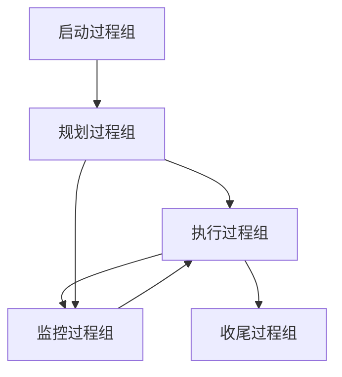
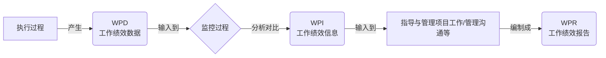

> [上一章：08-开发方法与生命周期详解](08-开发方法与生命周期详解.md) | [返回目录](../README.md) | [下一章：10-PMBOK7-精解](10-PMBOK7-精解.md)

---
# 09-PMBOK®第六版与过程组 精解 (扩充版)

> **版本**: 4.0  
> **核心教材**: PMBOK Guide 第6版  
> **最后更新**: 2025-10-20

> 本笔记旨在为您系统性地梳理《PMBOK®指南》第六版及《过程组：实践指南》的核心知识。掌握由 **五大过程组** 和 **十大知识领域** 构成的 **49个过程** 矩阵，是理解预测型项目管理方法的基石，也是PMP考试的重要基础。

---

## 模块一：核心框架概述

PMBOK®第六版的核心是将项目管理工作看作一系列相互关联的过程的集合。

### 1.1 五大过程组 (The 5 Process Groups)

过程组是项目管理活动的逻辑分组，体现了项目从开始到结束的动态流程。

1.  **启动 (Initiating)**: 定义一个新项目或新阶段，授权其开始。
2.  **规划 (Planning)**: 明确项目范围，优化目标，并为实现目标制定行动方案。
3.  **执行 (Executing)**: 完成项目管理计划中确定的工作，以满足项目要求。
4.  **监控 (Monitoring & Controlling)**: 跟踪、审查和调整项目进展与绩效，识别并启动必要的变更。
5.  **收尾 (Closing)**: 正式完成或结束项目、阶段或合同。

### 1.2 十大知识领域 (The 10 Knowledge Areas)

知识领域是按所需知识对项目管理过程进行的划分，代表了项目经理需要掌握的专业领域。

1.  **整合管理** (Integration)
2.  **范围管理** (Scope)
3.  **进度管理** (Schedule)
4.  **成本管理** (Cost)
5.  **质量管理** (Quality)
6.  **资源管理** (Resource)
7.  **沟通管理** (Communications)
8.  **风险管理** (Risk)
9.  **采购管理** (Procurement)
10. **干系人管理** (Stakeholder)

---

## 模块二：49个过程全景矩阵

下表是PMP考纲中最重要的图表之一，它将十大知识领域与五大过程组结合在一起，构成了49个具体的过程。

| **知识领域** | **启动过程组** | **规划过程组** | **执行过程组** | **监控过程组** | **收尾过程组** |
| :--- | :--- | :--- | :--- | :--- | :--- |
| **4. 整合管理** | 4.1 制定项目章程 | 4.2 制定项目管理计划 | 4.3 指导与管理项目工作 4.4 管理项目知识 | 4.5 监控项目工作 4.6 实施整体变更控制 | 4.7 结束项目或阶段 |
| **5. 范围管理** | | 5.1-5.4 规划/收集/定义/创建WBS | | 5.5 确认范围 5.6 控制范围 | |
| **6. 进度管理** | | 6.1-6.5 规划/定义/排序/估算/制定 | | 6.6 控制进度 | |
| **7. 成本管理** | | 7.1-7.3 规划/估算/制定 | | 7.4 控制成本 | |
| **8. 质量管理** | | 8.1 规划质量管理 | 8.2 管理质量 | 8.3 控制质量 | |
| **9. 资源管理** | | 9.1-9.2 规划/估算 | 9.3 获取资源 9.4 建设团队 9.5 管理团队 | 9.6 控制资源 | |
| **10. 沟通管理** | | 10.1 规划沟通管理 | 10.2 管理沟通 | 10.3 监督沟通 | |
| **11. 风险管理** | | 11.1-11.5 规划/识别/分析(定性/定量)/规划应对 | 11.6 实施风险应对 | 11.7 监督风险 | |
| **12. 采购管理** | | 12.1 规划采购管理 | 12.2 实施采购 | 12.3 控制采购 | |
| **13. 干系人管理** | 13.1 识别干系人 | 13.2 规划干系人参与 | 13.3 管理干系人参与 | 13.4 监督干系人参与 | |

---

## 模块三：核心数据流与概念图解

### 3.1 核心数据流: WPD -> WPI -> WPR

-   **工作绩效数据 (WPD)**: 原始观察结果 (如：完成了5公里)。
-   **工作绩效信息 (WPI)**: 经过分析的绩效数据 (如：进度落后)。
-   **工作绩效报告 (WPR)**: 用于决策的报告 (如：项目状态报告)。

### 3.2 EEF vs. OPA

| 对比维度 | 事业环境因素 (EEF) | 组织过程资产 (OPA) |
| :--- | :--- | :--- |
| **核心特征** | 项目团队 **无法控制** 的 | 组织 **内部拥有** 的资产 |
| **来源** | 内部或外部 | 仅内部 |
| **项目经理** | **必须遵守** | **可以并应当更新** |

---

## 模块四：十大知识领域暨49个过程详解

### 4. 整合管理 (Project Integration Management)

#### 4.1 制定项目章程 (Develop Project Charter)
- **核心作用**: 正式授权项目存在，并授权项目经理使用组织资源。
- **核心输入**: 商业文件 (商业论证) ⭐, 协议
- **核心工具**: 专家判断 ⭐, 数据收集 (头脑风暴)
- **核心输出**: **项目章程** ⭐⭐⭐, 假设日志

#### 4.2 制定项目管理计划 (Develop Project Management Plan)
- **核心作用**: 将所有子计划和基准整合为一份综合的项目管理计划。
- **核心输入**: 项目章程 ⭐, 其他过程的输出
- **核心工具**: 专家判断, 会议
- **核心输出**: **项目管理计划** ⭐⭐⭐

#### 4.3 指导与管理项目工作 (Direct and Manage Project Work)
- **核心作用**: 执行项目管理计划中的工作，生成可交付成果。
- **核心输入**: 项目管理计划 ⭐, 批准的变更请求
- **核心工具**: 项目管理信息系统 (PMIS), 会议
- **核心输出**: **可交付成果** ⭐⭐⭐, 工作绩效数据 (WPD), 问题日志, 变更请求

#### 4.4 管理项目知识 (Manage Project Knowledge)
- **核心作用**: 利用现有知识并生成新知识，以实现项目目标并促进组织学习。
- **核心输入**: 项目文件, 可交付成果
- **核心工具**: 知识管理 ⭐, 人际与团队技能
- **核心输出**: **经验教训登记册** ⭐

#### 4.5 监控项目工作 (Monitor and Control Project Work)
- **核心作用**: 跟踪、审查和报告项目总体进展，以实现项目目标。
- **核心输入**: 项目管理计划 ⭐, 工作绩效信息 (WPI)
- **核心工具**: 数据分析 (挣值分析) ⭐
- **核心输出**: **工作绩效报告 (WPR)** ⭐, 变更请求

#### 4.6 实施整体变更控制 (Perform Integrated Change Control)
- **核心作用**: 审查所有变更请求，批准变更并管理对可交付成果与项目文件的变更。
- **核心输入**: 项目管理计划, **变更请求** ⭐, 工作绩效报告
- **核心工具**: 变更控制工具, 会议 (CCB会议) ⭐
- **核心输出**: **批准的变更请求** ⭐, 项目管理计划更新

#### 4.7 结束项目或阶段 (Close Project or Phase)
- **核心作用**: 正式完成项目、阶段或合同的所有活动。
- **核心输入**: 项目章程, 项目管理计划, **验收的可交付成果** ⭐
- **核心工具**: 专家判断, 会议
- **核心输出**: **最终产品、服务或成果移交** ⭐, 最终报告, 组织过程资产更新

### 5. 范围管理 (Project Scope Management)

- **5.1 规划范围管理**: 输出：范围管理计划, 需求管理计划
- **5.2 收集需求**: 输出：需求文件, 需求跟踪矩阵
- **5.3 定义范围**: 输出：**项目范围说明书** ⭐
- **5.4 创建WBS**: 输出：**范围基准** ⭐ (范围说明书, WBS, WBS词典)
- **5.5 确认范围**: (与客户一起)正式验收可交付成果。输出：**验收的可交付成果** ⭐
- **5.6 控制范围**: 监督范围状态，管理范围基准的变更。输出：变更请求

### 6. 进度管理 (Project Schedule Management)

- **6.1 规划进度管理**: 输出：进度管理计划
- **6.2 定义活动**: 输出：活动清单, 里程碑清单
- **6.3 排列活动顺序**: 输出：项目进度网络图
- **6.4 估算活动持续时间**: 输出：持续时间估算
- **6.5 制定进度计划**: (使用关键路径法等) 输出：**进度基准** ⭐, 项目进度计划
- **6.6 控制进度**: 监督进度状态，管理进度基准的变更。输出：变更请求

### 7. 成本管理 (Project Cost Management)

- **7.1 规划成本管理**: 输出：成本管理计划
- **7.2 估算成本**: 输出：成本估算, 估算依据
- **7.3 制定预算**: (汇总成本估算) 输出：**成本基准** ⭐
- **7.4 控制成本**: (使用挣值管理) 监督成本状态，管理成本基准的变更。输出：变更请求

### 8. 质量管理 (Project Quality Management)

- **8.1 规划质量管理**: 输出：质量管理计划, 质量测量指标
- **8.2 管理质量**: (过程改进) 将质量政策转化成质量活动。输出：质量报告, 测试与评估文件
- **8.3 控制质量**: (检查产品) 检查可交付成果是否符合标准。输出：**核实的可交付成果** ⭐, 质量控制测量结果

### 9. 资源管理 (Project Resource Management)

- **9.1 规划资源管理**: 输出：资源管理计划, 团队章程
- **9.2 估算活动资源**: 输出：资源需求
- **9.3 获取资源**: 输出：实物资源分配, 项目团队派工单
- **9.4 建设团队**: (团队建设活动) 输出：团队绩效评价
- **9.5 管理团队**: (冲突管理, 领导力) 跟踪团队成员表现，提供反馈。输出：变更请求
- **9.6 控制资源**: 确保实物资源按计划可用。输出：变更请求

### 10. 沟通管理 (Project Communications Management)

- **10.1 规划沟通管理**: 输出：沟通管理计划
- **10.2 管理沟通**: 确保项目信息及时且恰当地分发。输出：**项目沟通** ⭐
- **10.3 监督沟通**: 监督沟通效果是否满足干系人需求。

### 11. 风险管理 (Project Risk Management)

- **11.1 规划风险管理**: 输出：风险管理计划
- **11.2 识别风险**: 输出：**风险登记册** ⭐, 风险报告
- **11.3 实施定性风险分析**: (排序) 对风险进行优先级排序。输出：风险登记册更新
- **11.4 实施定量风险分析**: (计算) 就已识别风险对项目整体目标的影响进行量化分析。输出：风险报告更新
- **11.5 规划风险应对**: (策略) 制定应对威胁和机会的策略。输出：变更请求, 风险登记册更新
- **11.6 实施风险应对**: 执行风险应对计划。输出：变更请求
- **11.7 监督风险**: 监督风险应对计划的实施情况。

### 12. 采购管理 (Project Procurement Management)

- **12.1 规划采购管理**: 输出：采购管理计划, 采购工作说明书(SOW)
- **12.2 实施采购**: 获取卖方应答，选择卖方并授予合同。输出：**协议(合同)** ⭐, 选定的卖方
- **12.3 控制采购**: 管理采购关系，监督合同执行情况。输出：**关闭的采购** ⭐

### 13. 干系人管理 (Project Stakeholder Management)

- **13.1 识别干系人**: 输出：**干系人登记册** ⭐
- **13.2 规划干系人参与**: 输出：干系人参与计划
- **13.3 管理干系人参与**: 与干系人沟通和协作，以满足其需求。输出：变更请求
- **13.4 监督干系人参与**: 监督干系人关系，并调整参与策略。

---
> [上一章：08-开发方法与生命周期详解](08-开发方法与生命周期详解.md) | [返回目录](../README.md) | [下一章：10-PMBOK7-精解](10-PMBOK7-精解.md)