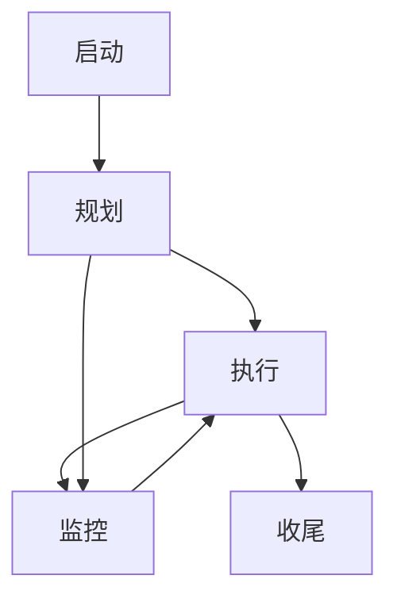
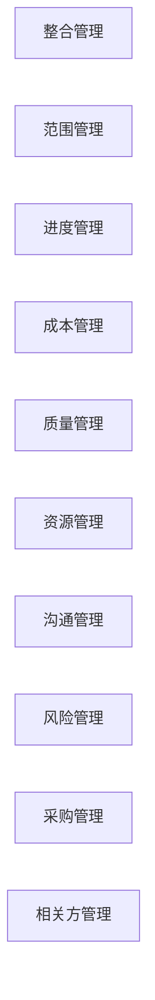

> [上一章：08-开发方法与生命周期详解](08-开发方法与生命周期详解.md) | [返回目录](../README.md) | [下一章：11-PMBOK7-精解](11-PMBOK7-精解.md)

---
# 10-PMBOK®第六版与过程组 精解

> 本笔记旨在为您系统性地精讲《PMBOK®指南》第六版的核心知识。第六版是PMP考试中**预测型项目管理**方法论的基石。掌握其逻辑框架，是理解PMP“过程域”题目的关键。我们将通过“是什么”、“为什么”、“怎么做”的结构，带您彻底搞懂这套经典的“武功招式”。

---

## 模块一：理解PMBOK®第六版的核心框架

想象一下，你要建一座房子（一个项目）。PMBOK第六版就是一本极其详尽的“建房手册”。它把整个建房过程，从两个维度进行了剖析：

1.  **五大过程组 (Process Groups)**: 这是项目管理的 **“时间轴”**。
    - 它告诉你建房要按“启动 -> 规划 -> 施工 -> 监控 -> 交付”这个顺序来。它描述了项目从开始到结束的生命周期。

2.  **十大知识领域 (Knowledge Areas)**: 这是项目管理的 **“专业技能”**。
    - 它告诉你建房需要懂“建筑设计（范围）、工期估算（进度）、预算（成本）、材料质量（质量）、工人管理（资源）”等10种专业知识。它描述了项目经理需要具备的能力。

这两条线交叉，就构成了包含 **49个过程** 的项目管理框架。每个具体的过程，都是在某个“时间点”（过程组），运用某种“专业技能”（知识领域）去完成的一项具体工作。

--- 

## 模块二：五大过程组精讲 (时间轴)

这是项目经理带领团队打怪升级的主线任务。

### 2.1 启动过程组 (Initiating)
- **核心目的**: **“师出有名”**。定义并正式授权一个新项目，任命项目经理。
- **“人话”解读**: 拿到项目的“出生证明”（项目章程）和项目经理的“尚方宝剑”。
- **关键过程与成果**:
    - **制定项目章程**: 这是启动过程组 **最核心** 的过程。项目章程一旦被批准，就标志着项目正式存在，并赋予了项目经理动用组织资源的权力。
    - **识别干系人**: 找出所有会影响项目或被项目影响的人或组织，并记录在“干系人登记册”中。**宜早不宜迟，宜全不宜漏**。

### 2.2 规划过程组 (Planning)
- **核心目的**: **“谋定而后动”**。制定一份完整、协调、可执行的“作战地图”（项目管理计划），以指导后续所有工作。
- **“人话”解读**: 把“老板的想法”变成“团队的干法”。这是PMBOK第六版中 **最庞大、最重要** 的过程组，包含24个过程。
- **关键活动**:
    - **制定项目管理计划**: 这是一个总计划，由范围、进度、成本等所有子计划汇编而成。
    - **规划“铁三角”**: 规划范围、进度、成本管理，并制定出“范围基准”、“进度基准”、“成本基准”。这三大基准是衡量项目绩效的“官方测量尺”。
    - **规划其他领域**: 规划质量、资源、沟通、风险、采购、干系人参与等，确保所有方面都考虑周全。
- **核心原则**: **渐进明细 (Progressive Elaboration)**。规划不是一次性的，而是随着信息的增多而持续更新和细化的。

### 2.3 执行过程组 (Executing)
- **核心目的**: **“照图施工”**。按照项目管理计划的要求，完成项目工作，交付可交付成果。
- **“人话”解读**: 带兵打仗，干就完了！这是 **花费预算最多、投入人力最多** 的阶段。
- **关键活动**:
    - **指导与管理项目工作**: 领导团队完成计划中的各项任务。
    - **管理项目知识**: 沉淀经验教训，形成组织过程资产。
    - **管理质量**: 执行质量保证活动，确保过程是正确的。
    - **建设团队、管理团队**: 提升团队能力，解决团队冲突。
    - **实施风险应对**: 执行事先规划好的风险应对措施。

### 2.4 监控过程组 (Monitoring & Controlling)
- **核心目的**: **“纠偏与看路”**。跟踪、审查和调整项目进展，确保项目始终在正确的轨道上运行。
- **“人话”解读**: 一边开车，一边看导航，确保没走偏。如果走偏了，要及时调整方向盘。
- **关键活动**:
    - **监控项目工作**: 将 **计划（基准）** 与 **实际** 进行比较，分析偏差（如进度偏差SV、成本偏差CV）。
    - **实施整体变更控制**: 这是 **唯一** 可以批准或否决变更请求的地方。所有变更都必须通过正式的变更控制流程。
    - **确认范围**: 与客户或发起人一起正式验收已完成的可交付成果。
    - **控制范围、进度、成本等**: 确保所有变更都受控，防止范围蔓延。

### 2.5 收尾过程组 (Closing)
- **核心目的**: **“善始善终”**。正式完成并结束项目、阶段或合同。
- **“人话”解读**: 打扫战场，交接工作，复盘总结，解散团队。
- **关键活动**：
    - **结束项目或阶段**: 获得最终验收，完成最终报告，更新经验教训登记册，存档所有项目文件，遣散项目资源。

---

## 模块三：核心概念与数据流

### 3.1 ITTOs (输入、工具与技术、输出)
- **是什么**: 每个过程都由ITTO构成。输入是“原材料”，工具与技术是“加工方法”，输出是“产成品”。
- **学习建议**: **不要死记硬背！** 应该去理解每个过程的“目的”，然后思考：“要完成这个目的，我需要哪些信息（输入）？我该用什么方法（工具）？我做完后会得到什么（输出）？”

### 3.2 核心数据流：WPD -> WPI -> WPR
这是监控过程组的“血液循环系统”，必须理解。

1.  **工作绩效数据 (WPD - Work Performance Data)**
    - **是什么**: **原始的、未经加工的** 观测值。比如：今天完成了3个任务，花了8小时，花费了500元。
    - **来源**: 来自 **执行过程组**。

2.  **工作绩效信息 (WPI - Work Performance Information)**
    - **是什么**: **经过分析和整合的** 信息。将原始数据与计划（基准）对比，得出“是否落后”、“是否超支”等结论。比如：计划今天完成4个任务，实际只完成3个，所以我们进度落后了。
    - **来源**: 来自 **监控过程组**（除整合管理外）。

3.  **工作绩效报告 (WPR - Work Performance Reports)**
    - **是什么**: **用于决策的、格式化的** 报告。将分析后的信息整理成图表、仪表盘等形式，分发给相关干系人。比如：向管理层汇报的“项目每周状态报告”。
    - **来源**: 来自监控过程组中的“监控项目工作”过程。

### 3.3 事业环境因素 (EEF) vs. 组织过程资产 (OPA)
这两个是几乎所有过程都可能用到的“环境输入”。

| 对比维度 | 事业环境因素 (EEF) | 组织过程资产 (OPA) |
| :--- | :--- | :--- |
| **核心特征** | 项目团队 **无法改变** 的“外部约束”或“内部环境”。是“**规则**”。 | 组织 **内部拥有** 的“内部财富”。是“**资产**”。 |
| **“人话”解读** | 你必须遵守的“**游戏规则**” | 你可以使用的“**祖传秘籍**”和“**经验宝库**” |
| **举例** | **外部**: 法律法规、市场状况 **内部**: 公司文化、基础设施、人事政策 | **过程与政策**: 模板、标准流程、变更控制程序 **知识库**: 经验教训、历史项目文件、风险数据 |
| **项目经理** | **必须遵守和适应** | **应当使用并可以更新** (如贡献新的经验教训) |

---
> [上一章：08-开发方法与生命周期详解](08-开发方法与生命周期详解.md) | [返回目录](../README.md) | [下一章：11-PMBOK7-精解](11-PMBOK7-精解.md)