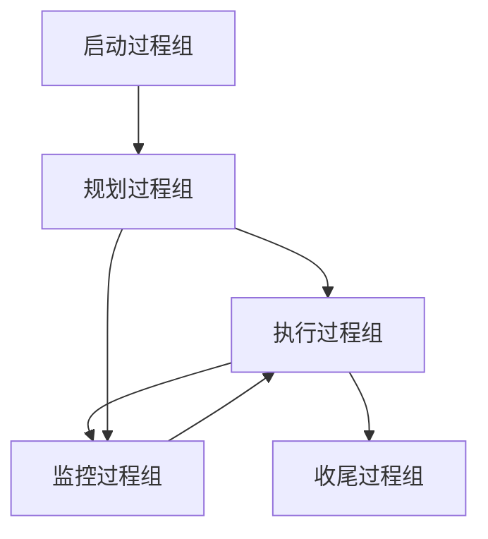
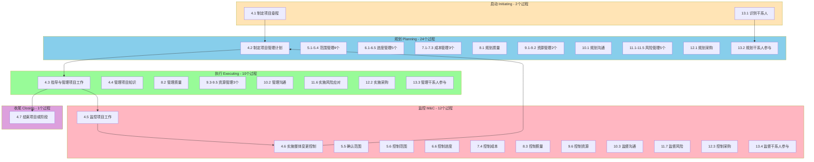
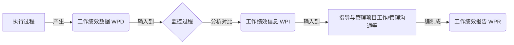

> [上一章：08-开发方法与生命周期详解](08-开发方法与生命周期详解.md) | [返回目录](../README.md) | [下一章：11-PMBOK7-精解](11-PMBOK7-精解.md)

---
# PMBOK®第六版与过程组 精解

> **版本**: 3.0  
> **核心教材**: PMBOK Guide 第6版  
> **最后更新**: 2025-10-20

> 本笔记旨在为您系统性地梳理《PMBOK®指南》第六版及《过程组：实践指南》的核心知识。掌握由 **五大过程组** 和 **十大知识领域** 构成的 **49个过程** 矩阵，是理解预测型项目管理方法的基石，也是PMP考试的重要基础。

---

## 模块一：核心框架概述

PMBOK®第六版的核心是将项目管理工作看作一系列相互关联的过程的集合。

### 1.1 五大过程组 (The 5 Process Groups)

过程组是项目管理活动的逻辑分组，体现了项目从开始到结束的动态流程。

1.  **启动 (Initiating)**: 定义一个新项目或新阶段，授权其开始。
2.  **规划 (Planning)**: 明确项目范围，优化目标，并为实现目标制定行动方案。
3.  **执行 (Executing)**: 完成项目管理计划中确定的工作，以满足项目要求。
4.  **监控 (Monitoring & Controlling)**: 跟踪、审查和调整项目进展与绩效，识别并启动必要的变更。
5.  **收尾 (Closing)**: 正式完成或结束项目、阶段或合同。

### 1.2 十大知识领域 (The 10 Knowledge Areas)

知识领域是按所需知识对项目管理过程进行的划分，代表了项目经理需要掌握的专业领域。

1.  **整合管理** (Integration)
2.  **范围管理** (Scope)
3.  **进度管理** (Schedule)
4.  **成本管理** (Cost)
5.  **质量管理** (Quality)
6.  **资源管理** (Resource)
7.  **沟通管理** (Communications)
8.  **风险管理** (Risk)
9.  **采购管理** (Procurement)
10. **干系人管理** (Stakeholder)

---

## 模块二：49个过程全景矩阵

**PMBOK6 49个过程可视化矩阵** (5大过程组 × 10大知识领域):

**49个过程分布统计**:
- 启动: 2个过程 (4%)
- 规划: 24个过程 (49%) ⭐ 最多
- 执行: 10个过程 (20%)
- 监控: 12个过程 (24%)
- 收尾: 1个过程 (2%)

下表是PMP考纲中最重要的图表之一，它将十大知识领域与五大过程组结合在一起，构成了49个具体的过程。

| **知识领域** | **启动过程组** | **规划过程组** | **执行过程组** | **监控过程组** | **收尾过程组** |
| :--- | :--- | :--- | :--- | :--- | :--- |
| **4. 整合管理** | 4.1 制定项目章程 | 4.2 制定项目管理计划 | 4.3 指导与管理项目工作 4.4 管理项目知识 | 4.5 监控项目工作 4.6 实施整体变更控制 | 4.7 结束项目或阶段 |
| **5. 范围管理** | | 5.1-5.4 规划/收集/定义/创建WBS | | 5.5 确认范围 5.6 控制范围 | |
| **6. 进度管理** | | 6.1-6.5 规划/定义/排序/估算/制定 | | 6.6 控制进度 | |
| **7. 成本管理** | | 7.1-7.3 规划/估算/制定 | | 7.4 控制成本 | |
| **8. 质量管理** | | 8.1 规划质量管理 | 8.2 管理质量 | 8.3 控制质量 | |
| **9. 资源管理** | | 9.1-9.2 规划/估算 | 9.3 获取资源 9.4 建设团队 9.5 管理团队 | 9.6 控制资源 | |
| **10. 沟通管理** | | 10.1 规划沟通管理 | 10.2 管理沟通 | 10.3 监督沟通 | |
| **11. 风险管理** | | 11.1-11.5 规划/识别/分析(定性/定量)/规划应对 | 11.6 实施风险应对 | 11.7 监督风险 | |
| **12. 采购管理** | | 12.1 规划采购管理 | 12.2 实施采购 | 12.3 控制采购 | |
| **13. 干系人管理** | 13.1 识别干系人 | 13.2 规划干系人参与 | 13.3 管理干系人参与 | 13.4 监督干系人参与 | |

---

## 模块三：核心数据流与概念图解

### 3.1 核心数据流

在过程组模型中，数据在不同过程之间流动，形成一个闭环。理解这个流向对掌握ITTO至关重要。

*   **工作绩效数据 (WPD)**: 在执行项目工作的过程中，从每个正在执行的活动中收集到的原始观察结果和测量值。 (最原始的数据)
*   **工作绩效信息 (WPI)**: 结合相关背景和跨领域关系进行分析后，得出的综合的绩效数据。 (经过分析的数据)
*   **工作绩效报告 (WPR)**: 为制定决策、采取行动或引起关注，而汇编工作绩效信息所形成的实物或电子文件。 (用于决策的报告)

### 3.2 事业环境因素(EEF) vs. 组织过程资产(OPA)

这两个概念是几乎所有过程的输入，是项目经理必须在其中运作的环境。

| 对比维度 | 事业环境因素 (EEF) | 组织过程资产 (OPA) |
| :--- | :--- | :--- |
| **核心特征** | 项目团队 **无法控制** 的 | 组织 **内部拥有** 的资产 |
| **来源** | 内部或外部 | 仅内部 |
| **举例** | **外部**: 市场情况、法律法规、行业标准 **内部**: 组织文化、基础设施、人事政策 | **计划、过程与文件**: 模板、政策、标准作业流程 **组织知识库**: 经验教训、历史信息、项目档案 |
| **项目经理** | **必须遵守** | **可以并应当更新** (尤其是经验教训) |

---
> [上一章：06-PMP核心概念辨析与记忆技巧](06-PMP核心概念辨析与记忆技巧.md) | [返回目录](../README.md) | [下一章：11-PMBOK7-精解](11-PMBOK7-精解.md)
