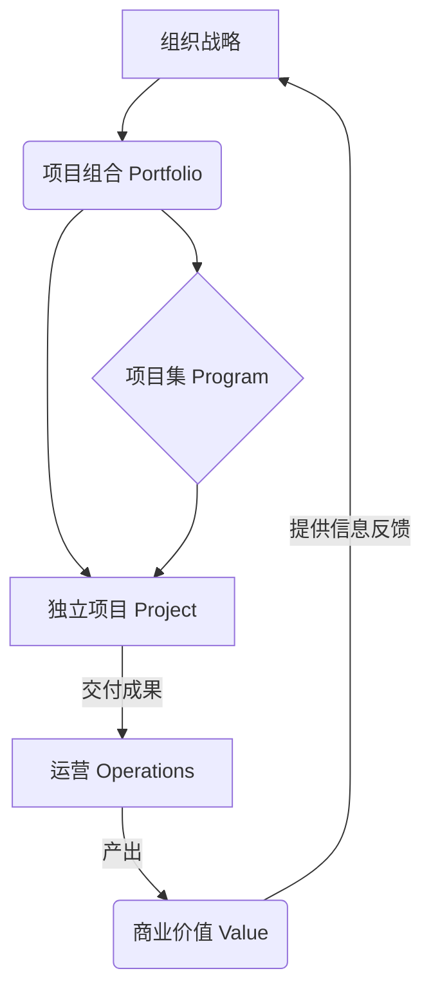

> [上一章：10-PMBOK6与过程组-精解](10-PMBOK6与过程组-精解.md) | [返回目录](../README.md) | [下一章：12-敏捷实践指南-精解](12-敏捷实践指南-精解.md)

---
# 11-PMBOK®第七版 精解

> 本笔记旨在为您系统性地精讲《PMBOK®指南》第七版的核心知识。第七版标志着PMP认证从“**过程驱动**”到“**价值驱动**”和“**原则导向**”的根本性转变。它不再是一本“操作手册”，而是一本指导项目经理在任何情境下做出正确决策的“**思维指南**”。掌握第七版，就是掌握现代PMP考试的“灵魂”。

---

## 模块一：核心转变：为什么会有第七版？

- **从“规定性”到“原则性”**: 第六版告诉你“应该遵循哪些过程”，而第七版告诉你“应该坚守哪些原则”。它承认项目环境千变万化，没有放之四海而皆准的流程，但有普适的原则。
- **从“交付成果”到“交付价值”**: 项目的成功不再仅仅是按时、按预算交付范围，而是交付的成果是否为组织和干系人创造了预期的 **价值**。
- **适用性更广**: 框架更加灵活，可以无缝地应用于预测型、敏捷、混合型等所有类型的项目。

---

## 模块二：价值交付系统 (The Value Delivery System)

这是第七版看待项目的宏观视角。它强调项目并非孤立存在，而是组织为实现战略、创造价值的系统中的一环。

- **关键认知**:
    - **战略驱动**: 所有项目、项目集、项目组合的启动，都源于组织的战略目标。
    - **价值闭环**: 项目交付的成果被整合到运营中，最终产生商业价值，而价值实现的信息又会反过来影响新的战略制定，形成一个持续优化的闭环。

---

## 模块三：十二大项目管理原则精讲 (The 12 Principles)

这是PMBOK7的灵魂，是指导项目管理从业者行为和决策的根本准则。在PMP情景题中，当你犹豫不决时，回归这些原则，往往能找到最佳答案。

| # | 原则 (Principle) | “人话”精讲 (In Plain Language) | PMP考试应用 (Exam Application) |
|:---:|:---|:---|:---|
| 1 | **管家精神 (Stewardship)** | 做一个有责任心、有担当的“管家”，诚信、正直地管理好你所负责的资源、关系和项目内外的一切。 | 当出现问题或风险时，项目经理应主动承担责任去处理，而不是推诿或隐瞒。 |
| 2 | **团队 (Team)** | 尊重并赋能你的团队，为他们创造一个协作、安全、高效的工作环境。团队的集体智慧和自组织能力是成功的关键。 | 优先选择能够促进团队协作、提升团队士气的选项。领导力体现在服务团队，而非命令团队。 |
| 3 | **干系人 (Stakeholders)** | 主动、持续地与所有干系人互动，理解他们的期望和诉求，引导他们参与进来，将“阻力”变为“助力”。 | 面对干系人的反对或不配合，首选“沟通”、“理解”、“引导”，而不是“说服”或“忽略”。 |
| 4 | **价值 (Value)** | 时刻将“我们做的这件事到底能带来什么价值？”放在首位。所有活动、功能和决策都应以能否最大化价值为衡量标准。 | 当需要在范围、进度、成本之间做权衡时，以“是否对交付最终价值最有利”作为决策依据。 |
| 5 | **系统思考 (Systems Thinking)** | 将项目看作一个动态的、相互关联的整体。理解一个部分的变更会如何像涟漪一样影响其他部分，具备全局观。 | 变更请求的影响分析不能只看局部，要全面评估其对整个项目乃至组织系统的影响。 |
| 6 | **领导力 (Leadership)** | 领导力不是职位，而是行为。任何人都可以通过愿景、激励、示范等方式展现领导力，以适应不同情境。 | 项目经理应根据团队成熟度和任务复杂度，灵活运用不同的领导风格（如指导、教练、支持、授权）。 |
| 7 | **裁剪 (Tailoring)** | “没有最好的，只有最合适的”。根据项目独特性（如规模、复杂性、文化）来量身定制最适合的开发方法、过程和工具。 | 题目中出现“一刀切”或“严格遵循标准流程”的选项通常是错误的。正确答案往往体现了灵活性和适应性。 |
| 8 | **质量 (Quality)** | 质量是内嵌于过程和成果中的，而不是在最后检查出来的。预防胜于检查，人人有责。 | 优先选择那些将质量活动（如代码审查、测试）融入到开发全过程的选项，而不是依赖最终的质检环节。 |
| 9 | **驾驭复杂性 (Complexity)** | 主动识别和应对由人类行为、系统行为和不确定性带来的复杂性，通过持续学习和适应来简化问题。 | 面对高度不确定的复杂问题，应采用迭代、增量的方法，通过小步快跑和快速反馈来降低风险。 |
| 10 | **风险 (Risk)** | 主动、持续地识别和管理风险，既要准备预案来最小化威胁，也要积极寻找机会来最大化收益。 | 风险管理是贯穿始终的。一个合格的项目经理总是在思考“下一步可能会发生什么？”。 |
| 11 | **适应性与韧性 (Adaptability & Resilience)** | 拥抱变化，并具备从挫折和失败中快速恢复、调整方向的能力。计划是用来指导的，不是用来束缚的。 | 当外部环境或需求发生重大变化时，应评估变化带来的机遇和挑战，并调整计划，而不是固守原计划。 |
| 12 | **变革管理 (Change Management)** | 项目本身就是一种变革。主动引导干系人理解、接受并融入变革，帮助他们从当前状态平稳过渡到未来状态。 | 当项目交付成果会改变人们的工作方式时，项目经理的职责不仅是交付，还包括培训、沟通等变革管理活动。 |

---

## 模块四：八大项目绩效域精讲 (The 8 Performance Domains)

如果说“原则”是道，是心法，那么“绩效域”就是术，是项目经理需要关注和发力的八个关键领域，是原则的实践场。

| 绩效域 (Domain) | 关注焦点 (Focus Area) | 与原则的联动 (Link to Principles) |
| :--- | :--- | :--- |
| **1. 干系人** | 建立并维护与干系人的良好关系，促进项目成功。 | 实践“干系人”、“管家精神”原则。 |
| **2. 团队** | 建立高绩效团队，营造协作、尊重和赋能的文化。 | 实践“团队”、“领导力”原则。 |
| **3. 开发方法和生命周期** | 根据项目特性，选择并裁剪最合适的开发方法。 | 实践“裁剪”、“价值”、“系统思考”原则。 |
| **4. 规划** | 组织、协调和明确完成项目工作所需的全部活动，是一个持续迭代的过程。 | 实践“系统思考”、“风险”、“适应性”原则。 |
| **5. 项目工作** | 高效地执行项目计划，管理资源，营造持续学习和改进的环境。 | 实践“质量”、“管家精神”原则。 |
| **6. 交付** | 交付满足范围和质量要求的可交付成果，并最终实现预期的商业价值。 | 实践“价值”、“质量”原则。 |
| **7. 测量** | 通过有效的测量来评估项目绩效，并采取行动确保项目处于正轨。 | 实践“价值”、“管家精神”原则。 |
| **8. 不确定性** | 驾驭项目固有的不确定性，包括风险、模糊性、复杂性和易变性。 | 实践“风险”、“驾驭复杂性”、“适应性与韧性”原则。 |

---

## 模块五：裁剪与模型、方法和工件

- **裁剪 (Tailoring)**: 这是PMBOK7反复强调的核心技能。项目经理需要像一个“老中医”，根据项目的“脉象”（环境、干系人、需求等），开出最合适的“药方”（方法、工具、过程）。
- **模型、方法和工件 (Models, Methods, and Artifacts)**: 第七版提供了一个开放的“工具箱”，不再将工具与特定过程绑定。这意味着项目经理可以根据需要，灵活选用最合适的工具。我们知识库中的 `05-高频工具技术与模型汇总.md` 和 `08-开发方法与生命周期详解.md` 就是对这个工具箱的最佳实践总结。

---
> [上一章：10-PMBOK6与过程组-精解](10-PMBOK6与过程组-精解.md) | [返回目录](../README.md) | [下一章：12-敏捷实践指南-精解](12-敏捷实践指南-精解.md)