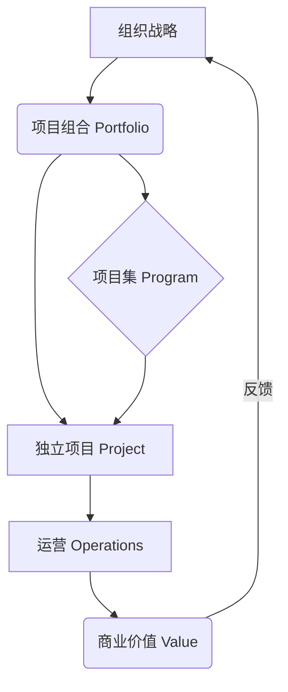
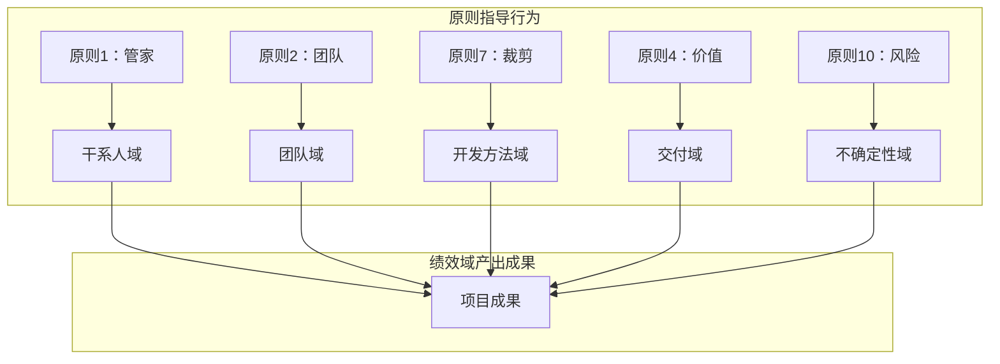

> [上一章：10-PMBOK6与过程组-精解](10-PMBOK6与过程组-精解.md) | [返回目录](../README.md) | [下一章：12-敏捷实践指南-精解](12-敏捷实践指南-精解.md)

---
# PMBOK®第七版 精解

> 本笔记旨在为您系统性地梳理《PMBOK®指南》第七版的核心知识。第七版标志着项目管理从 **“基于过程”** 的框架向 **“基于原则”** 的框架的范式转变。其核心不再是死板地遵循过程，而是灵活地应用原则，以 **价值交付** 为最终目的。

---

## 模块一：价值交付系统 (Value Delivery System)

第七版引入了“价值交付系统”的概念，强调项目是组织创造价值的载体。项目并非孤立存在，而是作为系统的一部分，与项目集、项目组合、运营等协同工作，共同实现组织的战略目标。

- **信息流**: 战略从高层流向项目组合、项目集和项目，而关于绩效和价值实现的信息则从运营和项目反向流回高层，形成一个持续优化的闭环。

---

## 模块二：十二大项目管理原则 (The 12 Project Management Principles)

这是PMBOK7的灵魂，是项目管理从业者行为和行动的指导方针。它们不是规定性的，而是普适的，需要根据具体情境进行裁剪应用。

| 原则 (Principle) | 核心思想 (Core Idea) |
| :--- | :--- |
| **1. 成为勤勉、尊重和有爱心的管家 (Stewardship)** | 对项目内外的资产、资源和关系负责，做出基于诚信、关心和可信的决策。 |
| **2. 创建协作的项目团队环境 (Team)** | 建立并维护一个协作、尊重、安全的团队文化，赋能团队共同创造价值。 |
| **3. 有效地与干系人互动 (Stakeholders)** | 主动识别、理解并引导干系人参与，以最大化支持并最小化阻力。 |
| **4. 专注于价值 (Value)** | 将所有项目活动与可交付成果所能实现的商业价值紧密对齐，并持续评估。 |
| **5. 识别、评估和响应系统交互 (Systems Thinking)** | 具备整体观，将项目视为一个复杂的系统，理解各部分之间的动态交互。 |
| **6. 展现领导力行为 (Leadership)** | 任何团队成员都可以展现领导力。通过影响、激励和指导来赋能团队。 |
| **7. 根据环境进行裁剪 (Tailoring)** | “没有最好的，只有最合适的”。根据项目独特性裁剪开发方法、过程和工件。 |
| **8. 将质量融入过程和可交付成果 (Quality)** | 质量是所有人的责任。将质量要求嵌入到所有工作流程中，预防胜于检查。 |
| **9. 驾驭复杂性 (Complexity)** | 主动识别和应对由人类行为、系统行为和模糊性带来的复杂性。 |
| **10. 优化风险应对 (Risk)** | 主动管理风险，既要最小化威胁，也要最大化机会。 |
| **11. 拥抱适应性和韧性 (Adaptability & Resilience)** | 具备从变化和挫折中快速恢复和调整的能力，拥抱变化而非固守计划。 |
| **12. 为实现预期的未来状态而驱动变革 (Change)** | 项目本身就是变革。主动管理变革过程，帮助干系人从当前状态过渡到未来状态。 |

---

## 模块三：八大项目绩效域 (The 8 Project Performance Domains)

绩效域是项目管理中至关重要的、相互关联的活动领域。原则指导行为，而绩效域则提供了评估绩效的领域。

| 绩效域 (Domain) | 关注焦点 (Focus Area) |
| :--- | :--- |
| **1. 干系人 (Stakeholder)** | 建立并维护与干系人的良好关系，促进项目成功。 |
| **2. 团队 (Team)** | 建立高绩效团队，营造协作、尊重和赋能的文化。 |
| **3. 开发方法和生命周期 (Development Approach & Lifecycle)** | 根据项目特性，选择并裁剪最合适的开发方法（预测型、敏捷、混合型）。 |
| **4. 规划 (Planning)** | 组织、协调和明确完成项目工作所需的全部活动，是一个持续迭代的过程。 |
| **5. 项目工作 (Project Work)** | 高效地执行项目计划，管理资源，营造持续学习和改进的环境。 |
| **6. 交付 (Delivery)** | 交付满足范围和质量要求的可交付成果，并最终实现预期的商业价值。 |
| **7. 测量 (Measurement)** | 通过有效的测量来评估项目绩效，并采取行动确保项目处于正轨。 |
| **8. 不确定性 (Uncertainty)** | 驾驭项目固有的不确定性，包括风险、模糊性、复杂性和易变性。 |

---

## 模块四：裁剪与模型、方法和工件

### 4.1 裁剪 (Tailoring)

- **核心思想**: 裁剪是项目经理和团队根据项目独有的背景和目标，有意识地调整项目管理方法的过程。这是一个主动的、持续的活动。
- **裁剪过程**: 1. 选择初始开发方法 -> 2. 对组织进行裁剪 -> 3. 对项目进行裁剪 -> 4. 实施并持续改进。

### 4.2 模型、方法和工件 (Models, Methods, and Artifacts)

- **新变化**: PMBOK7不再像第六版那样将工具和技术（ITTOs）与特定过程绑定，而是提供了一个开放的“工具箱”，列出了常用的模型、方法和工件，供项目团队按需选用。
- **与本知识库的关系**: 我们在 **`05-高频工具技术与模型汇总.md`** 中为您详细梳理了最核心、最高频的工具与模型，您可以将其作为对本章节的扩展和深化学习材料。

---
> [上一章：10-PMBOK6与过程组-精解](10-PMBOK6与过程组-精解.md) | [返回目录](../README.md) | [下一章：12-敏捷实践指南-精解](12-敏捷实践指南-精解.md)
