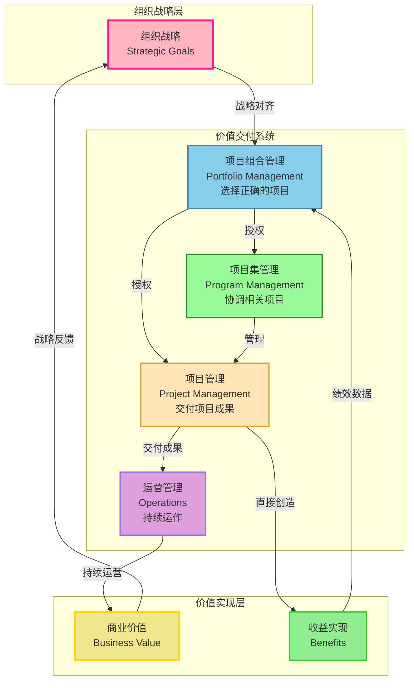
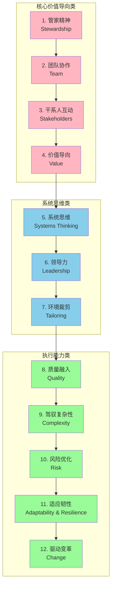
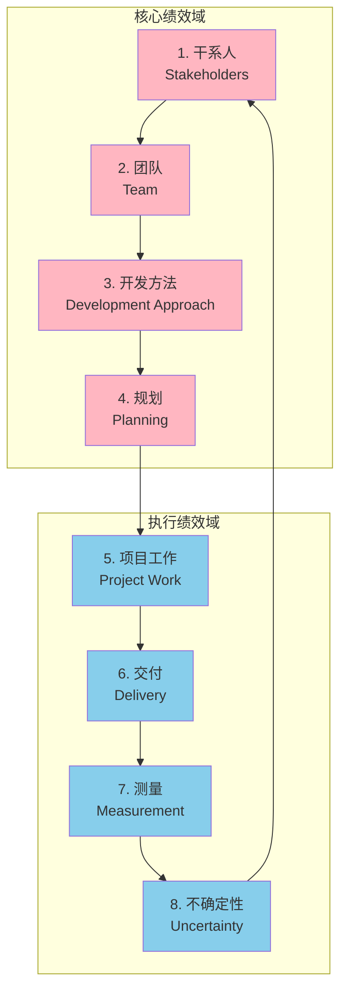
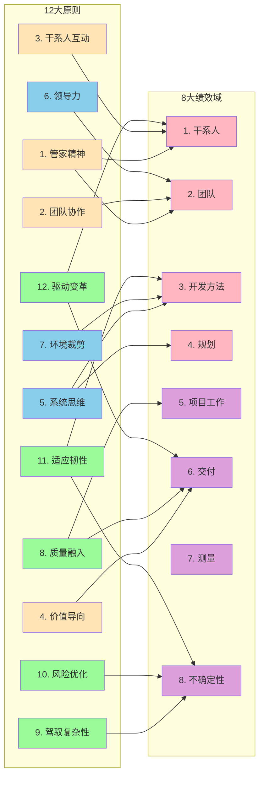

> [上一章：10-PMBOK6与过程组-精解](10-PMBOK6与过程组-精解.md) | [返回目录](../README.md) | [下一章：12-敏捷实践指南-精解](12-敏捷实践指南-精解.md)

---
# PMBOK®第七版 精解

> 本笔记旨在为您系统性地梳理《PMBOK®指南》第七版的核心知识。第七版标志着项目管理从 **“基于过程”** 的框架向 **“基于原则”** 的框架的范式转变。其核心不再是死板地遵循过程，而是灵活地应用原则，以 **价值交付** 为最终目的。

---

## 模块一：PMBOK6 vs PMBOK7 - 范式转变

### 1.1 核心差异对比

| 维度 | PMBOK6 (第六版) | PMBOK7 (第七版) |
|------|----------------|----------------|
| **核心框架** | 5大过程组 + 10大知识领域 | 12大原则 + 8大绩效域 |
| **指导方式** | 过程驱动（做什么） | 原则驱动（为什么） |
| **侧重点** | 预测型方法为主 | 方法敏捷性（适应型、混合型） |
| **输出** | 49个过程及ITTO | 期望结果（Outcome） |
| **价值观** | 符合标准流程 | 价值交付 |
| **结构** | 规定性（prescriptive） | 指导性（descriptive） |
| **灵活性** | 相对固定的流程 | 强调裁剪和适应 |
| **适用性** | 适合确定性高的项目 | 适合各种不确定性的项目 |

### 1.2 为什么转变？

**背景和原因**：

1. **项目环境日益复杂**
   - VUCA时代（易变性、不确定性、复杂性、模糊性）
   - 需求变化频繁，传统预测型方法难以应对
   - 技术迭代加速，需要更灵活的方法

2. **敏捷和混合方法成为主流**
   - 越来越多的组织采用敏捷或混合方法
   - 第六版以预测型为主，已不能满足现代项目管理需求
   - 需要一个包容各种方法的框架

3. **强调结果和价值，而非僵化流程**
   - 组织关注的是项目能创造多少价值
   - 严格遵守流程不等于项目成功
   - 需要从"做对事"到"做正确的事"

4. **项目经理角色转变**
   - 从"管理者"到"仆人式领导者"
   - 从"流程执行者"到"价值推动者"
   - 需要更强的适应能力和领导力

### 1.3 如何协同使用两个版本？

**重要提示**：第七版**不是**替代第六版，而是补充和扩展。

**协同使用策略**：

1. **第七版提供"心法"（原则和思维）**
   - 用12大原则指导决策和行为
   - 用8大绩效域评估项目绩效
   - 理解"为什么这样做"

2. **第六版提供"招式"（工具和流程）**
   - 用49个过程作为实践参考
   - 用ITTO作为工作检查清单
   - 理解"具体怎么做"

3. **实际应用建议**：
   - **初学者**：先学第六版，建立系统的流程知识
   - **进阶者**：学习第七版，提升到原则层面
   - **实践者**：两版结合，原则指导+流程执行

**PMP考试应对**：
- 考试融合了两个版本的内容
- 第七版的原则和价值观影响答题思维
- 第六版的工具和流程是答题基础
- 理解两版的关系有助于选择最佳答案

---

## 模块二：价值交付系统 (Value Delivery System)

第七版引入了“价值交付系统”的概念，强调项目是组织创造价值的载体。项目并非孤立存在，而是作为系统的一部分，与项目集、项目组合、运营等协同工作，共同实现组织的战略目标。

**价值交付系统架构图**:

**价值交付系统关键要素**:

| 要素 | 定义 | 核心目标 |
| :--- | :--- | :--- |
| **项目组合** | 为实现战略目标而组合在一起的项目、项目集、子项目组合和运营 | **选择正确的项目**,确保资源投入到最有价值的工作 |
| **项目集** | 为获得单独管理无法实现的收益而组合在一起的相关项目 | **协调相关项目**,实现协同效应 |
| **项目** | 为创造独特产品、服务或成果而进行的临时性工作 | **正确地执行项目**,交付承诺的成果 |
| **运营** | 持续进行的、重复性的工作，维持组织运转 | **持续运营**,将项目成果转化为持续价值 |

**信息流**: 战略从高层流向项目组合、项目集和项目，而关于绩效和价值实现的信息则从运营和项目反向流回高层，形成一个持续优化的闭环。

- **信息流**: 战略从高层流向项目组合、项目集和项目，而关于绩效和价值实现的信息则从运营和项目反向流回高层，形成一个持续优化的闭环。

---

**PMBOK7 12大原则关系图**:

**12大原则分类解读**:

| 分类 | 原则 | 核心作用 |
| :--- | :--- | :--- |
| **核心价值导向类** | 1-4 | 奠定项目管理的价值基础 |
| **系统思维类** | 5-7 | 提供整体性思考框架 |
| **执行能力类** | 8-12 | 确保项目成功执行 |## 模块二：十二大项目管理原则 (The 12 Project Management Principles)

这是PMBOK7的灵魂，是项目管理从业者行为和行动的指导方针。它们不是规定性的，而是普适的，需要根据具体情境进行裁剪应用。

| 原则 (Principle) | 核心思想 (Core Idea) |
| :--- | :--- |
| **1. 成为勤勉、尊重和有爱心的管家 (Stewardship)** | 对项目内外的资产、资源和关系负责，做出基于诚信、关心和可信的决策。 |
| **2. 创建协作的项目团队环境 (Team)** | 建立并维护一个协作、尊重、安全的团队文化，赋能团队共同创造价值。 |
| **3. 有效地与干系人互动 (Stakeholders)** | 主动识别、理解并引导干系人参与，以最大化支持并最小化阻力。 |
| **4. 专注于价值 (Value)** | 将所有项目活动与可交付成果所能实现的商业价值紧密对齐，并持续评估。 |
| **5. 识别、评估和响应系统交互 (Systems Thinking)** | 具备整体观，将项目视为一个复杂的系统，理解各部分之间的动态交互。 |
| **6. 展现领导力行为 (Leadership)** | 任何团队成员都可以展现领导力。通过影响、激励和指导来赋能团队。 |
| **7. 根据环境进行裁剪 (Tailoring)** | “没有最好的，只有最合适的”。根据项目独特性裁剪开发方法、过程和工件。 |
| **8. 将质量融入过程和可交付成果 (Quality)** | 质量是所有人的责任。将质量要求嵌入到所有工作流程中，预防胜于检查。 |
| **9. 驾驭复杂性 (Complexity)** | 主动识别和应对由人类行为、系统行为和模糊性带来的复杂性。 |
| **10. 优化风险应对 (Risk)** | 主动管理风险，既要最小化威胁，也要最大化机会。 |
| **11. 拥抱适应性和韧性 (Adaptability & Resilience)** | 具备从变化和挫折中快速恢复和调整的能力，拥抱变化而非固守计划。 |
| **12. 为实现预期的未来状态而驱动变革 (Change)** | 项目本身就是变革。主动管理变革过程，帮助干系人从当前状态过渡到未来状态。 |

---

## 模块三：八大项目绩效域 (The 8 Project Performance Domains)

绩效域是项目管理中至关重要的、相互关联的活动领域。原则指导行为，而绩效域则提供了评估绩效的领域。

### 3.1 干系人绩效域 (Stakeholder Performance Domain)

**关注焦点**: 建立并维护与干系人的良好关系，促进项目成功。

**核心概念**:
- 干系人是能够影响项目或被项目影响的个人、团体或组织
- 有效的干系人管理是项目成功的关键因素
- 需要在整个项目生命周期持续进行

**关键活动**:
1. **识别干系人**: 持续识别项目干系人
2. **理解和分析干系人**: 了解他们的利益、影响力、期望和需求
3. **优先排序干系人**: 根据权力、利益、影响力进行分类
4. **引导干系人参与**: 制定并执行干系人参与策略
5. **监督干系人参与**: 持续监控干系人参与度并调整策略

**干系人参与度评估**:
- **不了解 (Unaware)**: 不知道项目及其潜在影响
- **抵制 (Resistant)**: 知道项目但抵制变更
- **中立 (Neutral)**: 知道项目但既不支持也不反对
- **支持 (Supportive)**: 知道项目并支持变更
- **领导 (Leading)**: 知道项目并积极推动项目成功

**干系人参与策略**:
- **高权力/高利益**: 重点管理 (Manage Closely)
- **高权力/低利益**: 令其满意 (Keep Satisfied)
- **低权力/高利益**: 随时告知 (Keep Informed)
- **低权力/低利益**: 监督 (Monitor)

**期望结果**:
- 干系人与项目团队建立了富有成效的工作关系
- 干系人支持项目并对项目决策表示满意
- 项目目标与干系人需求保持一致

**考试应用**: 主动识别干系人、频繁沟通、管理期望、建立信任关系的选项通常是正确答案。

---

### 3.2 团队绩效域 (Team Performance Domain)

**关注焦点**: 建立高绩效团队，营造协作、尊重和赋能的文化。

**核心概念**:
- 高绩效团队是项目成功的关键
- 团队文化比个人技能更重要
- 仆人式领导是现代项目管理的核心

**高绩效团队的特征**:
- **自组织**: 团队自己决定如何完成工作
- **跨职能**: 拥有完成工作所需的全部技能
- **协作**: 成员之间积极合作，共享知识
- **信任**: 成员之间相互信任，敢于表达不同意见
- **持续学习**: 从经验中学习，不断改进

**关键活动**:
1. **组建团队**: 获取或组建项目团队
2. **建立共同理解**: 制定团队协议、工作规范
3. **赋能团队**: 提供资源、移除障碍、授权决策
4. **发展团队**: 提供培训、指导和成长机会
5. **管理冲突**: 建设性地解决冲突
6. **认可和奖励**: 表彰团队和个人贡献

**团队协议/团队章程** (Team Charter):
- 团队价值观和工作原则
- 沟通指南
- 决策流程
- 冲突解决方法
- 会议规范

**分布式团队管理**:
- 使用协作技术和工具
- 建立明确的沟通规范
- 安排重叠工作时间
- 定期进行团队建设活动
- 促进文化理解和尊重

**期望结果**:
- 团队成员拥有共同的理解和目标
- 团队高效协作，自我管理
- 团队成员技能得到发展
- 团队士气高昂，成员满意度高

**考试应用**: 强调赋能团队、仆人式领导、建立信任、促进协作的选项通常正确。

---

### 3.3 开发方法和生命周期绩效域 (Development Approach & Lifecycle Performance Domain)

**关注焦点**: 根据项目特性，选择并裁剪最合适的开发方法。

**核心概念**:
- 没有一种方法适用于所有项目
- 应根据项目特征选择预测型、迭代型、增量型、适应型或混合型方法
- 可以在项目执行过程中调整方法

**生命周期类型**:

1. **预测型 (Predictive)**
   - 前期详细规划，最后一次性交付
   - 适用于需求明确、技术成熟的项目
   - 例如：传统瀑布模型

2. **迭代型 (Iterative)**
   - 通过连续迭代完善产品
   - 每次迭代改进和细化
   - 适用于需求相对明确但需要逐步完善的项目

3. **增量型 (Incremental)**
   - 分批次交付可用的功能模块
   - 每个增量都是完整可用的
   - 适用于可以分阶段交付价值的项目

4. **适应型/敏捷型 (Adaptive/Agile)**
   - 同时采用迭代和增量
   - 在短周期内频繁交付价值
   - 适用于需求不确定、快速变化的项目

5. **混合型 (Hybrid)**
   - 结合多种方法
   - 根据项目不同部分选择不同方法
   - 最常见的实际应用

**选择标准** (Stacey矩阵):
- **需求确定性**: 需求越不确定，越应选择适应型
- **技术确定性**: 技术越不确定，越应选择迭代型
- **变化频率**: 变化越频繁，越应选择敏捷型
- **风险承受度**: 风险承受度低，应选择预测型

**裁剪考虑因素**:
- 产品、服务或成果的特征
- 组织文化和结构
- 团队规模和分布
- 法规和合规要求
- 干系人参与程度

**期望结果**:
- 开发方法与项目背景相匹配
- 团队理解并遵循选定的方法
- 项目能够有效应对变化和不确定性
- 交付节奏满足干系人需求

**考试应用**: 根据项目特征(需求确定性、变化频率等)选择合适方法的题目频繁出现。

---

### 3.4 规划绩效域 (Planning Performance Domain)

**关注焦点**: 组织、协调和明确完成项目工作所需的全部活动，是一个持续迭代的过程。

**核心概念**:
- 规划不是一次性活动，而是贯穿项目始终
- **渐进明细** (Progressive Elaboration): 随着信息增多，计划逐步细化
- **滚动式规划** (Rolling Wave Planning): 近期详细，远期概要
- 计划应该是动态的，随项目进展而更新

**关键活动**:
1. **估算**: 活动持续时间、成本、资源需求
2. **排期**: 制定项目进度计划
3. **预算**: 确定成本基准
4. **风险规划**: 识别风险并制定应对策略
5. **采购规划**: 确定采购内容和方式
6. **变更管理规划**: 建立变更控制流程

**规划的迭代性质**:
- 预测型项目: 前期规划详细，执行中调整
- 敏捷项目: 每个迭代都重新规划
- 混合项目: 高层预测，细节迭代

**规划层次**:
- **战略层**: 项目章程、商业论证
- **战术层**: 项目管理计划、各子计划
- **操作层**: 工作包、任务清单

**期望结果**:
- 项目计划全面、可行、被团队接受
- 计划与项目目标和干系人期望一致
- 团队理解计划并知道如何执行
- 计划足够灵活以应对变化

**考试应用**: 强调持续规划、渐进明细、团队参与规划的选项通常正确。

---

### 3.5 项目工作绩效域 (Project Work Performance Domain)

**关注焦点**: 高效地执行项目计划，管理资源，营造持续学习和改进的环境。

**核心概念**:
- 将计划转化为行动
- 有效管理物理资源和团队资源
- 建立学习和知识管理文化
- 管理采购和供应商关系

**关键活动**:
1. **执行工作**: 按计划完成项目工作
2. **管理物理资源**: 设备、材料、设施的获取和管理
3. **管理采购**: 供应商选择、合同管理、关系维护
4. **知识管理**: 捕获、分享和应用项目知识
5. **过程改进**: 识别改进机会并实施
6. **沟通**: 确保信息有效流动

**物理资源管理**:
- 获取资源: 采购或租赁所需设备和材料
- 分配资源: 将资源分配给具体活动
- 监控使用: 跟踪资源使用效率
- 控制资源: 确保资源可用性和质量

**采购与供应商管理**:
- 制定采购策略
- 选择供应商
- 管理合同和关系
- 监控供应商绩效
- 结束采购

**知识管理**:
- **显性知识**: 可以编码的知识(文档、流程)
- **隐性知识**: 个人经验和洞察
- 经验教训的捕获和分享
- 知识库的建立和维护

**期望结果**:
- 项目工作高效完成，达到质量标准
- 资源得到有效利用
- 团队知识和能力得到提升
- 采购满足项目需求
- 建立了持续改进的文化

**考试应用**: 强调知识共享、持续改进、有效资源管理的选项通常正确。

---

### 3.6 交付绩效域 (Delivery Performance Domain)

**关注焦点**: 交付满足范围和质量要求的可交付成果，并最终实现预期的商业价值。

**核心概念**:
- 交付不仅是产出产品，更要实现价值
- 需求管理贯穿项目始终
- 范围和质量必须满足验收标准
- 价值实现可能在项目结束后

**需求管理详细流程**:

1. **需求收集 (Elicit)**
   - 访谈、焦点小组、问卷调查
   - 原型、观察、文档分析
   - 头脑风暴、亲和图

2. **需求分析 (Analyze)**
   - 分类和优先级排序
   - 识别依赖关系
   - 评估可行性

3. **需求验证 (Validate)**
   - 确认需求准确反映干系人需要
   - 需求可测试、可实现

4. **需求确认 (Verify)**
   - 确认交付成果满足需求
   - 与验收标准对比

**WBS创建方法**:
- **100%规则**: WBS包含项目全部工作
- 分解层次: 从高层可交付成果到工作包
- 工作包: 可估算、可分配的最小单元
- WBS词典: 详细描述每个工作包

**完成的定义 (DoD) vs 验收标准**:
- **DoD**: 适用于所有工作项的通用质量标准
  - 例如: 代码已审查、测试已通过、文档已更新
- **验收标准**: 特定于某个用户故事或可交付成果的具体要求
  - 例如: 登录功能在3秒内响应

**范围蔓延防范**:
- 明确定义范围基准
- 建立变更控制流程
- 持续与干系人沟通
- 记录并评估所有变更请求

**期望结果**:
- 可交付成果满足质量和范围要求
- 干系人接受可交付成果
- 项目实现预期的商业价值和收益
- 范围得到有效控制

**考试应用**: 强调价值实现、范围控制、质量预防的选项通常正确。

---

### 3.7 测量绩效域 (Measurement Performance Domain)

**关注焦点**: 通过有效的测量来评估项目绩效，并采取行动确保项目处于正轨。

**核心概念**:
- "你无法管理你无法测量的东西"
- 测量应该支持决策，而非仅仅收集数据
- 关注结果和价值，而非仅仅输出和活动
- 使用领先指标预测问题，而非仅依赖滞后指标

**关键绩效指标 (KPI) 选择**:
- **SMART原则**:
  - Specific (具体的)
  - Measurable (可测量的)
  - Achievable (可达成的)
  - Relevant (相关的)
  - Time-bound (有时限的)

**基线管理**:
- **范围基准**: 项目范围说明书 + WBS + WBS词典
- **进度基准**: 经批准的项目进度计划
- **成本基准**: 经批准的时间分段预算
- **绩效测量基准 (PMB)**: 三个基准的整合

**测量维度**:
- **交付**: 范围、质量、可交付成果
- **进度**: 里程碑、关键路径、进度偏差
- **成本**: 预算、挣值分析、成本绩效
- **资源**: 资源利用率、团队绩效
- **商业价值**: ROI、收益实现

**预测技术**:
- 趋势分析
- 挣值管理 (EVM)
- 因果分析
- 情景分析
- 模拟 (如蒙特卡洛)

**仪表盘和数据可视化**:
- 燃尽图/燃起图
- 累积流图
- 绩效仪表盘
- 红绿灯状态指示器

**期望结果**:
- 项目绩效得到及时、准确的测量
- 团队和干系人了解项目状态
- 偏差被及时识别和纠正
- 数据支持有效决策

**考试应用**: 强调基于数据决策、使用EVM、关注价值而非仅仅活动的选项通常正确。

---

### 3.8 不确定性绩效域 (Uncertainty Performance Domain)

**关注焦点**: 驾驭项目固有的不确定性，包括风险、模糊性、复杂性和易变性。

**核心概念**:
- 不确定性是项目的固有特征
- 风险可以是威胁(负面)，也可以是机会(正面)
- 主动风险管理优于被动应对
- 不确定性管理需要贯穿项目全生命周期

**不确定性类型**:

1. **风险 (Risk)**: 可识别的不确定事件
   - 已知的不确定性
   - 可以评估概率和影响
   - 例如: 关键供应商可能延期交货

2. **模糊性 (Ambiguity)**: 缺乏清晰的理解
   - "不知道不知道什么"
   - 需要通过实验和学习来减少
   - 例如: 新技术的能力未知

3. **复杂性 (Complexity)**: 多个相互作用的因素
   - 系统行为难以预测
   - 需要系统思维
   - 例如: 多个利益冲突的干系人

4. **易变性 (Volatility)**: 快速和不可预测的变化
   - 外部环境的快速变化
   - 需要灵活性和适应性
   - 例如: 市场需求快速变化

**整体项目风险 vs 单个项目风险**:
- **整体项目风险**: 不确定性对项目目标的整体影响
- **单个项目风险**: 特定的风险事件

**风险管理流程**:
1. **规划风险管理**: 定义如何管理风险
2. **识别风险**: 找出项目风险
3. **定性分析**: 评估概率和影响，优先排序
4. **定量分析**: 量化风险对目标的影响
5. **规划风险应对**: 制定应对策略
6. **实施风险应对**: 执行应对计划
7. **监督风险**: 跟踪风险和应对效果

**风险临界值 (Risk Threshold)**:
- 组织或干系人愿意接受的风险水平
- 超过临界值需要采取行动
- 例如: 成本超支不超过10%

**敏捷环境下的风险管理**:
- 短迭代限制风险影响范围
- 高透明度使风险快速可见
- 频繁反馈及早发现偏差
- 风险调整的待办列表优先级

**储备管理**:
- **应急储备**: 应对已知-未知风险，包含在成本基准内
- **管理储备**: 应对未知-未知风险，不包含在成本基准内

**期望结果**:
- 威胁得到最小化，机会得到最大化
- 团队主动识别和应对不确定性
- 项目能够适应变化和意外情况
- 整体项目风险在可接受范围内

**考试应用**: 强调主动风险管理、拥抱变化、应对不确定性的选项通常正确。

---
**PMBOK7 8大绩效域关系图**:

**8大绩效域分类解读**:

| 分类 | 绩效域 | 核心作用 |
| :--- | :--- | :--- |
| **核心绩效域** | 1-4 | 奠定项目管理的基础 |
| **执行绩效域** | 5-8 | 确保项目成功执行 |

**绩效域相互关系**:

1. **干系人绩效域** → 影响所有其他绩效域（干系人需求驱动一切）
2. **规划绩效域** → 为项目工作和交付提供基础
3. **测量绩效域** → 为所有绩效域提供反馈循环
4. **不确定性绩效域** → 贯穿所有绩效域（风险无处不在）

**系统思维视角**:
- 在一个绩效域的行动会影响其他绩效域
- 需要平衡各个绩效域的需求
- 整体优化优于局部优化
### 3.9 绩效域的相互作用

**核心思想**: 8个绩效域不是孤立的，而是相互关联的系统。

**关键关系**:
- **干系人绩效域** → 影响所有其他绩效域（干系人需求驱动一切）
- **规划绩效域** → 为项目工作和交付提供基础
## 原则-绩效域映射矩阵

**PMBOK7 原则与绩效域关系矩阵**:

**原则与绩效域详细映射关系**:

| 原则 | 主要影响的绩效域 | 说明 |
| :--- | :--- | :--- |
| **1. 管家精神** | 干系人、团队 | 对干系人和团队负责，建立信任关系 |
| **2. 团队协作** | 团队 | 创建协作的团队环境 |
| **3. 干系人互动** | 干系人 | 有效与干系人沟通和互动 |
| **4. 价值导向** | 交付 | 所有活动都聚焦于价值实现 |
| **5. 系统思维** | 开发方法、规划 | 整体性思考项目各部分关系 |
| **6. 领导力** | 团队 | 通过影响和激励赋能团队 |
| **7. 环境裁剪** | 开发方法 | 根据项目环境选择合适方法 |
| **8. 质量融入** | 项目工作、交付 | 将质量要求融入所有工作 |
| **9. 驾驭复杂性** | 不确定性 | 识别和应对项目复杂性 |
| **10. 风险优化** | 不确定性 | 主动管理风险和机会 |
| **11. 适应韧性** | 开发方法、不确定性 | 拥抱变化，快速适应调整 |
| **12. 驱动变革** | 干系人、交付 | 主动管理变革过程 |

**映射说明**:
- 每个原则都可能影响多个绩效域
- 绩效域之间相互关联，原则起到指导作用
- 这种映射关系帮助理解如何在具体领域应用原则- **测量绩效域** → 为所有绩效域提供反馈循环
- **不确定性绩效域** → 贯穿所有绩效域（风险无处不在）

**系统思维视角**:
- 在一个绩效域的行动会影响其他绩效域
- 需要平衡各个绩效域的需求
- 整体优化优于局部优化

---

## 模块四：裁剪与模型、方法和工件

### 4.1 裁剪 (Tailoring)

- **核心思想**: 裁剪是项目经理和团队根据项目独有的背景和目标，有意识地调整项目管理方法的过程。这是一个主动的、持续的活动。
- **裁剪过程**: 1. 选择初始开发方法 -> 2. 对组织进行裁剪 -> 3. 对项目进行裁剪 -> 4. 实施并持续改进。

### 4.2 模型、方法和工件 (Models, Methods, and Artifacts)

- **新变化**: PMBOK7不再像第六版那样将工具和技术（ITTOs）与特定过程绑定，而是提供了一个开放的“工具箱”，列出了常用的模型、方法和工件，供项目团队按需选用。
- **与本知识库的关系**: 我们在 **`05-高频工具技术与模型汇总.md`** 中为您详细梳理了最核心、最高频的工具与模型，您可以将其作为对本章节的扩展和深化学习材料。

---
> [上一章：10-PMBOK6与过程组-精解](10-PMBOK6与过程组-精解.md) | [返回目录](../README.md) | [下一章：12-敏捷实践指南-精解](12-敏捷实践指南-精解.md)

