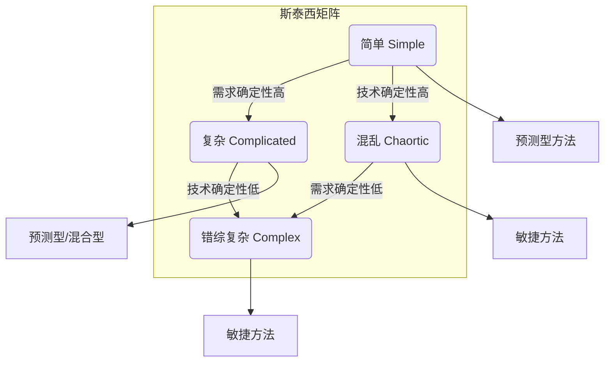

> [上一章：11-PMBOK7-精解](11-PMBOK7-精解.md) | [返回目录](../README.md)

---
# 《敏捷实践指南》精解

> 本笔记旨在为您系统性地梳理《敏捷实践指南》的核心知识。该指南由PMI与敏捷联盟联合发布，是PMP考试中关于敏捷和混合方法的最权威参考。掌握其内容，对于理解现代项目管理和通过PMP考试至关重要。

---

## 模块一：敏捷核心理念与思维模式

### 1.1 敏捷宣言与十二原则

敏捷的核心是其价值观和原则，它们定义了敏捷的思维模式。

- **敏捷宣言四大价值观**:

  1. **个体和互动** 高于 流程和工具
  2. **工作的软件** 高于 详尽的文档
  3. **客户合作** 高于 合同谈判
  4. **响应变化** 高于 遵循计划
- **十二项支撑原则**: 这些原则是宣言的具体化，强调 **客户满意度、拥抱变化、频繁交付、团队协作、可持续发展** 和 **持续改进** 等核心实践。

### 1.2 不确定性与生命周期选择

敏捷方法特别适用于需求和技术方案不确定性高的项目。**斯泰西矩阵(Stacey Matrix)** 是一个经典模型，用于根据需求和技术的确定性来选择合适的项目管理方法。

- **结论**: 需求和技术越不确定，项目就越“复杂”或“错综复杂”，此时越应该采用敏捷或适应型方法。

---

## 模块二：生命周期选择

《敏捷实践指南》定义了四种生命周期，项目团队需要根据项目特点进行裁剪选择。

| 生命周期   | 需求特点 | 交付方式         | 目标         | 主要风险控制                                 |
| :----------- | :--------- | :----------------- | :------------- | :--------------------------------------------- |
| **预测型** | 固定     | 一次性交付       | 管理成本     | 在项目开始时进行详细规划                     |
| **迭代型** | 动态     | 一次性交付       | 方案的正确性 | 通过多次迭代获取反馈，完善方案               |
| **增量型** | 动态     | 频繁、小批量交付 | 交付速度     | 尽早交付高价值部分，加快投资回报             |
| **敏捷型** | 动态     | 频繁、小批量交付 | 客户价值     | 迭代和增量并用，通过反馈和频繁交付来控制风险 |

---

## 模块三：创建敏捷环境——仆人式领导与敏捷团队

### 3.1 仆人式领导 (Servant Leadership)

- **核心职责**: 仆人式领导者不是传统的“命令-控制”型老板，而是团队的 **“服务员”** 和 **“保护者”**。
- **关键行为**:
  - **移除障碍**: 主动为团队清除前进道路上的任何阻碍。
  - **营造安全环境**: 创造一个让团队成员敢于说真话、敢于尝试、不怕失败的环境。
  - **授权赋能**: 将权力和责任下放给团队，相信团队的专业判断。
  - **教练与指导**: 帮助团队成员成长，提升整个团队的能力。

### 3.2 敏捷团队

- **核心特征**:
  - **跨职能 (Cross-functional)**: 团队拥有交付一个完整产品增量所需的全部技能（如开发、测试、设计等）。
  - **自组织 (Self-organizing)**: 团队自己决定如何最好地完成工作，而不是由外部经理来分配任务。
  - **专职 (Dedicated)**: 理想情况下，团队成员100%投入在一个项目中，以最大化效率和专注度。
  - **团队规模**: 通常建议 **3-9人**，即“两个披萨”原则（两个披萨能喂饱的团队规模最合适）。

---

## 模块四：在敏捷环境中交付——核心实践

《敏捷实践指南》介绍了多种敏捷方法，其中 **Scrum** 和 **Kanban** 是最主流的两种。

### 4.1 Scrum框架

Scrum是一个基于时间盒迭代的框架，其核心循环在 **`04-敏捷与混合方法深度解析.md`** 中已有详细图解。关键实践包括：

- **产品待办列表 (Product Backlog)**: 由产品负责人（PO）管理的、按价值排序的需求列表。
- **Sprint规划会**: 团队在Sprint开始时，从业主列表中选择最高价值的需求作为本次Sprint的目标。
- **每日站会**: 团队成员每日同步进度，识别障碍。
- **Sprint评审会**: 迭代结束时，向干系人演示可工作的软件增量，获取反馈。
- **Sprint回顾会**: 团队反思并改进自己的工作流程。

### 4.2 看板方法 (Kanban)

Kanban是一个专注于优化工作流程、提升交付效率的框架。

- **核心实践**:
  1. **可视化工作流**: 用看板将所有工作状态（如：待办、开发中、测试中、完成）清晰地展示出来。
  2. **限制在制品 (WIP)**: **看板的精髓**。通过限制同时进行的工作项数量，减少任务切换的浪费，缩短交付周期。
  3. **管理流动**: 持续监控和度量工作项在流程中的流动情况，识别并消除瓶颈。

---

## 模块五：项目的组织考虑因素

成功推行敏捷不仅仅是项目团队的事，还需要整个组织的支持和变革。

- **组织变革管理**: 推广敏捷需要改变组织文化、汇报结构和绩效考核方式。
- **采购与合同**: 传统的固定范围合同与敏捷的适应性相悖，需要探索更灵活的合同模式（如价值导向、增量付费）。
- **项目管理办公室 (PMO)**: 敏捷环境下的PMO，其角色应从“管控型”转变为“服务型”，为敏捷团队提供支持、资源和指导。

---
> [上一章：11-PMBOK7-精解](11-PMBOK7-精解.md) | [返回目录](../README.md)
