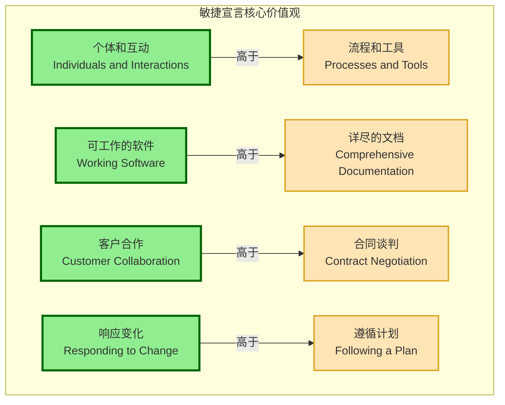
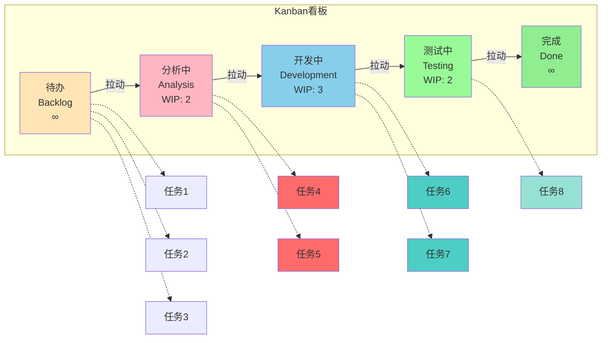

> [上一章：11-PMBOK7-精解](11-PMBOK7-精解.md) | [返回目录](../README.md) | [下一章：无](ACRONYMS.md)

---
# 12-《敏捷实践指南》精解

> 《敏捷实践指南》是PMI与敏捷联盟合作编写的官方指南，是PMP考试中关于敏捷部分的“圣经”。本篇笔记将完全遵循该指南的结构和核心思想，为您提炼出所有关键“考点”，助您深入理解敏捷的“道”与“术”。

---

### 考点：敏捷宣言的四大价值观

敏捷宣言是敏捷思维的基石，定义了敏捷的核心价值取向：

**敏捷宣言四大价值观可视化**:

**价值观对比表**:

| 更重视的（左侧） | | 虽有价值但次之（右侧） |
|---|---|---|
| **个体和互动** | **高于** | 流程和工具 |
| **可工作的软件** | **高于** | 详尽的文档 |
| **客户合作** | **高于** | 合同谈判 |
| **响应变化** | **高于** | 遵循计划 |

**深度解读**：

**1. 个体和互动 > 流程和工具**
- **含义**: 人比工具更重要。敏捷强调团队成员之间的直接沟通和协作，而不是依赖复杂的流程或工具来传递信息。
- **应用**: 面对面交谈优于邮件；团队自组织优于严格的层级管理。
- **常见误区**: ❌ 不是说不需要工具，而是工具应服务于人，而非束缚人。
- **考试应用**: 当选项体现"促进团队面对面沟通"时通常是正确答案。

**2. 可工作的软件 > 详尽的文档**
- **含义**: 产品的价值体现在可用的功能上，而不是厚厚的文档中。
- **应用**: 每个Sprint交付可演示的、可运行的产品增量；文档以"足够"为原则。
- **常见误区**: ❌ 不是不写文档，而是文档应简洁、必要、及时更新。
- **考试应用**: 选项强调"交付可工作的增量"优于"完善文档"。

**3. 客户合作 > 合同谈判**
- **含义**: 与客户建立伙伴关系，共同探索需求和解决方案，而不是通过合同条款争执。
- **应用**: 产品负责人持续参与；频繁的Sprint评审会让客户尽早看到成果并提供反馈。
- **常见误区**: ❌ 不是不要合同，而是合同应支持协作和灵活性。
- **考试应用**: 强调"与客户频繁互动、共同决策"的选项通常正确。

**4. 响应变化 > 遵循计划**
- **含义**: 拥抱变化，而不是僵化地执行初始计划。
- **应用**: 产品待办列表可以随时调整优先级；每个Sprint重新规划。
- **常见误区**: ❌ 不是没有计划，而是计划应该是动态的、可调整的。
- **考试应用**: 面对变更时，选择"欣然接受并调整计划"而非"严格按原计划执行"。

---

### 考点：敏捷宣言的十二条原则

这12条原则将4大价值观具体化，指导敏捷实践：

**客户价值类（原则1-3）**：

1. **持续交付有价值的软件以满足客户**
   - 我们最重要的目标，是通过持续不断地及早交付有价值的软件使客户满意。
   - **考试应用**: 强调频繁交付、尽早交付价值。

2. **欣然面对需求变化**
   - 欣然面对需求变化，即使在开发后期也一样。敏捷过程掌控变化，为客户的竞争优势服务。
   - **考试应用**: 变更不是问题，而是机会。

3. **经常交付可工作的软件**
   - 经常地交付可工作的软件，相隔几星期或一两个月，倾向于采取较短的周期。
   - **考试应用**: 短迭代周期（1-4周）优于长周期。

**团队协作类（原则4-6）**：

4. **业务人员和开发人员必须相互合作**
   - 业务人员和开发人员必须相互合作，项目中的每一天都不例外。
   - **考试应用**: 产品负责人(PO)持续参与，每日协作。

5. **激发个体的斗志**
   - 激发个体的斗志，以他们为核心搭建项目。提供所需的环境和支援，辅以信任，从而达成目标。
   - **考试应用**: 赋能团队、提供支持，而非微观管理。

6. **面对面交谈是最有效的沟通方式**
   - 不论团队内外，传递信息效果最好、效率最高的方式是面对面的交谈。
   - **考试应用**: 优先选择面对面沟通，特别是重要信息。

**技术实践类（原则7-10）**：

7. **可工作的软件是进度的首要度量标准**
   - 可工作的软件是进度的首要度量标准。
   - **考试应用**: 用"完成的功能"衡量进度，而非"完成的文档"或"消耗的时间"。

8. **敏捷过程倡导可持续开发**
   - 敏捷过程倡导可持续开发。责任人、开发人员和用户应该能够一直维持稳定的步调。
   - **考试应用**: 避免过度加班，保持团队长期稳定的速率。

9. **坚持不懈地追求技术卓越和良好设计**
   - 坚持不懈地追求技术卓越和良好设计，敏捷能力由此增强。
   - **考试应用**: 技术债务要及时偿还，重视代码质量。

10. **以简洁为本**
    - 以简洁为本，它是极力减少不必要工作量的艺术。
    - **考试应用**: 只做必要的工作，避免过度设计和"镀金"。

**持续改进类（原则11-12）**：

11. **最好的架构、需求和设计出自自组织团队**
    - 最好的架构、需求和设计出自自组织团队。
    - **考试应用**: 信任团队，让团队自己做技术决策。

12. **团队定期反思如何提高成效**
    - 团队定期地反思如何能提高成效，并依此调整自身的举止表现。
    - **考试应用**: Sprint回顾会的核心目的，持续改进。

---

### 考点：敏捷的本质与思维模式

- **A. 不确定性谱系**: 敏捷适用于需求不确定性高、技术不确定性高的项目。对于需求和技术都明确的项目，应使用预测型方法。
- **B. 经验过程控制**: 敏捷通过 **透明、检视、适应** 的短周期循环来应对不确定性。
- **C. 仆人式领导**: 敏捷团队的领导者（如Scrum Master）是 **服务者**，其职责是赋能团队、移除障碍，而非命令和控制。

---

### 考点：看板方法 (Kanban Method)

#### Kanban核心定义
- **核心思想**: 一种专注于优化价值流动效率的敏捷方法，通过可视化工作流程和限制在制品来持续改进。
- **与Scrum区别**: Scrum是时间盒迭代（固定Sprint），Kanban是持续流动（无固定迭代）。

**Kanban看板示意图**:

**看板关键要素说明**:
- **WIP限制**: 每列标注的数字(如"WIP: 3")表示该列最多允许的任务数
- **拉动系统**: 只有当下游列有空位时，才能从上游拉入新任务
- **可视化**: 所有任务状态一目了然，便于识别瓶颈

#### Kanban六个核心实践

**1. 可视化工作流程 (Visualize the Workflow)**
- 使用看板将所有工作项和流程步骤可视化
- 典型看板列：待办 → 分析 → 开发 → 测试 → 完成
- 每个工作项用卡片表示，在看板上移动
- **考试应用**: "让团队看到工作流程"→ 可视化

**2. 限制在制品 (Limit Work in Progress - WIP)**
- 为每个流程步骤设置WIP限制（如"开发中：最多3项"）
- 当某列达到WIP限制时，团队必须先完成现有工作才能拉入新工作
- **目的**: 识别瓶颈，防止多任务切换，缩短交付周期
- **考试应用**: "大量任务堆积在某环节"→ 设置WIP限制

**3. 管理流动 (Manage Flow)**
- 监控和优化工作项从开始到完成的流动速度
- 关注减少等待时间和阻塞
- **目标**: 平滑、快速、可预测的流动
- **考试应用**: "缩短交付周期"→ 管理流动

**4. 明确流程策略 (Make Policies Explicit)**
- 公开透明的工作规则（如"完成的定义"、"何时可以拉入新任务"）
- 让所有团队成员理解并遵循规则
- 便于识别改进机会
- **考试应用**: "团队对标准不清楚"→ 明确流程策略

**5. 建立反馈循环 (Implement Feedback Loops)**
- 定期评审会议（如每日站会、补充会议、交付计划评审）
- 基于数据和指标进行讨论
- 及时调整和改进
- **考试应用**: "持续改进"→ 反馈循环

**6. 协作改进/改善 (Improve Collaboratively, Evolve Experimentally)**
- 使用科学方法进行持续改进
- 基于数据和模型做出改变
- 团队共同识别和实施改进措施
- **考试应用**: "团队共同寻找改进点"→ 协作改进

#### Kanban核心指标

- **前置时间 (Lead Time)**: 从工作项进入系统到完成的总时间
- **周期时间 (Cycle Time)**: 从开始工作到完成的时间
- **吞吐量 (Throughput)**: 单位时间内完成的工作项数量
- **在制品数量 (WIP)**: 当前正在进行中的工作项数量

#### Kanban vs Scrum对比

| 维度 | Scrum | Kanban |
|------|-------|--------|
| 迭代 | 固定时间盒（Sprint） | 持续流动，无固定迭代 |
| 角色 | 明确的3个角色（PO/SM/Dev） | 无强制角色要求 |
| 变更 | Sprint内不允许变更待办列表 | 可随时变更优先级 |
| 承诺 | 承诺Sprint目标 | 承诺持续交付 |
| 度量 | 速率（Velocity） | 前置时间、周期时间 |
| WIP限制 | 间接限制（Sprint容量） | 明确的WIP限制 |
| 适用场景 | 需求相对明确的项目 | 高度不确定、频繁变化的工作 |

**考试应用**: 
- 看到"瓶颈"、"堆积" → 设置WIP限制
- 看到"持续交付"、"无固定迭代" → Kanban
- 看到"流动效率"、"缩短交付周期" → 管理流动

---

### 考点：生命周期选择

- **A. 四种生命周期**: 
    - **预测型**: 前期一次性规划，最后一次性交付。
    - **迭代型**: 多次迭代以完善产品，最后一次性交付。
    - **增量型**: 分批次交付可用的功能模块。
    - **敏捷型**: 同时采用迭代和增量的方式，在短周期内频繁交付价值。
- **B. 混合型方法**: 根据项目不同部分的特点，混合使用预测型和敏捷型方法。例如，硬件开发用预测型，软件开发用敏捷型。

---

### 考点：创建敏捷环境

- **A. 高绩效团队的特征**: 
    - **自组织**: 团队自己决定如何完成工作。
    - **跨职能**: 团队拥有完成工作所需的全部技能。
    - **团队规模小**: 通常为3-9人，以保证沟通效率。
    - **人员稳定**: 稳定的团队有助于提高默契和效率。
- **B. 仆人式领导的角色**: 
    - **建立安全文化**: 鼓励团队成员敢于提问、敢于犯错、敢于挑战。
    - **教练与指导**: 帮助团队成员成长，提升技能。
    - **管理干系人**: 确保干系人与团队的有效协作。

---

### 考点：在敏捷环境中交付

- **A. 常见实践**: 
    - **产品待办列表 (Backlog)**: 一个动态的、经过排序的需求列表。
    - **迭代/Sprint**: 一个固定的、短的时间盒（通常1-4周），团队在其中完成一部分工作。
    - **每日站会**: 团队成员快速同步进度、计划和障碍。
    - **评审 (Review)**: 在迭代结束时，向干系人演示可工作的软件，并收集反馈。
    - **回顾 (Retrospective)**: 在迭代结束时，团队内部反思工作流程，寻找改进点。
- **B. 敏捷度量**: 
    - **燃尽图/燃起图**: 可视化地跟踪剩余工作量或已完成工作量。
    - **累积流量图 (CFD)**: 用于看板方法，显示不同状态下的任务数量，帮助识别瓶颈。

---

### 考点：敏捷的组织考虑因素

- **A. 组织变革**: 推行敏捷不仅仅是项目团队的事，更是一场组织级的变革。需要管理层的支持、文化的转变。
- **B. 敏捷合同**: 传统的总价合同不适用于需求多变的敏捷项目。应采用更灵活的合同，如按价值付费、增量式合同等。
- **C. 多团队协调**: 对于大型项目，需要有机制来协调多个敏捷团队的工作，如Scrum of Scrums (SoS)。

---

---

### 考点：XP极限编程 (Extreme Programming)

**XP核心理念**:
- "拥抱变化"而非"预防变化"
- 通过短迭代周期和持续反馈来应对需求变化
- 强调程序员和客户之间的紧密协作

**XP五大核心价值观**:

| 价值观 | 核心思想 | 实践体现 |
| :--- | :--- | :--- |
| **沟通 (Communication)** | 团队成员之间保持开放、频繁的沟通 | 结对编程、现场客户、简单设计 |
| **简单 (Simplicity)** | 只做当前需要做的事，避免过度设计 | 简单设计、重构、测试驱动开发 |
| **反馈 (Feedback)** | 快速获得反馈，及时调整方向 | 测试驱动开发、持续集成、客户测试 |
| **勇气 (Courage)** | 敢于做出艰难决定，持续改进 | 重构、拥抱变化、做正确的事 |
| **尊重 (Respect)** | 团队成员相互尊重，共同承担责任 | 结对编程、集体代码所有权 |

**XP 12个核心实践**:

#### 4个核心实践 (Primary Practices):

1. **结对编程 (Pair Programming)**
   - 两人共用一台电脑编写代码
   - 一人编码(驾驶员)，一人审查(导航员)
   - 提高代码质量，促进知识共享

2. **测试驱动开发 (Test-Driven Development, TDD)**
   - 先写测试，再写代码
   - 确保代码满足需求
   - 提供即时反馈

3. **重构 (Refactoring)**
   - 在不改变外部行为的前提下改进代码结构
   - 持续优化代码质量
   - 保持代码简洁和可维护

4. **简单设计 (Simple Design)**
   - 实现当前需求的最简单方案
   - 避免过度设计和未来功能猜测
   - 保持设计清晰易懂

#### 8个辅助实践 (Secondary Practices):

5. **持续集成 (Continuous Integration)**
   - 频繁地将代码集成到主干
   - 快速发现和解决集成问题
   - 保持系统始终可工作

6. **代码集体所有权 (Collective Code Ownership)**
   - 任何团队成员都可以修改任何代码
---

## ✅ 学习自检清单

完成本章学习后，请检查您是否掌握了以下核心知识点：

- [ ] 理解敏捷宣言4大价值观及其优先级
- [ ] 掌握敏捷12条原则的核心思想
- [ ] 理解Scrum框架的3-5-3结构
- [ ] 掌握Kanban方法的6个核心实践
- [ ] 理解燃尽图的解读方法和应用场景
- [ ] 掌握XP极限编程的5大价值观和12个实践
- [ ] 理解混合方法的应用场景和组合方式
- [ ] 掌握敏捷环境下的团队管理和沟通技巧

> **学习建议**: 对于未掌握的知识点，建议回到相应章节重新学习，并结合实际项目经验进行思考。   - 促进知识共享和责任共担
   - 避免知识孤岛

7. **编码标准 (Coding Standards)**
   - 统一的代码编写规范
   - 提高代码可读性和维护性
   - 降低团队协作成本

8. **可持续的节奏 (Sustainable Pace)**
   - 保持稳定的工作节奏
   - 避免加班文化
   - 确保长期生产力

9. **现场客户 (On-site Customer)**
   - 客户代表全程参与项目
   - 快速响应需求变更
   - 确保交付价值

10. **隐喻 (Metaphor)**
    - 用简单的故事描述系统架构
    - 帮助团队和客户理解系统
    - 提供设计指导原则

11. **小版本发布 (Small Releases)**
    - 频繁发布小版本
    - 快速获得用户反馈
    - 降低发布风险

12. **每周40小时工作制 (40-hour Week)**
    - 避免疲劳导致的错误
    - 保持团队创造力和专注力
    - 确保工作可持续性

**XP与Scrum的区别**:

| 维度 | XP | Scrum |
| :--- | :--- | :--- |
| **关注点** | 工程实践和技术卓越 | 项目管理和团队协作 |
| **角色** | 无特定角色，强调程序员和客户 | 定义了PO、SM、开发团队 |
| **事件** | 无固定事件框架 | 定义了Sprint、站会、评审、回顾 |
| **工件** | 无特定工件 | 定义了产品待办列表、Sprint待办列表、增量 |
| **适用场景** | 技术复杂、需求变化快的项目 | 各类项目，特别是需求不明确的项目 |

**考试要点**:
- XP强调技术实践，Scrum强调管理框架
- XP适合技术能力强的团队
- XP的12个实践需要综合应用才能发挥效果> [上一章：11-PMBOK7-精解](11-PMBOK7-精解.md) | [返回目录](../README.md) | [下一章：无](ACRONYMS.md)

